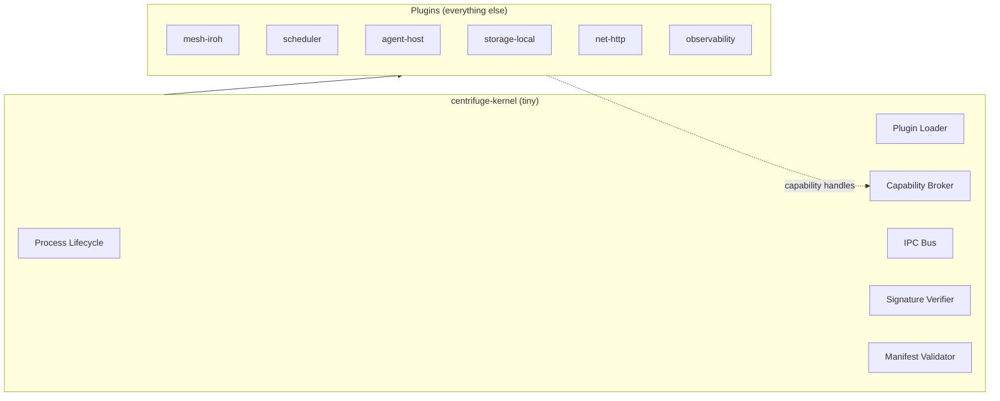
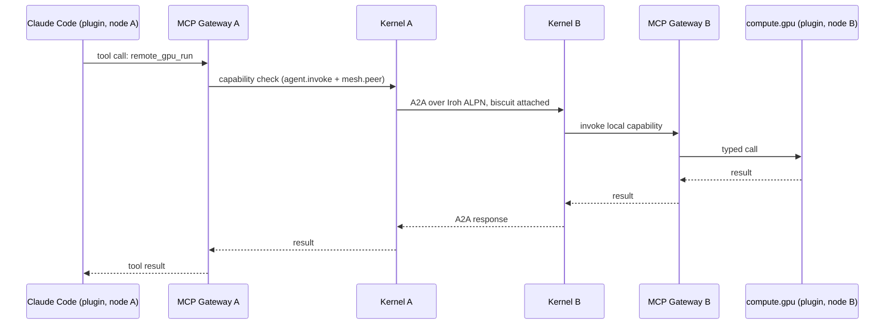

# Centrifuge — Architecture v1

**Status:** Proposed (v1, for adversarial review)
**Date:** 2026-04-28
**Author:** Architect role
**Audience:** experienced Rust engineers; critics expected to attack every load-bearing decision

---

## 1. System Overview

Centrifuge is a **tiny Rust kernel that runs Wasm Component plugins** under a capability-based permission model and federates them across a mesh of devices. It is the substrate on which one can build: distributed compute over a LAN/WAN, an AI agent host (Claude Code, Codex, OpenCode, Aider), batched compute scheduling with hardware advertising, network management, and similar device-fleet workloads — all delivered *as plugins*, not as kernel features.

The kernel is uncompromisingly small. It owns five things: process lifecycle, plugin loading, capability brokerage, IPC, and signature verification. Everything else — networking, scheduling, agents, observability — is a plugin.

### What Centrifuge IS

- A **plugin host** (Wasmtime + WASI 0.2/Preview 2 Component Model) with a typed capability surface.
- A **capability broker** that hands out opaque handles; plugins cannot name what they were not given.
- A **mesh node** that uses Iroh as its single ground-truth transport.
- A **single static binary** (`centrifuged`) plus a thin CLI (`centrifuge`).
- A **substrate** for higher-level systems: compute scheduler, agent host, network manager — each one a plugin.

### What Centrifuge IS NOT (non-goals)

- **Not a container runtime.** Plugins are Wasm components, not OCI containers. (OCI is used only as a *distribution* format.)
- **Not a Kubernetes alternative.** No declarative reconciliation loop in the kernel; if you want one, ship it as a plugin.
- **Not an orchestrator** for arbitrary processes. Tier-5 native plugins exist as an escape hatch, not a happy path.
- **Not a general-purpose IaaS** or a place to dump Docker images and call them "workloads."
- **Not opinionated about compute scheduling, agent protocol, or network topology.** Those are plugins, deliberately.
- **Not a numeric-tier security model.** Tiers are UX; capabilities enforce.
- **Not a JIT plugin loader for untrusted internet code.** Plugins must be signed by a publisher key the user trusts.

### One-paragraph elevator

A user `docker run`s `centrifuged` on each device they own. Each daemon discovers its peers via mDNS on the LAN and pkarr on the WAN, joins a SWIM-gossiped mesh keyed by Ed25519 `NodeId`s, and exposes a typed capability bus. Plugins — distributed as signed OCI artifacts — declare which capabilities they need (`compute.gpu`, `net.lan`, `agent.invoke`, …) and receive opaque handles for exactly those. From there, you compose: a `scheduler` plugin advertises hardware and places signed Wasm work units; an `agent-host` plugin runs Claude Code with kernel-mediated MCP tools; a `mesh-fs` plugin shares storage. The kernel never grew.

---

## 2. Core Kernel Responsibilities

The kernel (`centrifuge-kernel` crate) owns, exhaustively:

| Responsibility | What it does | What it doesn't |
|---|---|---|
| **Process lifecycle** | Daemon start/stop, signal handling, supervised tasks via `tokio::task::JoinSet`, structured shutdown | Doesn't restart plugins on crash without policy (that's a supervisor plugin) |
| **Plugin loader** | Resolves OCI ref → fetches → verifies signature → pre-compiles via Wasmtime → instantiates | Doesn't choose *which* plugins to run (manifest-driven or CLI-driven) |
| **Capability broker** | Issues, revokes, attenuates handles; mediates every host call; logs all grants | Doesn't decide policy beyond manifest+powerbox; doesn't proxy data |
| **Permission enforcement** | Validates manifests against signing key authority; runtime check on every capability invocation | No ambient authority anywhere; no `--allow-all` |
| **IPC bus** | In-process typed bus between Wasm components (component-to-component calls via WIT); Cap'n Proto bridge to subprocess plugins | Not a message broker, not durable, not network-spanning (that's the `mesh` plugin) |
| **Manifest validation** | Parses `centrifuge.toml` per plugin; verifies declared capabilities are well-formed; resolves capability scopes | Does not negotiate scopes — they're declarative |
| **Signing & verification** | Verifies plugin signatures (minisign-style Ed25519, or Sigstore cosign for OCI); maintains user's trusted-publisher keyring | No CA; no transitive trust |

**Hard rule:** the kernel does not include networking, agent specifics, or compute scheduling. If feature X is in the kernel, ask: "does *every* deployment need X?" If no, X is a plugin. If we can't decide, X is a plugin.

### What's deliberately NOT in the kernel

- HTTP server, HTTP client (use a `net.http` capability provider plugin)
- Iroh transport itself (the `mesh-iroh` plugin owns it; the kernel only knows the `mesh.peer` capability shape)
- Storage (a `storage-local` plugin owns SQLite/sled/whatever)
- Telemetry exporter (an `observability` plugin)
- Config reload watcher (a `maintenance` plugin)
- The compute scheduler (a `scheduler` plugin — see §7)
- The agent host (an `agent-host` plugin — see §8)

### Mermaid: kernel surface



---

## 3. Plugin Model

### 3.1 Chosen mechanism: Wasm Component Model (Wasmtime + WASI 0.2)

**Decision.** Plugins are **WebAssembly components** targeting WASI Preview 2, executed by Wasmtime ≥25 inside the daemon process.

**Why (justified from research 02):**

- Capability-based by construction — a guest cannot fabricate handles; the host hands them out. This is the *exact* security model Centrifuge needs.
- WIT is a stable interface contract decoupled from rustc ABI — solves the "no stable Rust ABI" problem permanently.
- AOT via Cranelift gives 1.5–3× native for compute; boundary cost (a few hundred ns per lift/lower) is fine because plugin calls are coarse.
- Multi-language: Rust is smooth, C/C++/Go/JS/Python all reach Component Model in 2025–2026.
- Hot reload is trivial — instantiate new component, drop old.
- Production-grade: Zed, Lapce, wasmCloud, Spin all ship this in production.

**Rejected alternatives (and why):**

- **`abi_stable` cdylib** — fastest, but no sandbox. Kills permission tiers. Acceptable only if host and plugins ship together; that's not Centrifuge.
- **Extism** — simpler, multi-language, but bytes-in/bytes-out boundary loses typed capabilities. We *want* typed records and resource handles.
- **Embedded scripting (Rhai/mlua/pyo3)** — 10–50× slower; no GPU story; pyo3 has no real sandbox. Wrong tool.
- **Subprocess+IPC as default** — process-launch overhead, protocol versioning hell. We keep this as a tier-5 escape hatch only (§3.5).
- **In-tree Cargo features (Bevy-style)** — no enforcement surface. Defeats the entire premise.

### 3.2 ABI / contract

Every plugin imports the **`centrifuge:plugin/lifecycle@0.1.0`** WIT world plus whatever **capability worlds** it requested in its manifest. The lifecycle world is mandatory:

```wit
package centrifuge:plugin@0.1.0;

interface lifecycle {
  /// Called once after instantiation. Plugin receives its identity and capability bundle.
  init: func(ctx: plugin-context) -> result<_, init-error>;

  /// Called when host wants the plugin to start work. May be re-called after idle.
  activate: func() -> result<_, activate-error>;

  /// Called when host wants the plugin to suspend (lazy activation policy).
  idle: func() -> result<_, idle-error>;

  /// Called once before unload. Plugin must release all resources.
  shutdown: func() -> result<_, shutdown-error>;
}

record plugin-context {
  plugin-id: string,
  node-id: string,         // host's mesh NodeId
  data-dir: string,        // sandboxed, plugin-scoped
  trace-id: string,
}

world plugin {
  import lifecycle;
  // capability worlds added per manifest, e.g. import centrifuge:cap/compute-gpu@0.1.0
}
```

### 3.3 Lifecycle

```
[install] -> [load] -> [validate-manifest] -> [verify-signature]
   -> [pre-compile]  (Wasmtime AOT, cached at $data_dir/aot)
   -> [instantiate]  (allocate linear memory, wire imports)
   -> [init]
   -> [activate]   <-->   [idle]    (lazy hibernation)
   -> [shutdown]
   -> [unload]
```

- **Lazy activation** (borrowed from Spin/wasmCloud): plugins idle to a serialized state after N seconds without an inbound capability call. Re-activated on demand. Critical on Pi-class devices.
- **Hot reload:** atomic — new instance is initialized in shadow, capability handles are migrated via a `migrate` hook (optional), old instance shutdown. If the plugin doesn't implement migrate, in-flight calls drain then swap.
- **Crash policy:** Wasmtime traps abort the instance, not the daemon. Kernel logs and either restarts (per-plugin policy in manifest) or removes from active set.

### 3.4 Signing & distribution

**Decision.** Plugins are distributed as **OCI artifacts** (per wasmCloud and Spin). Signing uses **Sigstore cosign** for OCI provenance plus an inline **minisign Ed25519** signature embedded in the manifest layer for offline verification.

- Format: `oci://registry.example.com/centrifuge/scheduler:1.4.2` → OCI image with three layers:
  1. `application/vnd.centrifuge.manifest.v1+toml` (the manifest)
  2. `application/wasm` (the component)
  3. `application/vnd.centrifuge.signature.v1+ed25519` (publisher signature over the SHA-256 of layers 1+2)
- Trust model: per-user keyring of trusted publisher keys at `~/.config/centrifuge/trust.toml`. No CA, no central registry of truth. `centrifuge trust add <pubkey> --label "kozugroup"` is how you onboard a publisher.
- **No remote code loading at runtime.** The plugin's Wasm is fixed at install. (Borrowed from MV3 — kills `eval`-class supply-chain attacks.)

### 3.5 Tier-5 escape hatch: subprocess plugins (Cap'n Proto)

For plugins that genuinely need raw driver access (CUDA without WASI-NN, kernel-bypass NIC, exotic device drivers), Centrifuge supports **subprocess plugins**:

- Plugin is a native binary (any language) launched by the kernel.
- IPC over a Unix domain socket using **Cap'n Proto** with `pycapnp`-style schema generation. (Picked over gRPC for: zero-copy serialization, capability-style handles natively in the protocol, lower per-call overhead.)
- OS sandboxing applied: `seccomp-bpf` on Linux, `sandbox-exec` on macOS, `AppContainer`/job objects on Windows. Profile derived from declared capabilities.
- This is the **only** way a plugin gets tier-5. The user is prompted explicitly with the rationale string from the manifest (Powerbox, §4.4).

---

## 4. Permission Model

### 4.1 Position

Capabilities are the **enforcement** primitive. Tiers are **UX**, computed *from* capabilities, never enforced *by* them. The kernel never branches on a tier number.

This directly follows research 01's recommendation. The systems that started linear (Linux `CAP_*`, Android pre-Marshmallow) all split. The systems that won (WASI, Fuchsia, iOS entitlements) are object-capability or fine-grained from day one.

### 4.2 Capability primitives (named handles)

Every capability is a **typed WIT resource** issued by the kernel. The plugin owns a handle and can pass it (constrained by `borrow`/`own` semantics) but cannot fabricate one. Examples (full list in §5):

- `compute.cpu { max-threads, fuel-budget }`
- `compute.gpu { vendor, vram-mb, exclusive }`
- `compute.npu { backend, model-allowlist }`
- `storage.local { root: dir-handle, mode: ro|rw }`
- `storage.shared { mesh-scope, root: dir-handle, mode }`
- `net.lan { peers: peer-set | "any" }`
- `net.wan { hosts: pattern-set }`
- `agent.invoke { runtime: claude|codex|opencode, model-allowlist }`
- `mesh.peer { peer: node-id }`
- `ipc.peer { plugin: plugin-id }`
- `system.clock { precision: coarse|monotonic }`
- `system.entropy { rate-limit }`

Scopes are part of the handle's *type*, not a free-form string. Each capability has a fixed scope schema; manifest authors fill it; the broker validates.

### 4.3 The 5-tier UX surface (computed)

The user-facing tier is a **deterministic function** of the requested capability set, computed at install time:

```
fn compute_tier(caps: &CapSet) -> u8 {
  if caps.contains_any(&[Subprocess, RawDevice, KernelBypass]) { return 5; }
  if caps.contains_any(&[NetWanWildcard, StorageHostRoot, AgentBypass]) { return 4; }
  if caps.contains_any(&[NetLanAny, ComputeGpuExclusive, AgentInvoke]) { return 3; }
  if caps.contains_any(&[NetLanScoped, StorageSharedScoped, ComputeCpu]) { return 2; }
  // pure compute, plugin-data only, no network, no devices
  return 1;
}
```

Tier 1 = sandbox/minimal; Tier 5 = full root (subprocess only). Tiers exist for: install-time UX ("This plugin requests broad authority — Tier 4"), policy ("don't auto-load tier ≥4"), and audit ("show me all tier-5 plugins").

**Tier numbers never appear in kernel match statements.** If a critic finds one, that's a bug.

### 4.4 Manifest schema (`centrifuge.toml`)

```toml
[plugin]
id = "scheduler"
version = "1.4.2"
description = "Distributed compute scheduler"
publisher = "ed25519:abc123..."   # publisher pubkey

[runtime]
kind = "wasm-component"            # or "subprocess" for tier-5
abi = "centrifuge:plugin@0.1.0"
component = "scheduler.wasm"       # path within OCI artifact

[capabilities.compute-cpu]
max-threads = 8
fuel-budget = "1G"
rationale = "Run distributed work units submitted by mesh peers."

[capabilities.mesh-peer]
scope = "any"
rationale = "Schedule across all known peers."

[capabilities.storage-local]
mode = "rw"
scope = "$plugin_data"
rationale = "Cache compiled work-unit AOT artifacts."

[lifecycle]
activation = "lazy"
idle-timeout-secs = 300

[signature]
ed25519 = "...sig over manifest+component..."
```

### 4.5 Compile-time + runtime checks

- **Compile time** (at plugin build): `cargo-centrifuge` verifies that every WIT import in the component is *declared* in the manifest. A component that imports `compute-gpu` but doesn't declare it in its manifest fails the build. Eliminates the "request-more-than-you-need" Android-pre-Marshmallow failure mode.
- **Install time:** kernel parses manifest, validates schema, computes tier, presents user with rationale strings (powerbox), records consent.
- **Runtime:** every capability handle invocation flows through the broker. The broker logs every call (sampled in production). Trap on unauthorized handle (which should be impossible given Wasm linkage; defense in depth).

### 4.6 Powerbox — runtime grants

Some grants only make sense at use time (Sandstorm's lesson). Example: a backup plugin asking "I want to read this directory." Flow:

1. Plugin calls `powerbox::request<storage.local>("Choose backup source")`.
2. Kernel pops a UI prompt (CLI prompt in headless mode; native dialog if Centrifuge has a frontend plugin).
3. User picks a directory.
4. Kernel mints a fresh `storage.local` handle scoped to that path, hands it to the plugin.
5. Grant is recorded; user can revoke from `centrifuge perms list` / `centrifuge perms revoke`.

Plugins **cannot** request capabilities not listed in their manifest, even via powerbox. The manifest is an upper bound; powerbox narrows scope, never widens kind.

### 4.7 Monotonic narrowing (from `pledge`)

A plugin can voluntarily call `capabilities::drop(handle)` and never regain it. Useful for "I needed network during init, now I don't." The kernel exposes this as a `cap-bag` resource on the lifecycle context.

---

## 5. Capability Surfaces (the connectors)

These are the typed WIT interfaces the kernel exposes via the broker. Each is its own WIT package; plugins import only what they declare.

```wit
// centrifuge:cap/compute-cpu@0.1.0
package centrifuge:cap;

interface compute-cpu {
  resource cpu-pool {
    submit: func(wasm-blob: list<u8>, args: list<string>) -> result<job-id, submit-error>;
    cancel: func(id: job-id) -> result<_, cancel-error>;
    wait:   func(id: job-id) -> result<job-result, job-error>;
  }
  type job-id = u64;
  record job-result { exit-code: s32, stdout: list<u8>, stderr: list<u8>, duration-ms: u64 }
}
```

```wit
// centrifuge:cap/compute-gpu@0.1.0
interface compute-gpu {
  resource device {
    info: func() -> device-info;
    submit-shader: func(wgsl: string, bindings: list<binding>) -> result<dispatch-id, gpu-error>;
    map-buffer: func(buf: borrow<gpu-buffer>) -> result<list<u8>, gpu-error>;
  }
  resource gpu-buffer { /* opaque */ }
  record device-info { vendor: string, name: string, vram-mb: u32, backend: string }
}
```

```wit
// centrifuge:cap/compute-npu@0.1.0  (uses WASI-NN underneath)
interface compute-npu {
  resource session {
    load-named-model: func(name: string) -> result<model, npu-error>;
    infer: func(model: borrow<model>, inputs: list<tensor>) -> result<list<tensor>, npu-error>;
  }
  resource model { /* opaque */ }
  record tensor { shape: list<u32>, dtype: dtype, data: list<u8> }
}
```

```wit
// centrifuge:cap/storage-local@0.1.0
interface storage-local {
  resource dir {
    open-file: func(path: string, mode: open-mode) -> result<file, fs-error>;
    list:      func() -> result<list<entry>, fs-error>;
  }
  resource file {
    read:  func(offset: u64, len: u32) -> result<list<u8>, fs-error>;
    write: func(offset: u64, data: list<u8>) -> result<u32, fs-error>;
  }
}
```

```wit
// centrifuge:cap/storage-shared@0.1.0   (mesh-replicated; backed by iroh-blobs/iroh-docs)
interface storage-shared {
  resource doc {
    get: func(key: string) -> option<list<u8>>;
    put: func(key: string, value: list<u8>) -> result<_, doc-error>;
    subscribe: func(prefix: string) -> stream<doc-event>;
  }
}
```

```wit
// centrifuge:cap/net-lan@0.1.0
interface net-lan {
  resource peer-conn {
    send: func(stream: u32, data: list<u8>) -> result<_, net-error>;
    recv: func(stream: u32) -> result<list<u8>, net-error>;
  }
  open: func(peer: node-id, alpn: string) -> result<peer-conn, net-error>;
}
```

```wit
// centrifuge:cap/net-wan@0.1.0   (egress to internet hosts in scope)
interface net-wan {
  resource http-client {
    request: func(req: http-request) -> result<http-response, http-error>;
  }
}
```

```wit
// centrifuge:cap/agent-invoke@0.1.0
interface agent-invoke {
  resource session {
    send-prompt: func(text: string, attachments: list<attachment>) -> result<turn-id, agent-error>;
    next-event:  func(turn: turn-id) -> result<agent-event, agent-error>;
    register-tool: func(spec: tool-spec) -> result<_, agent-error>;
  }
  variant agent-event {
    text(string),
    tool-call(tool-call),
    tool-result(tool-result),
    done(turn-summary),
  }
}
```

```wit
// centrifuge:cap/mesh-peer@0.1.0
interface mesh-peer {
  list-peers: func() -> list<peer-info>;
  watch:      func() -> stream<peer-event>;
  resolve:    func(id: node-id) -> option<peer-info>;
  record peer-info { id: node-id, addrs: list<string>, capabilities: list<string>, link: link-quality }
  record link-quality { rtt-ms: u32, bandwidth-est-mbps: u32, loss-pct: f32 }
}
```

Every WIT interface follows three rules: (a) handles are resources, never raw paths/ids; (b) errors are typed variants, never magic numbers; (c) async streams use `stream<T>` from WASI 0.2.

---

## 6. Mesh / Network Layer

This entire section describes the **`mesh-iroh` plugin**, not the kernel. The kernel only knows the `mesh.peer` capability shape.

### 6.1 Transport: Iroh

**Decision.** Iroh is the single transport. `iroh` ≥0.34, `iroh-net`, `iroh-relay`, `iroh-base`, `iroh-dns-server`, `iroh-gossip`, `iroh-blobs`, `iroh-docs`.

Why: QUIC over direct UDP, hole-punched UDP, or DERP-derived TCP relay fallback. NAT traversal is solved. `NodeId` (Ed25519) is a content-addressable identity — no DNS, no certs, no PKI. Continuous perf measurement (`perf.iroh.computer`) means we can trust the latency numbers in scheduling decisions.

Rejected: rust-libp2p (heavier, more moving parts, weaker UX), Tailscale/Headscale (operator-managed, not embeddable as a library at our level), Yggdrasil (niche), raw QUIC (we'd reinvent NAT traversal).

### 6.2 Discovery

**LAN-fast-path:** mDNS/DNS-SD service `_centrifuge._udp.local` via `mdns-sd`. Sub-second discovery on the same broadcast domain.

**WAN:** pkarr (BEP-44/Pkarr DNS records signed by `NodeId`) via `iroh-dns-server` at `dns.iroh.link` (or self-hosted). A node can be reached *anywhere* given just its `NodeId`.

Both run concurrently. mDNS is the speed optimization; pkarr is the correctness baseline.

### 6.3 Membership: SWIM gossip

**Decision.** SWIM-style gossip via `chitchat` (Quickwit) for cluster membership and failure detection. O(log N) detection, no central coordinator.

Used to maintain the *liveness view* — who is alive, who is suspected, who left. Not used for arbitrary message dissemination (use `iroh-gossip` for that, layered above).

### 6.4 Identity: Ed25519 = `NodeId`

A daemon's identity is its Iroh `NodeId` — the SHA-256 of an Ed25519 public key. Generated on first boot, stored at `$data_dir/identity.key`, never rotates without explicit user opt-in (rotation breaks long-lived capability tokens; this is a feature).

### 6.5 Capability tokens: biscuit-auth

**Decision.** Cross-node authorization uses **biscuits** (`biscuit-auth` 5.x). Attenuable, offline-verifiable Datalog-checked tokens.

Example token semantics:

```
authority:
  user("alice")
  device("laptop-7af3...")
  cap("compute.gpu", vram_mb >= 2048)
  cap("mesh.peer", any)
  expires(2026-05-01T00:00:00Z)
```

A scheduler delegating work to a peer mints a biscuit attenuated to "this specific job's resources for 60 seconds." The peer verifies offline. No phone-home, no central PDP.

### 6.6 ALPN multiplexing

A single Iroh connection carries multiple ALPNs:

- `centrifuge/control/1` — gossip + membership + capability-token exchange
- `centrifuge/scheduler/1` — work-unit submission/results
- `centrifuge/agent/1` — A2A bridge (§8)
- `centrifuge/blobs/1` — `iroh-blobs` for work-unit Wasm transfer
- `centrifuge/docs/1` — `iroh-docs` for shared-storage capability backing

---

## 7. Distributed Compute Scheduler (a Plugin)

This is the `scheduler` plugin. The kernel doesn't know it exists.

### 7.1 Task model

A **task** is a signed Wasm component plus a resource spec plus inputs:

```rust
struct Task {
  id: TaskId,
  component: Cid,                  // content-addressed Wasm blob (iroh-blobs)
  signature: Ed25519Sig,           // submitter's signature over (component, spec, inputs)
  resources: ResourceSpec,         // what it needs
  inputs: Vec<InputRef>,           // blob refs or inline bytes
  deadline: Option<Instant>,
  affinity: Affinity,              // node hints
  retry: RetryPolicy,
}

struct ResourceSpec {
  cpu: f32,                        // logical, à la Ray
  memory_mb: u32,
  gpu: Option<GpuReq>,             // { vram_mb, vendor: any | nvidia | apple | ... }
  npu: Option<NpuReq>,             // { backend, models: ["llama3-8b-q4"] }
  custom: HashMap<String, f32>,    // accelerator_type, etc.
  network: NetReq,                 // bandwidth_mbps, peer_locality
}
```

### 7.2 Resource advertising

Each node advertises its capabilities as a *capability surface*, not raw devices (research 03 lesson). Advertisement is a record gossiped via `iroh-gossip` on `centrifuge/scheduler/1`:

```
node = "abc123..."
cpu = { logical_cores: 16, load_avg: 0.4 }
gpu = [{ vendor: "apple", name: "M4 Max", vram_mb: 36864 }]
npu = [{ backend: "coreml", models: ["llama3-8b-q4", "whisper-v3"] }]
storage = { free_gb: 412 }
links = { "node-X": { rtt_ms: 4, bw_mbps: 940 }, "node-Y": { rtt_ms: 87, bw_mbps: 22 } }
```

### 7.3 Placement algorithm

Greedy bin-packing with a multi-criteria score, computed per (task, candidate-node):

```
score = w_fit       * resource_fit(task, node)
      + w_locality  * data_locality(task, node)
      + w_network   * link_quality(submitter, node)
      + w_load      * (1 - normalized_load(node))
      - w_cost      * estimated_cost(task, node)
```

**Centrifuge differentiator** (per research 03): *network-bandwidth-aware* placement. Most schedulers treat the network as uniform — wrong on a heterogeneous LAN/WAN mesh. Each node continuously measures RTT/bandwidth to its peers (cheap probe via `iroh-net-report`) and surfaces it in the gossip record.

Algorithm (pseudo):

1. Filter candidate nodes: must satisfy `ResourceSpec` hard constraints.
2. Score each candidate.
3. Pick top-K, attempt placement in score order.
4. On placement failure, fall back to next.
5. If no candidate, queue with backoff up to deadline.

### 7.4 Work unit format

A work unit is the signed Wasm component plus an inputs sidecar. Distribution:

- Submitter `iroh-blobs put`s the component → gets `Cid`.
- Submitter signs `(Cid, ResourceSpec, inputs_cid, deadline)` → biscuit.
- Submitter sends biscuit + spec to scheduler peer over `centrifuge/scheduler/1`.
- Scheduler picks worker; relays biscuit. Worker `iroh-blobs get`s the component, verifies signature against an allowlist of publisher keys, instantiates, runs.

**Hard rule:** workers verify both the biscuit (authorization) and the publisher signature on the Wasm (supply chain). Both required.

### 7.5 Failure handling

- **Worker crash:** Wasm trap → scheduler notified via task-result stream; retry per `RetryPolicy` (default: 1 retry on different node, then fail).
- **Network partition:** SWIM marks worker `suspect` → `dead`; in-flight tasks reassigned after `dead` confirmation (default 30s).
- **Deadline miss:** task cancelled; partial results discarded.
- **Speculative execution:** off by default; opt-in for tasks marked `idempotent: true`.
- **Stragglers:** when ≥80% of a batch's tasks complete, surviving nodes get ⌈1.2 × median_runtime⌉ before reassignment. (Spark-style.)

---

## 8. Agent Integration (a Plugin Tier)

This is the `agent-host` plugin family. Different agents (Claude Code, Codex, OpenCode, Aider, Cline, Continue) each ship as a separate plugin sharing a common WIT contract.

### 8.1 Contract

From research 04, applied:

```wit
// centrifuge:agent/host@0.1.0
package centrifuge:agent;

world agent-plugin {
  import centrifuge:cap/agent-invoke@0.1.0;
  import centrifuge:cap/storage-local@0.1.0;  // for session state
  import centrifuge:cap/net-wan@0.1.0;        // for model API calls
  export agent-runtime;
}

interface agent-runtime {
  /// Returns the agent's metadata.
  describe: func() -> agent-descriptor;

  /// Open a session. The kernel injects hooks for audit + cross-agent policy.
  open-session: func(opts: session-opts) -> result<session-handle, agent-error>;

  /// Hooks injected by the kernel; the plugin MUST call them.
  /// (Enforced by the SDK shim, not trustable; defense in depth via audit.)
  // before-tool, after-tool, on-artifact are kernel-side callbacks
}

record agent-descriptor {
  name: string,                   // "claude-code"
  protocol: agent-protocol,       // mcp | a2a | proprietary
  models: list<string>,
  permission-modes: list<string>, // "ask" | "auto" | "plan"
  cost-model: option<cost-model>,
  sandbox-profile: sandbox-hint,
}
```

### 8.2 Registration

On `init`, the agent plugin calls `agent_invoke::register(descriptor)` against the kernel. The kernel adds it to a routing table keyed by `(protocol, name)`. Other plugins (or remote peers) request a session via `agent_invoke::open(name, opts)`.

### 8.3 MCP gateway

Each kernel runs **one** MCP gateway as a plugin (`mcp-gateway`). Local agents see the kernel's other plugins as MCP tools (a `compute.gpu` capability becomes a `compute_gpu_submit_shader` tool). The gateway is the *only* way agents see Centrifuge capabilities — so the broker stays in the loop.

### 8.4 Cross-device agent calls

Each kernel runs **one** A2A endpoint and one MCP gateway. Local agents call remote agents through the *local* MCP gateway, which proxies over `centrifuge/agent/1` ALPN to the remote kernel. The remote kernel mints a biscuit-attenuated session, runs the call, returns. From the agent's POV it's a local tool. From the user's POV, identity, sandbox, and audit are uniform.



### 8.5 Hooks (audit + policy)

Every agent plugin must accept kernel-injected `before_tool` / `after_tool` / `on_artifact` callbacks. Audit log entries flow to the `observability` plugin. This is how Centrifuge enforces audit logs and cross-agent permission policy without trusting the agent — even if Claude Code's own permission model is bypassed, the kernel saw every tool call.

---

## 9. Operations

### 9.1 Packaging

- **Single static binary** `centrifuged` (~25–40 MB compressed, includes Wasmtime).
- **CLI** `centrifuge` (same binary, different argv0).
- **Docker image** `ghcr.io/thekozugroup/centrifuge:1.x` based on `gcr.io/distroless/static`. `docker run -d --net=host -v centrifuge-data:/var/lib/centrifuge ghcr.io/thekozugroup/centrifuge`.
- **Homebrew, apt, dnf, AUR** secondary; OCI is the source of truth.

### 9.2 Daemon mode

`centrifuged --config /etc/centrifuge/config.toml` runs as `centrifuge` user, drops privileges, forks no children except subprocess plugins. Systemd unit ships in the Debian/RPM package.

### 9.3 Config (`config.toml`)

```toml
[node]
data_dir = "/var/lib/centrifuge"
identity_file = "/var/lib/centrifuge/identity.key"

[mesh]
listen = ["0.0.0.0:11431"]
relay = "default"                 # use n0's public DERP relays
mdns = true
pkarr = true

[plugins]
auto_load = ["mesh-iroh", "scheduler", "observability"]

[plugins.scheduler]
oci = "ghcr.io/thekozugroup/centrifuge-scheduler:1.4.2"
config = { max_concurrent_jobs = 16 }

[trust]
publishers = ["ed25519:abc123...", "ed25519:def456..."]

[telemetry]
opt_in = false
endpoint = "https://telemetry.centrifuge.example.com"
```

### 9.4 Update flow

- `centrifuge update` pulls new OCI tags for installed plugins.
- Atomic: pre-compile new component → instantiate in shadow → drain old → swap → shutdown old.
- Kernel updates require daemon restart; SWIM mesh re-converges in seconds.

### 9.5 Telemetry

**Opt-in**, per Sandstorm/Tauri ethos. Anonymous metrics: kernel version, plugin OCI refs (not configs), aggregate task counts, mesh size. Never plugin payloads, never agent prompts. Disabled by default.

### 9.6 Maintenance hooks

A `maintenance` plugin (kernel-shipped recipe, not kernel code) handles: garbage collection of old AOT caches, biscuit-token expiry sweeps, log rotation, pre-compilation of plugins on idle. All visible to the user via `centrifuge maintenance status`.

---

## 10. Crate Layout

A Cargo workspace, opinionated.

```
centrifuge/
├── Cargo.toml                    # [workspace]
├── crates/
│   ├── centrifuge-kernel/        # the daemon library
│   │   └── (process lifecycle, plugin loader, capability broker, IPC bus, manifest validator, signature verifier)
│   ├── centrifuge-bin/           # `centrifuged` and `centrifuge` (single binary, two argv0)
│   ├── centrifuge-wit/           # all WIT files; published as a versioned crate
│   ├── centrifuge-types/         # shared Rust types: NodeId, PluginId, TaskId, Cid
│   ├── centrifuge-manifest/      # TOML manifest parser + validator + tier-computer
│   ├── centrifuge-signing/       # cosign verify + minisign + biscuit-auth helpers
│   ├── centrifuge-oci/           # OCI artifact fetch + verify
│   ├── centrifuge-host/          # Wasmtime embedding; capability handle implementations
│   ├── centrifuge-broker/        # capability broker + powerbox runtime
│   ├── centrifuge-ipc/           # Cap'n Proto subprocess bridge
│   ├── centrifuge-sdk-rust/      # plugin author SDK; wraps wit-bindgen
│   └── cargo-centrifuge/         # `cargo centrifuge build/sign/publish`
├── plugins/                      # first-party plugins live here, each its own workspace member
│   ├── mesh-iroh/
│   ├── scheduler/
│   ├── observability/
│   ├── storage-local/
│   ├── storage-shared/
│   ├── mcp-gateway/
│   ├── agent-host-claude/
│   └── agent-host-codex/
└── docs/
```

### Crate purposes & deps (selected)

| Crate | Purpose | Public surface | Notable deps |
|---|---|---|---|
| `centrifuge-kernel` | Daemon lib | `Daemon::new(config) -> Daemon`, `daemon.run().await` | `tokio`, `wasmtime`, `centrifuge-{host,broker,manifest,signing,oci,ipc}` |
| `centrifuge-bin` | Binary entrypoint | argv0-aware: `centrifuged` daemon vs `centrifuge` CLI | `clap`, `centrifuge-kernel` |
| `centrifuge-wit` | WIT contracts | `.wit` files, distributed unchanged | (none — versioned data) |
| `centrifuge-host` | Wasmtime glue | Implements every capability WIT host-side | `wasmtime`, `wasmtime-wasi`, `wasi-nn` |
| `centrifuge-broker` | Capability broker | `Broker::issue(plugin, cap)`, `Broker::revoke(handle)` | `centrifuge-types`, `tokio` |
| `centrifuge-sdk-rust` | Plugin SDK | `#[centrifuge::plugin]` macro | `wit-bindgen` |
| `cargo-centrifuge` | Build tool | `cargo centrifuge build`, `cargo centrifuge sign` | `cargo-component`, `cosign-rs` |

### Public API discipline

- The kernel exposes **no `pub` Rust API** other than `Daemon::new` and `Daemon::run`. Everything else is plugin-facing via WIT.
- WIT is the only stable contract. Rust APIs may break across minor versions.

---

## 11. Threat Model — Top 10

| # | Threat | Mitigation |
|---|---|---|
| 1 | **Malicious plugin escapes Wasm sandbox** | Wasmtime hardening (no JIT spray, fuel limits, memory limits); subprocess-tier plugins additionally seccomp/sandbox-exec'd; signed publisher keys |
| 2 | **Supply-chain: trusted publisher signs malicious update** | User-controlled trust roots (no CA); minor-version pinning by default; `centrifuge audit` diff between versions; community mirroring |
| 3 | **Capability handle leakage between plugins** | WIT resource handles are per-instance tables; no shared pool; broker logs every handoff |
| 4 | **Confused deputy: tier-3 plugin coerces tier-5 plugin** | Capabilities, not tiers, gate calls; biscuit attenuation across plugin boundaries; routing tree audit (Fuchsia-style) |
| 5 | **Mesh impersonation / Sybil** | Ed25519 `NodeId` is content-addressed; user explicitly trusts peer pubkeys; biscuit tokens limit blast radius even if a peer is compromised |
| 6 | **DoS via runaway plugin** | Wasmtime fuel + memory caps per plugin; CPU cgroup on subprocess plugins; broker rate-limits powerbox prompts |
| 7 | **Eavesdropping on mesh traffic** | Iroh QUIC is always TLS 1.3 with `NodeId`-pinned certs; relay sees opaque QUIC streams |
| 8 | **Replay of capability tokens** | Biscuits include nonce + short expiry (default 60s for jobs); receivers track recent nonces |
| 9 | **Powerbox prompt fatigue → user clickthrough** | Rationale string is *required*; UI shows what authority is being granted in plain English; defaults err narrow |
| 10 | **Agent plugin exfiltrates user data via tool calls** | All tool invocations flow through kernel-injected `before_tool` hooks → audit log → optional policy plugin can deny; `net.wan` scope is required and enumerated |

### Out-of-scope (acknowledged)

- Side-channel attacks on shared GPU (Spectre-class). Mitigation requires HW.
- A malicious *kernel build*. We do not defend against the user running a backdoored daemon they compiled themselves.
- Physical attack on a mesh device.

---

## 12. Build Phases

| Phase | Milestone | Scope | Out of scope |
|---|---|---|---|
| **0 — Skeleton** | "Daemon boots, loads no-op plugin" | `centrifuge-kernel`, `centrifuge-bin`, `centrifuge-host`, `centrifuge-wit` (lifecycle only), `centrifuge-sdk-rust`, manifest parsing, OCI fetch (unsigned ok in dev), Wasmtime embedding, lifecycle WIT. Hello-world plugin loaded from local file | signing, mesh, scheduler, agents |
| **1 — Capability broker + first capabilities** | "Plugin reads from a sandboxed dir, can't read elsewhere" | Broker, powerbox CLI prompts, `storage.local`, `system.clock`, `system.entropy`, manifest tier computation, basic config | network, mesh, multi-node |
| **2 — Mesh + identity** | "Two daemons discover each other on LAN and exchange capability tokens" | `mesh-iroh` plugin, mDNS, pkarr, SWIM via chitchat, biscuit-auth, `mesh.peer` + `net.lan` capabilities, signing infra (cosign + minisign), OCI signed-artifact pipeline | scheduler, agent host |
| **3 — Compute MVP** | "Submit a Wasm job; it runs on best-fit peer; returns result" | `scheduler` plugin, resource advertising via gossip, placement algorithm (CPU + memory only; no GPU yet), `iroh-blobs` for work-unit transfer, retry/cancel | GPU/NPU, agents, network-bandwidth-aware placement |
| **4 — Heterogeneous compute** | "GPU + NPU jobs route to capable peers" | `compute.gpu` via WASI-GFX (or host-function fallback if WASI-GFX not stable), `compute.npu` via WASI-NN, advertising includes link quality, bandwidth-aware scoring, subprocess escape hatch tier-5 | agents |
| **5 — Agent layer** | "Claude Code on laptop calls a GPU on desktop; audit log reflects every tool call" | `mcp-gateway` plugin, `agent-host-claude` plugin, A2A bridge over `centrifuge/agent/1`, kernel hooks for audit, biscuit-attenuated cross-device sessions | additional agents (Codex, OpenCode become incremental work) |

### MVP cut

**MVP = Phases 0–3.** Single-binary install, signed plugins, mesh, CPU-only distributed compute. Ships as 1.0.

Phases 4–5 are 1.x feature releases. The architecture supports them from day 0 (capability surfaces are in `centrifuge-wit` from Phase 0); we just don't *implement* the host side until needed.

---

## 13. Open Questions / Known Weak Points

These are explicitly listed for critics to attack.

1. **WASI-GFX timing.** The whole "GPU compute from sandboxed plugins" story assumes WASI-GFX stabilizes in Wasmtime in ~12 months. If it slips, Phase 4 falls back to a custom `compute.gpu` host function — usable but non-portable across runtimes. We'd live, but it weakens the multi-language story.

2. **Component Model async maturity.** `wit-bindgen` async ergonomics in Rust are still rough. We're betting they'll be production-grade by the time Phase 1 lands. If not, we eat callback-style plumbing.

3. **Hot-reload + capability-handle migration.** I claimed this is "trivial." It's trivial when handles are stateless; it's hard when a plugin holds an open file handle that crosses the swap. The `migrate` hook is hand-wavy. May force us to fall back to "drain, swap, accept brief unavailability."

4. **SWIM under high churn / Wi-Fi roam.** SWIM's failure-detection timeouts are tuned for datacenters. On a household Wi-Fi where laptops sleep, we'll see flapping. May need `chitchat`-on-top-of-`iroh-gossip` instead of plain SWIM.

5. **biscuit-auth Datalog complexity.** Authorization rules in Datalog look elegant in slides; in production, debugging "why was this token rejected" is hard. May regret the choice vs simpler scope-list tokens.

6. **Tier computation function (§4.3) is a smell.** A handwritten `if/else` ladder mapping caps to tier numbers will rot exactly the way `CAP_SYS_ADMIN` rotted. We need a property test ensuring monotonicity (more caps → tier never decreases) and an ADR every time we extend it.

7. **MCP gateway is a chokepoint.** Single MCP gateway per kernel means one plugin's bug can break all agent tool calls. Should we shard? Lifecycle-isolate? Not designed yet.

8. **Lazy hibernation correctness.** A plugin that holds an `iroh-blobs` download stream and gets idled out drops the stream. Need clearer rules for when the kernel is *allowed* to hibernate a plugin (probably: only when its public WIT resources are all idle).

9. **OCI as a distribution format for Wasm.** The OCI spec's media-type story for Wasm is still settling (artifact spec vs image spec). We may need to ship our own media types and pin to specific registry implementations.

10. **No declared cluster-state model.** We don't have a "desired state" reconciler. A `wadm`-style app manifest layer is wanted but pushed to "post-MVP plugin." Critics will rightly point out that without it, multi-plugin compositions are imperative scripts, not declarations.

11. **Subprocess tier-5 sandbox quality is OS-dependent.** seccomp on Linux is robust, sandbox-exec on macOS is private API and brittle, AppContainer on Windows is functional but byzantine. The "tier-5 escape hatch" promises a sandbox whose rigor varies per OS; we should be honest about that in docs.

12. **Single-binary monolith vs split daemons.** The kernel is "tiny" but it's still a single process holding the broker, the loader, and the IPC bus. A bug in any of them takes the node down. wasmCloud splits host/provider; we don't (yet). Could be wrong.

13. **`cargo-centrifuge` as a hard dependency for plugin authors.** If the SDK is too opinionated, polyglot plugin authors (Go/JS/Python) will hate it. The Extism alternative would be friendlier but we rejected it.

14. **No clear migration path from "v1 plugin" to "v2 plugin" if WIT changes.** Once people ship plugins, breaking the lifecycle WIT is painful. We need an explicit ADR on WIT-versioning and a deprecation policy before publishing 1.0.

15. **The agent-host plugin must run *some* MCP-speaking agent code.** Claude Code is a Node app. We're going to end up shipping a node runtime as a plugin or running Claude Code as a tier-5 subprocess. Either is ugly.

---

## Appendix A — Decision Summary

| # | Decision | Alternatives rejected | Reason |
|---|---|---|---|
| D1 | Wasm Component Model is the default plugin runtime | abi_stable, Extism, scripting, in-tree, subprocess-as-default | Capability semantics + multi-language + ABI stability — only mechanism that natively encodes "permission tiers" |
| D2 | Capabilities, not tiers, are the enforcement primitive | 5-tier model, Linux-CAP-style flags | Every linear system surveyed has split; orthogonal capabilities compose |
| D3 | Tier number is a *computed* presentation layer | Tier as primitive | UX without authority |
| D4 | Iroh as the single transport | libp2p, Tailscale, raw QUIC | NAT traversal solved, content-addressed identity, one library |
| D5 | Plugins distributed as OCI artifacts | Custom registry, Git, tarballs | Industry standard; cosign provenance; lazy activation friendly |
| D6 | biscuit-auth for cross-node capability tokens | macaroons, OPA, custom JWT | Attenuable, offline-verifiable, Rust-native |
| D7 | SWIM gossip for membership | Raft, central registry, libp2p Kademlia | O(log N), decentralized, battle-tested |
| D8 | Subprocess+Cap'n Proto tier-5 escape hatch | gRPC, no escape hatch | Some workloads need raw drivers; Cap'n Proto carries capability semantics natively |
| D9 | Powerbox-style runtime grants | Pure manifest, prompt-on-every-call | Sandstorm's UX wins; tied to user verbs |
| D10 | Single-binary daemon + CLI | Multi-binary, container-native | Operator UX, embedded mesh deployments |
