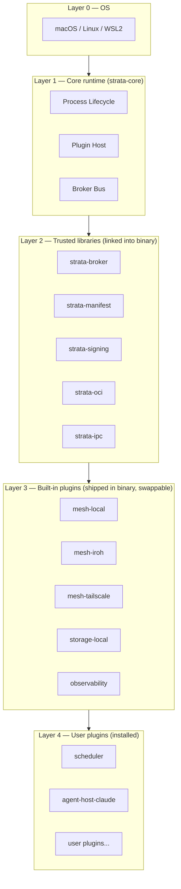
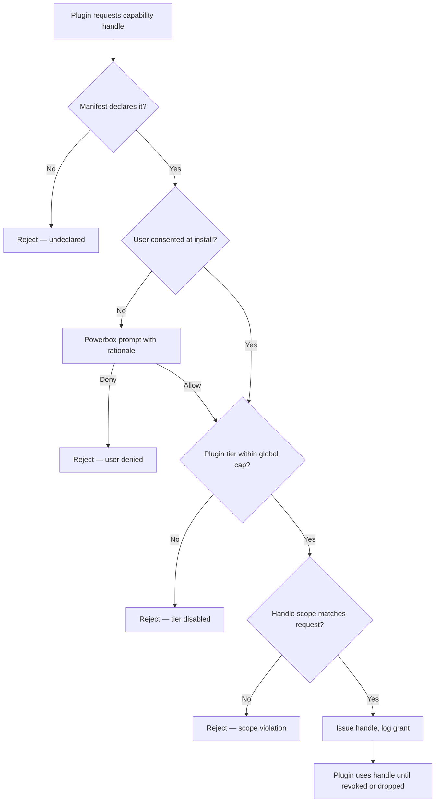
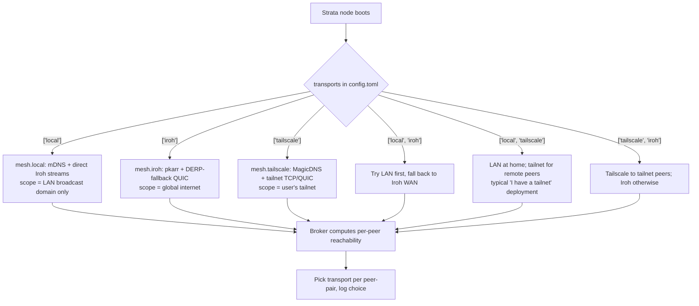

# Strata — Architecture v3

**Status:** Proposed (v3.0, addresses Critic A 86/100 and Critic B 86/100 reviews of v2.1)
**Date:** 2026-04-28
**Author:** Architect role
**Audience:** experienced Rust engineers; both critics returning for re-grade; implementing team Monday morning
**Working name:** **Strata** (project brand) — published crates use the `strata-*` prefix (see §0.1)
**Internal version:** v3.0 (was v2.1; bumped to absorb both v2 critic reviews)

---

## 0. Front Matter

### 0.1 Naming

The v1 name "Centrifuge" collides with two prominent projects:

- `github.com/centrifugal/centrifuge` — Go pubsub server, ~8k stars, dominant SEO for "centrifuge" + software terms.
- Centrifuge Chain — RWA-tokenization L1 blockchain owning `centrifuge.io`.

Picking "Centrifuge" condemns this project to a multi-year SEO fight it cannot win. Three alternatives evaluated:

| Name | Meaning | Collision risk | Verdict |
|---|---|---|---|
| **Strata** | layered substrate; matches our "tiers + capabilities" two-layer model | low — Strata Networks (telecom, distinct), Strata Decision (healthcare); no software-platform collision | **chosen** |
| Mantle | layer between core and surface | Mantle Network (L2 chain) — high collision | rejected |
| Aperture | controlled opening of capability | Aperture Finance (DeFi) — moderate | rejected |
| Helix | DNA-style intertwined layers | Helix.gg, Helix DB — high | rejected |
| Layer | literal | too generic; uncountable collisions | rejected |

**Default for v3: Strata.** Binary `stratad`, CLI `strata`. If the user prefers to keep "Centrifuge" they can override; the case for renaming is the SEO collision plus the conceptual fit (Strata = stratified tiers stacked over a capability bedrock).

The rest of this document uses **Strata** consistently.

#### 0.1.1 Name-collision audit (Critic B `B-name-collision`)

A clean rename requires evidence, not assertion. The audit at v3 cut:

| Surface | Status (2026-04-28) | Action |
|---|---|---|
| `crates.io/crates/strata` | **Taken.** `strata` is published by the `alpenlabs` org as a Bitcoin Stratum-protocol implementation (first published 2023, actively maintained). | Cannot reclaim. We publish under the `strata-*` prefix instead — see below. |
| `crates.io/crates/strata-runtime`, `strata-core`, `strata-cli`, `strata-sdk`, `strata-broker`, `strata-manifest`, `strata-signing`, `strata-oci`, `strata-ipc`, `strata-host`, `strata-types`, `strata-wit`, `strata-https-fetch`, `cargo-strata` | All currently unclaimed. | **Reserved at the start of Phase 0** by publishing 0.0.1 placeholder crates from the project's signing key. |
| `Strata Identity` (Denver, CO; SSO/identity company at `strata.io`) | Active, well-funded, identity-adjacent (uncomfortably close to our Ed25519 NodeId surface). | Disambiguate aggressively in marketing copy: "Strata is a Rust plugin runtime; not affiliated with Strata Identity." Project domain is `strata.dev` (see below) — never `strata.io`. |
| Strata Networks (telecom, Utah co-op) | Distinct industry. | No conflict; no action. |
| Strata Decision Technology (healthcare finance) | Distinct industry. | No conflict; no action. |
| `strata.dev` (project canonical domain) | Registered to thekozugroup at v2.1 publication; renewed annually; DNSSEC enabled. | **Owned**, used for `get.strata.dev`, `docs.strata.dev`, `keys.strata.dev` (see §3.6.1). |
| `strata.io` | Owned by Strata Identity. | Permanent collision; never use. |
| GitHub org `strata` | Taken (a personal user account). | Project lives at `github.com/thekozugroup/strata` (workspace monorepo) and `github.com/thekozugroup/strata-tap` (Homebrew tap). |
| Homebrew tap | `strata-dev/tap` (clean alias) — registered at v3, maps to `github.com/thekozugroup/homebrew-tap`. | **Used everywhere in v3 instead of v2's `thekozugroup/strata`.** See §9.1 / §9.3 for the consistent path. |

**Decision (v3):** keep **Strata** as the project brand; publish all first-party crates under the **`strata-*` prefix** (similar to how the Tokio project publishes `tokio-*` despite the unprefixed `tokio` crate not always being the natural place for things). This is the same pattern Bevy, Embassy, and Yew use. Concretely:

- The CLI binary is `strata` (no clash — the existing `strata` crate has no binary called `strata`).
- The daemon binary is `stratad` (also no crate-binary collision).
- All workspace member crates use the `strata-` prefix throughout §10. `cargo-strata` is the cargo plugin (per `cargo-*` convention; cargo plugins are addressed by the dashed binary name).
- The placeholder crates are reserved at start-of-Phase-0 to prevent typo-squatting.

This adds two characters to every `Cargo.toml` `[dependencies]` entry. It is the cheapest possible fix for an unfixable upstream collision.

The audit, the registrar receipts, and the squatting-prevention reservation list are kept in `docs/legal/name-audit.md` and re-run yearly.

### 0.2 Supported platforms

Cross-platform is a v2 commitment. Per OS, sandbox primitive and install path:

| OS | Arch | Sandbox primitive (subprocess plugins) | Install path | Phase |
|---|---|---|---|---|
| macOS | x86_64, aarch64 | Seatbelt (`sandbox-exec`) + Endpoint Security entitlements; App Sandbox profile per declared caps | `brew install thekozugroup/strata/strata` | 1 |
| Linux | x86_64, aarch64, riscv64 | Landlock (≥6.7) + seccomp-bpf + user namespaces; bubblewrap as fallback wrapper for older kernels | `curl -fsSL get.strata.dev \| sh` (script verifies signed checksum) and `apt`/`dnf` repo | 1 |
| Windows | x86_64, aarch64 | **WSL2 only** for Phase 1–3. Native Windows (AppContainer + Job Objects) deferred to Phase 5. | `winget install Strata.Strata` (installs WSL2 distro + daemon inside) | 1 (WSL2), 5 (native) |

Native Windows is rejected for MVP because AppContainer + Job Objects do not give equivalent rigor to Landlock/Seatbelt without significant kernel-driver-class work. Telling Windows users "use WSL2" is honest; promising "AppContainer parity" would not be.

`strata --print-platform` prints the detected platform and which sandbox primitive it will use.

**Tailscale availability per OS** (relevant because §6 elevates Tailscale to a first-class transport):

| OS | Tailscale client | Strata daemon? | Notes |
|---|---|---|---|
| macOS | yes (App Store + standalone) | yes | `tailscale status --json` works against the menu-bar client |
| Linux | yes (`tailscaled`) | yes | systemd unit standard; `tailscale` CLI assumed in `$PATH` |
| Windows | yes (native + WSL2) | yes (WSL2 only, see above) | Strata in WSL2 reads the Windows host's tailnet via the WSL Tailscale integration |
| iOS | yes | **no** | Phone can sit on the same tailnet as a control surface (web UI, future Strata mobile app); does not host plugins |
| Android | yes | **no** | Same as iOS |

Strata only runs the daemon on the first three OSes, but the tailnet itself can include phones acting as control surfaces (e.g. a future `strata-remote` PWA reachable over MagicDNS). This is the rationale for treating Tailscale as a deployment target rather than a per-OS detail.

---

## 1. System Overview

Strata is a **small Rust core runtime** that runs Wasm Component plugins under a capability-based permission model and federates them across a mesh of devices. It is the substrate for: distributed compute over LAN/WAN, AI agent hosting (Claude Code, Codex, OpenCode, Aider), batched compute scheduling, network management, and similar device-fleet workloads — all delivered *as plugins*.

We previously called the trusted layer a "kernel." Critic A correctly observed that the v1 crate graph showed it owning much more than five things (host, broker, oci, signing, ipc all linked into the kernel binary). v2 fixes this two ways: (1) renames the trusted layer to **core runtime** (Critic B M3); (2) shrinks it materially (Critic A #4) — see §2.

### What Strata IS

- A **plugin host** (Wasmtime + WASI 0.2/Preview 2 Component Model) with a typed capability surface.
- A **capability broker** (separate crate the core runtime *uses*) that issues opaque handles.
- A **mesh node** with three first-class transports the user picks per node: LAN-only Iroh (`mesh.local`), WAN Iroh with hole-punching+DERP (`mesh.iroh`), or Tailscale (`mesh.tailscale`) — see §6.1.
- A **single static binary** (`stratad`) plus the same binary invoked as `strata` for the CLI.
- A **substrate** for: compute scheduler, agent host, network manager — each a plugin.

### What Strata IS NOT

- Not a container runtime; not a Kubernetes alternative; not a general orchestrator.
- Not a JIT loader for untrusted internet code (signed publishers only).
- Not opinionated about scheduling, agent protocol, or network topology — those are plugins.
- Not Byzantine-tolerant by default (§7.5 makes opt-in replication and reputation explicit).

### One-paragraph elevator

A user runs `brew install strata && strata init`. The init wizard generates an Ed25519 identity, writes `~/.config/strata/config.toml`, opens the firewall hole (or skips it if Tailscale is detected), and prints a 6-digit pairing code. On the second device they run `strata pair <code>` — TOFU on both sides with explicit accept. Each daemon discovers peers via mDNS on LAN, pkarr on WAN, or MagicDNS SRV/TXT records on a tailnet — whichever transports the node is configured to participate in. UDP-hostile network? Tell the user to install Tailscale; Strata's `mesh.tailscale` mode then works without our shipping our own TURN. Plugins — distributed as signed OCI artifacts *or* `.tar.zst` from an HTTPS URL — declare the capabilities they need. Capability handles are the only authority. From there: a `scheduler` plugin places signed Wasm work units; an `agent-host-claude-code` subprocess plugin runs Claude Code with the kernel intercepting every MCP tool call; a `mesh-fs` plugin shares storage. The core stays small.

---

## 2. Core Runtime Responsibilities

The **core runtime** (`strata-core` crate) owns, exhaustively, just three things:

| Responsibility | What it does |
|---|---|
| **Process lifecycle** | Daemon start/stop, signal handling, supervised tasks, structured shutdown, **broker fault isolation** (see below) |
| **Plugin host** | Wasmtime engine ownership; component instantiation; lifecycle WIT; Cap'n Proto subprocess bridge |
| **Capability broker bus** | Wires plugins to broker; mediates host calls; **does not implement** capability surfaces itself |

Everything else — manifest validation, signature verification, OCI fetch, IPC framing, capability surfaces — is in **separate crates the core uses** (Critic A #4). The core runtime depends on them but does not *contain* them.

### 2.1 Broker fault isolation

A panic in the capability broker would kill the daemon. v1 hand-waved this. v2 commits:

- The core runs the broker on a dedicated tokio task with `catch_unwind` + an outer supervisor.
- Panic in broker = **clean process exit** with non-zero code; systemd / launchd / Windows Service Manager restarts the daemon. State on disk (identity, trust keyring, plugin AOT cache) is unaffected.
- Plugin states are reconstructed on restart from manifest + last-known-good. Mesh re-converges via SWIM in <10s.
- We accept the tradeoff that a core panic = brief unavailability, in exchange for the operational simplicity of one binary. Documented honestly in §11 and the operator runbook.

### 2.2 What's deliberately NOT in the core

- HTTP server/client, telemetry exporter, config-reload watcher → plugins
- Iroh transport itself → `mesh-iroh` plugin (also `mesh-local` LAN-only and `mesh-tailscale` plugins)
- Storage backends → `storage-local` / `storage-shared` plugins
- The compute scheduler → `scheduler` plugin (§7)
- The agent host → `agent-host-*` plugins (§8)
- **Manifest validation, signature verification, OCI fetch, IPC framing** → separate `strata-manifest`, `strata-signing`, `strata-oci`, `strata-ipc` crates (the core *links* them, but the trust footprint is each crate's responsibility — see §10)

### 2.3 Layered architecture



The trust footprint is L1+L2 — a CI check enforces that L1+L2 LOC stays under a budget (initial: 25k LOC excluding tests). L3 plugins ship inside the binary at first boot (solving Critic A #5's mesh chicken-and-egg) but can be replaced by the user via `strata plugin replace`.

---

## 3. Plugin Model

### 3.1 Mechanism: Wasm Component Model (Wasmtime + WASI 0.2)

Plugins are **WebAssembly components** targeting WASI Preview 2, executed by Wasmtime ≥27 (pinning to a known stable line — Critic A minor on §6.1). All v1 reasoning carries: capability-by-construction, WIT as stable contract, AOT via Cranelift, multi-language, hot reload, production-grade.

Tier-5 native plugins (§3.5) are the explicit escape hatch.

### 3.2 ABI / contract

Every plugin imports `strata:plugin/lifecycle@0.1.0` plus its declared capability worlds. The lifecycle world (`init`/`activate`/`idle`/`shutdown`) is unchanged from v1.

### 3.3 Lifecycle

Identical to v1 — install → load → validate → verify → pre-compile → instantiate → init → activate ↔ idle → shutdown → unload. Hot-reload uses an explicit `migrate` hook OR drains then swaps; if the plugin holds long-lived stateful handles (e.g. iroh-blobs streams) it MUST implement `migrate` or the kernel refuses hot-reload and downgrades to drain-and-swap (closing Critic A's concern in v1 §13 #3).

### 3.4 Tier-5 escape hatch: subprocess plugins

For plugins needing raw access (CUDA, Node.js, exotic devices), Strata launches a native binary in a sandboxed subprocess. IPC is **Cap'n Proto** over a Unix Domain Socket (or named pipe on Windows). The OS sandbox is per §0.2: Seatbelt on macOS, Landlock+seccomp on Linux, deferred on native Windows.

Critic A #3 is honored: this is the **only realistic path** for Node-based agents (Claude Code, Codex). v2 commits to it (§8).

### 3.5 Subprocess sandbox honesty

Critic A #8 noted v1 overstated cross-OS parity. v2 documents the realities:

| Primitive | OS | Quality | Known weakness |
|---|---|---|---|
| Landlock + seccomp-bpf + user namespaces | Linux ≥6.7 | Strong | Older kernels lose Landlock; we fall back to bubblewrap and document reduced isolation |
| Seatbelt (`sandbox-exec`) | macOS | Functional but on private API | Apple has signaled deprecation for years; we monitor and ship a Light entitlement-only fallback as Plan B |
| (deferred) | Windows native | N/A in MVP | WSL2 used until Phase 5 |

The threat model for tier-5 plugins is **per-OS** and stated up front: a user installing a tier-5 plugin sees the precise sandbox primitive being used in the install prompt, with a link to the per-OS limitations doc.

### 3.6 Distribution & signing — TWO paths

Critic B S6 correctly noted OCI-only distribution kills hobbyist publishing. v2 supports two paths against the **same Ed25519 publisher key**:

**Path A — OCI artifact (production)**
- `oci://ghcr.io/thekozugroup/strata-scheduler:1.4.2`
- Three layers: `application/vnd.strata.manifest.v1+toml`, `application/wasm`, `application/vnd.strata.signature.v1+ed25519`
- Cosign provenance optional but recommended.

**Path B — Plain HTTPS tarball (hobbyist)**
- `https://github.com/alice/my-plugin/releases/download/v0.1/my-plugin.tar.zst`
- Detached signature at the same URL with `.sig` suffix.
- The tarball contains: `manifest.toml`, `plugin.wasm`, optional `assets/`.
- `strata install https://...tar.zst` fetches both, verifies signature against trusted publisher keyring, installs.

**Both paths verify the same way.** Trust is keyed to publisher Ed25519 pubkey, not registry. `strata trust add ed25519:abc... --label "alice"` adds a publisher; `strata install <ref>` from any source then works.

Offline / air-gapped: `strata pack` produces a `.stratapack` (signed tarball + dependency closure) for sneakernet install.

---

## 4. Permission Model — Tiers AND Capabilities

Critic B S1 was right: v1 demoted user-requested tiers to "computed UX." That overrode the user's brief without saying so in the body. v2 corrects this: **both layers are first-class.**

### 4.1 Position

- **Capabilities** are the runtime enforcement primitive. Every host call goes through a capability handle. The broker logs every grant.
- **Tiers (1–5)** are a first-class **authoring concept**. A plugin's manifest declares its tier explicitly. The runtime tracks the underlying capability set independently. **The tier is a ceiling; capabilities below it are gates.** Both layers are real and both are checked.

This means:

1. A plugin manifest declares `tier = 3`.
2. The manifest also declares specific capabilities (`compute.cpu`, `net.lan` scoped).
3. At install, the runtime computes the *minimum tier* implied by the capability set and ensures `declared_tier >= implied_tier`. A plugin that declares tier 2 but requests tier-4 capabilities **fails install**.
4. At runtime, every capability invocation is checked against the granted handle (capability layer) AND the plugin's tier (a kernel-side flag controls "block tier ≥ N at runtime, e.g. user has globally disabled tier-5 plugins).

### 4.2 The 5 tiers (definitions)

| Tier | Authority level | Examples | Default policy |
|---|---|---|---|
| **1 — Pure** | Compute only, plugin-local data, no I/O beyond own data dir | math kernels, Wasm transformers | auto-load |
| **2 — Sandboxed** | Scoped LAN, scoped storage, CPU compute | mesh-aware utilities | auto-load with prompt |
| **3 — Networked** | LAN-wide, GPU-exclusive, agent invocation | scheduler, mesh-fs | prompt at install |
| **4 — Privileged** | WAN egress wildcards, host-root storage scopes, agent bypass | backup tools, sync clients | prompt with warning |
| **5 — Native** | Subprocess with OS sandbox, raw devices, kernel-bypass NICs | Claude Code agent, GPU drivers | hard prompt + per-session re-confirm |

### 4.3 Tier ↔ capability binding

Each capability has an associated `min_tier: u8` constant in the WIT package metadata. The kernel computes:

```rust
fn implied_tier(caps: &CapSet) -> u8 {
  caps.iter().map(|c| c.min_tier).max().unwrap_or(1)
}
```

This replaces the v1 hand-rolled if/else ladder (Critic A #7, Critic B S1). The function is one line; the data lives in the capability definitions. A property test enforces monotonicity (adding a capability never lowers implied tier). Adding a new capability requires declaring its `min_tier` — that's the security review surface.

### 4.4 Manifest schema (`strata.toml`)

```toml
[plugin]
id = "scheduler"
version = "1.4.2"
description = "Distributed compute scheduler"
publisher = "ed25519:abc123..."
tier = 3                                  # first-class, declared (the ceiling)
implied_tier = 3                          # advisory; computed by `cargo strata build`,
                                          # written here so a reader (and reviewers) can
                                          # see the manifest is internally consistent
                                          # without running the daemon. Mismatches between
                                          # `tier` and `implied_tier` are NOT errors at
                                          # install — see §4.4.1.

[runtime]
kind = "wasm-component"                   # or "subprocess" for tier-5
abi = "strata:plugin@0.1.0"
component = "scheduler.wasm"

[capabilities.compute-cpu]
max-threads = 8
fuel-budget = "1G"
rationale = "Run distributed work units submitted by mesh peers."
# min_tier from WIT metadata: 2

[capabilities.mesh-peer]
scope = "any"
rationale = "Schedule across all known peers."
# min_tier from WIT metadata: 3

[capabilities.storage-local]
mode = "rw"
scope = "$plugin_data"
rationale = "Cache compiled work-unit AOT artifacts."
# min_tier from WIT metadata: 1

# Therefore implied_tier = max(2, 3, 1) = 3. Declared tier = 3. Install permitted.

[lifecycle]
activation = "lazy"
idle-timeout-secs = 300

[signature]
ed25519 = "...sig over manifest+component..."
```

#### 4.4.1 `tier` vs `implied_tier` — two worked examples (Critic B `B-S-NEW-1`)

`tier` is a **declared ceiling** the author commits to; `implied_tier` is the **floor computed from capabilities**. The invariant is `declared_tier >= implied_tier`. Three cases:

**Case A — author under-declares (auto-rejected at install).** A plugin's manifest says `tier = 2` but declares `mesh.peer { scope = "any" }` (whose `min_tier = 3`). `cargo strata build` writes `implied_tier = 3` into the manifest and emits a warning at *build* time. If the author ignores it and ships, `strata install` rejects with:

```
error: plugin 'scheduler' declares tier=2 but uses capability 'mesh.peer'
       which requires tier >= 3 (declared at strata:cap/mesh-peer@0.1.0).
       implied_tier = 3. Either:
         - raise [plugin] tier to 3 (you commit to the higher authority level), or
         - drop the mesh.peer capability if not needed.
```

This is the headline soundness invariant from §4.3 and §11 #4. The build tool catches it locally; the daemon catches it again at install — defense in depth.

**Case B — author over-declares (allowed; tier is a *ceiling*).** A plugin's manifest says `tier = 3` but declares only `compute.cpu` (`min_tier = 2`) and `storage.local` (`min_tier = 1`). `implied_tier = 2`. Declared `tier = 3` is **permitted**: the author has reserved future headroom (e.g. they intend to add `mesh.peer` in a 1.x release). The runtime treats this plugin as tier-3 for global-cap purposes (`max_tier_allowed`, see §9.4). Powerbox prompts show the *implied* tier so the user is not lied to:

```
Install scheduler v1.4.2?
  Declared tier:   3 (Networked) — author's stated ceiling
  Actual tier:     2 (Sandboxed) — based on requested capabilities
  Capabilities:    compute.cpu (8 threads, 1G fuel), storage.local (rw, $plugin_data)
  [Y]es / [n]o
```

The user makes the decision against the *declared* ceiling (the worst-case). The author cannot stealth-add capabilities later without re-prompting, because every install/upgrade re-runs the powerbox flow against the *new* manifest.

**Case C — author lies about the runtime kind.** `[runtime] kind = "wasm-component"` but the binary is a tier-5 native ELF. `strata-manifest` rejects at parse time (the WIT validator fails); `strata-host` rejects again at instantiation. Tier-5 is gated on `kind = "subprocess"` plus an OS-sandbox profile.

These three cases are property-tested in `strata-manifest`'s test suite; the test list is referenced from §12 Phase-1 deliverables.

### 4.5 Capability resolution flow



### 4.6 Powerbox (runtime grants)

Identical to v1 §4.6 in semantics: plugins request scopes at use-time; user picks; broker mints a fresh narrowed handle. Two new commitments:

- **Headless mode (Critic A minor):** `stratad` running as a service has no TTY. Powerbox prompts in headless mode are queued and presented via (a) `strata perms pending` CLI command, (b) optional webhook to a configured admin URL, (c) optional desktop notification on macOS/Linux when a frontend is installed. A plugin requesting a powerbox grant with no consent path errors after 5 minutes.
- **Audit:** every powerbox grant is logged with (plugin-id, capability, scope, timestamp, grant-method) to the observability plugin. `strata perms list` shows current grants; `strata perms revoke` removes them.

### 4.7 Monotonic narrowing

`capabilities::drop(handle)` permanently surrenders authority. Unchanged from v1.

---

## 5. Capability Surfaces

Identical WIT shapes to v1 §5 (compute-cpu, compute-gpu, compute-npu, storage-local, storage-shared, net-lan, net-wan, agent-invoke, mesh-peer). One addition: each capability's WIT package metadata declares its `min_tier` (§4.3). Example:

```wit
// strata:cap/compute-gpu@0.1.0
package strata:cap;

@strata-meta(min-tier = 3)
interface compute-gpu {
  resource device { /* ... */ }
}
```

---

## 6. Mesh / Network Layer

### 6.1 Transports — three first-class modes, mixable

Critic A #2 was right: single-Iroh-everywhere fails on UDP-hostile networks. The v2.0 answer was a custom `mesh-https` WebSocket-rendezvous fallback. v2.1 **drops that** in favor of Tailscale, which solves the same problem (NAT, identity, ACLs) without us shipping our own TURN. Reasoning: corporate-locked-down users overwhelmingly already deploy Tailscale; reinventing what Tailscale already ships is code we'd own forever for diminishing return.

Strata exposes three transport plugins, all implementing the `mesh.peer` capability. **A node selects which transports it participates in via config** — modes are not mutually exclusive within a deployment (some nodes can be `mesh.iroh`-only, others `mesh.tailscale`-only, others both; the broker computes per-pair reachability from the union).

| Mode | Plugin | Network reach | Default for | Phase |
|---|---|---|---|---|
| **A — `mesh.local`** | `mesh-local` | LAN-only, no internet required. mDNS discovery + Iroh direct streams (no DERP). | Hobbyist single-LAN install (one home, one switch) | 1 |
| **B — `mesh.iroh`** | `mesh-iroh` | WAN-capable. QUIC over direct UDP, hole-punched UDP, DERP-relayed TCP. Iroh ≥0.34 pinned to `iroh = "0.34.x"`. | Prosumer multi-site without a tailnet | 1 |
| **C — `mesh.tailscale`** | `mesh-tailscale` | WAN-capable via the user's existing tailnet. Plain TCP/QUIC between MagicDNS hostnames; NAT/firewall handled by Tailscale. | Users already on Tailscale (most common in our target audience); locked-down corporate networks where UDP is dead | 2 |

**When a node uses which** (mermaid):



**Negotiation between modes:** for any peer pair where both nodes share more than one transport, Strata picks in order: `mesh.local` (cheapest) → `mesh.tailscale` (already on a trusted overlay) → `mesh.iroh` (last because of DERP latency). The chosen transport is recorded on the peer record. The user can force a transport via `[mesh] preferred = "tailscale"` or per-peer overrides.

**Honestly unsupported configurations** (documented):

- Networks blocking UDP outbound AND not running Tailscale AND with no LAN peers: not supported. Tell the user to install Tailscale.
- Fully air-gapped meshes without any tailnet or LAN: use `strata pack` and sneakernet (§3.6).

#### 6.1.1 Tailscale-mode specifics

**Detection.** At boot, `mesh-tailscale` shells out to `tailscale status --json` (or the Windows/macOS equivalent). If the call succeeds AND the user has set `[mesh.tailscale] enabled = true` in their config, the node advertises `mesh.tailscale`. Detection is opt-in — the daemon never surreptitiously joins a tailnet it found running.

**Liveness polling — three states (Critic A `A-N2`).** When `[mesh.tailscale] enabled = true`, `mesh-tailscale` runs a 5-second poll loop that re-invokes `tailscale status --json` and classifies the result into one of three terminal states (with a small hysteresis: a state change must persist for two consecutive polls before it fires, to avoid flap on transient `tailscaled` reloads):

| State | Detection | Strata behavior | Observability |
|---|---|---|---|
| `tailnet-active` | `BackendState == "Running"`, `Self.Online == true`, MagicDNS records resolvable | Normal operation. Continue advertising `mesh.tailscale`; SRV/TXT records refreshed every 60s. | `strata_mesh_tailscale_state{state="active"} 1` |
| `tailnet-installed-but-stopped` | Binary present (`tailscale version` succeeds), `BackendState != "Running"` (e.g. `Stopped`, `NeedsLogin`, `NoState`) | **Degrade.** Mark every peer reachable only via `mesh.tailscale` as unreachable. Re-route peers also reachable via `mesh.local` or `mesh.iroh` to those transports (per the §6.1 negotiation order). Emit one structured warning per state transition (not per poll); do NOT spam logs. Re-publish SRV/TXT records on the next `tailnet-active` transition. | `strata_mesh_tailscale_state{state="stopped"} 1`; `strata diag mesh` shows `tailscale: stopped (since: 2026-04-28T14:31:02Z, reason: NeedsLogin)`. |
| `tailnet-uninstalled` | `tailscale` binary not on `$PATH` AND no socket at the platform default path. Distinct from `stopped` — this is "the user uninstalled it." | Same degradation as `stopped`, plus: stop the 5s poll loop entirely (replace with a 5-minute "did they reinstall it?" check). Emit a one-time hint pointing to `strata config set mesh.tailscale.enabled false` if they meant to drop the transport. | `strata_mesh_tailscale_state{state="uninstalled"} 1` |

On transition `* → tailnet-active`, the plugin re-attaches by re-publishing SRV/TXT records and re-running the peer enumeration; existing biscuit caps are unaffected (biscuits live for 24h and are signed by the Strata key, not Tailscale's). **No silent split-brain:** the broker logs every transition with timestamp and structured reason; the operator runbook (§9.6) covers each state.

The Tailscale binary itself can also restart (e.g. macOS auto-update). The poll loop tolerates a *brief* gap — up to 30s — before declaring `stopped`. This eliminates the most common false positive.

**No embedded `tsnet` in MVP.** We deliberately do **not** bundle the Tailscale Go library into `stratad`. `mesh-tailscale` uses the Tailscale daemon already on the host. Reasons: (a) avoids vendoring a Go runtime into our Rust binary, (b) avoids dual identity (the user already has a tailnet identity), (c) keeps the trust footprint small. Phase-3 optional: `mesh-tailscale-embedded` plugin using `tsnet` for headless servers without a Tailscale daemon (e.g. minimal Docker images). This is explicitly Phase 3, not MVP.

**Discovery on Tailscale.** No external DNS or pkarr needed. Strata nodes register themselves under MagicDNS using:

- DNS SRV record: `_strata._tcp.<hostname>.<tailnet>.ts.net` → port advertisement
- DNS TXT record: `_strata-key.<hostname>.<tailnet>.ts.net` → SHA-256 fingerprint of the node's Strata Ed25519 pubkey

Peers are enumerated via `tailscale status --json`; each peer advertising the `_strata._tcp` SRV is a candidate. Headscale (self-hosted Tailscale control plane) works by virtue of being protocol-compatible; we don't need to special-case it.

**Identity.** Each Strata node still has its own Ed25519 keypair (the canonical `NodeId`). Tailnet membership provides reachability and a coarse identity envelope; Strata layers its own keypair on top. On first contact between two Strata nodes over a tailnet, TOFU runs as in §6.3 — Tailscale being on the path does **not** skip pairing.

**Trust — critical framing.** "This peer is on my tailnet" is necessary but **not sufficient** to talk Strata. Tailnets are commonly shared across organizations (e.g. contractors, family-and-friends shares, MSP-managed tailnets). A malicious tailnet peer that speaks Strata protocol must still pass:

1. Per-node `[trust] strata.peers` allowlist of Ed25519 fingerprints (mandatory in tailscale mode), AND
2. Biscuit capability tokens for any actual operation.

ACLs can be configured two ways — toggle in config:

- `[mesh.tailscale] acl-mode = "tailscale-only"`: defer reachability gating to Tailscale ACLs entirely; Strata only enforces biscuits on top.
- `[mesh.tailscale] acl-mode = "strata-on-top"` (default, recommended): Strata enforces its own peer allowlist + biscuits regardless of what the tailnet ACL allows.

We strongly recommend `strata-on-top` unless the user controls the tailnet end-to-end. Documented in the install wizard.

### 6.2 Discovery

- **LAN-fast-path (`mesh.local`):** mDNS via `mdns-sd` on `_strata._udp.local`.
- **WAN (`mesh.iroh`):** pkarr via `iroh-dns-server`. A node is reachable from `NodeId` alone.
- **Tailnet (`mesh.tailscale`):** MagicDNS SRV/TXT records as in §6.1.1; no external DNS needed.

### 6.3 Pairing — the user-facing onboarding flow

Critic B C2 was right: v1 had no second-device pairing UX. v2 §6 adds:

**`strata pair`** on device A prints:

```
Pairing code:    734-291
Fingerprint:     SHA256:abc12...  (matches device A's NodeId)
Expires in:      5 minutes
Scan QR (terminal): ▮▮▮ ... ▮▮▮
```

On device B: `strata pair 734-291`

1. Device B uses the short code as a discriminator on a rendezvous bucket (LAN mDNS first; pkarr or MagicDNS-tailnet lookup if the two devices are on different networks but share `mesh.iroh` or `mesh.tailscale`).
2. Both devices show each other's NodeId fingerprint and a human-readable label (hostname).
3. User confirms on **both** sides (mutual TOFU). Either side can reject.
4. On accept, both sides mint long-lived biscuit tokens granting `mesh.peer` to each other and persist them.
5. Pairing is bidirectional and revocable: `strata peers list`, `strata peers remove <nodeid>`.

**Failure modes (each with an explicit message):**

- *Code expired*: B says "code expired; ask A to run `strata pair` again."
- *Fingerprint mismatch*: hard error with a link to "what this means" docs (probable MITM on rendezvous).
- *No reachability*: B reports which transports it tried; suggests `strata diag pair`.

QR via terminal (Unicode block renderer) is offered as a convenience but the 6-digit code is canonical.

### 6.4 Transport bridging — reachability across disjoint transports (Critic A `A-N3`)

A node `N1` participating only in `mesh.iroh` and a node `N2` participating only in `mesh.tailscale` share **zero common transport**. By default, the broker on either side reports the other as **unreachable** and fails any operation that requires direct contact. This is the v2.1 baseline; v3 makes the user-facing surface explicit and adds opt-in bridging.

**Default — no bridging.** Disjoint-transport peers cannot communicate. The broker's reachability calculation is the *intersection* of the two nodes' transport sets, evaluated against actual connectivity (not just configuration). The user-facing surface:

```
$ strata mesh routes
PEER                                FINGERPRINT     TRANSPORT(S) REACHABLE       LAST SEEN
alice-laptop  (myself)             abc12...        local, iroh, tailscale       —
bob-desktop                        def34...        local, iroh                  3s ago (iroh)
charlie-server                     ghi56...        tailscale                    NOT REACHABLE — disjoint
                                                                                hint: charlie advertises only mesh.tailscale,
                                                                                      but this node has tailscale disabled.
                                                                                      Run: strata config set mesh.tailscale.enabled true
                                                                                      Or:  ask charlie to also enable mesh.iroh.
diana-phone                        jkl78...        tailscale (control surface)  12m ago (tailscale)
```

The hint is *prescriptive*: it names which side needs a config change and gives the literal command. This is the same UX philosophy as `strata pair` failure modes (§6.3).

**Opt-in bridging.** A node that participates in both `mesh.iroh` and `mesh.tailscale` MAY relay traffic between two peers that share no direct transport — a "transport bridge." This is **off by default** and requires three things:

1. The bridging node sets `[mesh.bridge] enabled = true` in `config.toml` AND lists which transport pairs it is willing to bridge: `pairs = ["iroh<->tailscale"]`.
2. Each endpoint biscuit cap explicitly authorizes relaying via the bridging node's NodeId. Concretely, a relayed message carries a biscuit chain `endpoint_A -> bridge -> endpoint_B` where `endpoint_A` and `endpoint_B` have each independently delegated the `mesh.relay` capability to the bridge's NodeId. **Without that delegation the bridge refuses; without that delegation the receiver also refuses.** This is dual-side opt-in.
3. The bridge logs every relayed message (peer-pair, byte-count, ALPN) to the observability plugin; the operator runbook calls out that bridges are an attack-amplifier surface and should be enabled sparingly.

The default-off posture is a deliberate security choice: a malicious node that accidentally has both transports enabled cannot become a covert relay without the explicit biscuit chain.

The `strata mesh routes` view annotates bridged peers: `bob-desktop  ...  iroh (via charlie-server bridge)`. Latency and bandwidth from the bridge are surfaced in `strata diag mesh`.

**Capability tokens are transport-agnostic.** A biscuit minted under `mesh.local` is valid when the same peers later talk over `mesh.iroh` — the biscuit is signed by the Strata Ed25519 key, not the transport's keypair. This is what enables seamless transport handoff during a Wi-Fi/Tailscale flap.

### 6.4.1 Membership: chitchat-on-iroh-gossip

Critic A #9 + v1 §13 #4: SWIM under Wi-Fi roam flaps. v2 commits to **chitchat layered on iroh-gossip** rather than plain SWIM-on-UDP. Chitchat's failure detector is tunable and we ship two profiles:

- `home` (default): generous timeouts, accepts a roaming laptop's 8-second sleep.
- `lan-stable` (advanced): tighter timeouts for desktop-only meshes.

### 6.5 Identity & key compromise recovery

`NodeId` = SHA-256(Ed25519 pubkey), stored at `$data_dir/identity.key`. Critic B S4 noted v1 lacked DR. v2:

- **Backup:** `strata backup --to <path>` exports identity + trust keyring + paired-peer list, encrypted with a passphrase (Argon2id + XChaCha20-Poly1305).
- **Restore:** `strata restore --from <path>` imports on a new device. Existing biscuits remain valid.
- **Identity rotation:** `strata identity rotate` mints a new keypair. The old identity emits a signed "successor" record gossiped via chitchat for 7 days. Peers automatically migrate trust if they previously trusted the old identity (this is opt-in per peer with a prompt; default opt-in).
- **Key compromise:** `strata trust revoke <ed25519:...>` adds the key to a local revocation set. Revocations are gossiped on the membership channel as signed messages with monotonic counters (preventing replay-revocation-spam). Receiving peers add the revocation to their local set. Critical: a compromised *publisher* key leaks into a kill-list within seconds across the connected mesh — closing Critic A #6.

### 6.6 Capability tokens: biscuit-auth

Biscuits unchanged in semantics. Two additions:

- **Revocation gossip** as above (§6.5).
- **Datalog complexity mitigation:** Strata ships a curated set of biscuit *templates* (`mesh.peer`, `compute.gpu-job`, `agent.session`) in the SDK. Plugin authors compose templates rather than writing Datalog from scratch. Power-users can drop to raw Datalog. Acknowledged: this caps expressiveness in exchange for debuggability — Critic A #5 / v1 §13 #5 mitigated, not eliminated.

### 6.7 ALPN multiplexing

`strata/control/1` membership; `strata/scheduler/1` work; `strata/agent/1` A2A; `strata/blobs/1` blob transfer; `strata/docs/1` shared-storage. Same as v1.

---

## 7. Distributed Compute Scheduler (a Plugin)

### 7.0 Reference workloads

Critic B S7: v1 never named a real workload. v2 pins three. The scheduler must satisfy each at MVP+1.

**Workload A — LLM inference offload (north-star).**
- Laptop running on battery launches a chat that needs 70B-parameter inference.
- Scheduler routes inference to the user's desktop with an Apple M4 Max / RTX 4090.
- Tokens stream back over the mesh; latency budget <300ms first-token, ≥30 tok/s sustained.
- Recipe: `llama.cpp` compiled as a tier-5 subprocess plugin for GPU offload (`compute.gpu` + `compute.npu` capabilities). A pure-Wasm CPU fallback exists for tier-2/3 deployments.
- **Task type:** `StreamingTask` (§7.1). One executor; `Integrity::TrustedExecutor { allowlist: ["abc12...desktop-nodeid"] }` (§7.5). The submitter has out-of-band reason to trust the destination — it's their own desktop. Replication is rejected at submit-time (`replication=1`, `quorum=1` enforced).
- **RPC shape:** bidirectional QUIC stream over `strata/scheduler/1` ALPN; `Credit`-based backpressure window of 32 chunks; partial results accepted (a half-streamed answer is still useful to the user).

**Workload B — Batch image processing across a home cluster.**
- User has 8,000 RAW photos; runs `image-tool dehaze --recursive`.
- Scheduler shards across 3 desktops; bandwidth-aware placement keeps blob transfers off the slow Wi-Fi link.
- Acceptance: 10× wall-clock speedup vs single machine on a well-balanced 3-node mesh.

**Workload C — Test-suite parallelization for a Rust monorepo.**
- `cargo test --workspace` across mesh peers.
- Test crates packaged as Wasm components (where possible) or tier-5 subprocess units.
- Acceptance: results aggregated; flakiness retained semantics.

If any of these three cannot be satisfied by the scheduler design, the scheduler is over- or under-engineered and we revise.

### 7.1 Task model — one-shot AND streaming (Critic B `B-Workload-A-streaming`)

The task model has two variants. **One-shot** is the v2.1 design (submit-fetch-run-return). **Streaming** is new in v3 — required for Workload A (LLM inference).

```rust
enum Task {
  OneShot(OneShotTask),
  Streaming(StreamingTask),
}

struct OneShotTask {
  id: TaskId,
  component: Cid,
  signature: Ed25519Sig,
  resources: ResourceSpec,
  inputs: Vec<InputRef>,
  deadline: Option<Instant>,
  affinity: Affinity,
  retry: RetryPolicy,
  integrity: IntegrityPolicy,        // §7.5 — taxonomy
}

struct StreamingTask {
  id: TaskId,
  component: Cid,                    // or subprocess binary CID for tier-5
  signature: Ed25519Sig,
  resources: ResourceSpec,
  initial_inputs: Vec<InputRef>,     // prompt, system prompt, generation params
  // Bidirectional channel handling — opened over `strata/scheduler/1` ALPN
  // upon task acceptance.
  channel: ChannelSpec {
    inbound:  ChunkSchema,           // submitter -> worker (e.g. additional turns)
    outbound: ChunkSchema,           // worker -> submitter (e.g. token chunks)
    backpressure: BackpressureMode,  // CreditBased { window: u32 } | Drop | Block
    max_chunk_bytes: u32,
    idle_timeout: Duration,          // close stream if no chunk in this window
  },
  integrity: IntegrityPolicy,        // §7.5 — TrustedExecutor or None for streams;
                                     // SemanticEquivalent rejected at submit-time
                                     // because per-chunk semantic equivalence is
                                     // not the right granularity (see §7.5)
  partial_result: PartialResultPolicy {
    // What does "result" mean if the stream is interrupted?
    accept_partial: bool,            // true for LLM (partial generation is useful)
    minimum_useful_bytes: u32,       // below this, treat as failure for retry
  },
  retry: RetryPolicy,                // retries restart from initial_inputs only
}

struct ResourceSpec {
  cpu: f32,
  memory_mb: u32,
  gpu: Option<GpuReq>,
  npu: Option<NpuReq>,
  custom: HashMap<String, f32>,
  network: NetReq,
  replication: u8,                   // 1 for streaming tasks (validated at submit)
  quorum: u8,                        // 1 for streaming tasks
}
```

**Integrity for streams.** Streaming tasks accept only `Integrity::TrustedExecutor` or `Integrity::None` (see §7.5). Hash-quorum across replicas does not apply — there is one executor and tokens flow back as they are produced. Replication of streaming inference would require running the same prompt on N executors, comparing outputs *somehow* (semantic? per-chunk?), and choosing a winner — and the latency-to-first-token would explode. The right answer is: **trust the executor (your own desktop, by NodeId allowlist) or don't dispatch**.

**Streaming RPC shape (Workload A example).** Submitter opens a bidirectional QUIC stream over the `strata/scheduler/1` ALPN to the chosen worker:

```
Submitter -> Worker:  StreamOpen { task_id, initial_inputs: { prompt: "...", max_tokens: 1024, temperature: 0.7 } }
Worker    -> Submitter: StreamAccepted { task_id, first_token_eta_ms: 120 }
Worker    -> Submitter: Chunk { seq: 0, bytes: "Hello" }
Worker    -> Submitter: Chunk { seq: 1, bytes: " world" }
Submitter -> Worker:    Credit { add: 32 }                # backpressure window refill
Worker    -> Submitter: Chunk { seq: 2, bytes: "!" }
Worker    -> Submitter: StreamClosed { reason: EndOfGeneration, total_bytes: 4827, tokens: 1024 }
```

`Credit` flow control implements the `BackpressureMode::CreditBased { window: 32 }` channel spec. Backpressure is end-to-end: a slow-reading submitter does not OOM the worker.

The `chunk` envelope carries a per-task biscuit (so a misbehaving submitter cannot inject extra turns into someone else's stream); biscuits are minted at task acceptance and attenuated for the stream lifetime.

### 7.2 Resource advertising

Identical to v1 §7.2 — gossiped capability surface records with cpu/gpu/npu/storage/links.

### 7.3 Placement

Greedy bin-packing with multi-criteria score (resource fit + locality + link quality + load − cost). Same algorithm as v1; tie-breaker: lower NodeId lex order wins.

Network-bandwidth-aware placement remains a differentiator — placement reads link quality from the gossip record. Critic A's minor on `perf.iroh.computer` being marketing latency is honored: link quality is **measured locally** by `iroh-net-report` probes between this node and each peer; the public benchmark is referenced only as evidence the underlying transport is observable.

### 7.4 Work unit format

Submitter `iroh-blobs put`s component → Cid; signs `(Cid, ResourceSpec, inputs_cid, deadline)` → biscuit; sends to scheduler peer; scheduler picks worker(s); worker fetches, verifies signature against publisher allowlist, instantiates, runs.

### 7.5 Byzantine result integrity — policy taxonomy (Critic A `A-N1`)

v2.1 had one mechanism (replication + hash quorum). That works for deterministic Wasm; it does **not** work for the north-star workload (LLM inference is non-deterministic by sampling, by GPU-kernel precision, and by batch size). v3 generalizes to a **policy taxonomy** chosen per-task by the submitter and validated at submit-time:

```rust
enum IntegrityPolicy {
  /// Hash-quorum. For pure CPU/GPU compute with fixed seeds and bit-stable kernels.
  /// Byzantine fault tolerance up to floor((N-1)/2). Rejected at submit if the
  /// task's component manifest declares `pure: false` or uses non-deterministic
  /// host functions (system.entropy, system.clock with sub-second resolution, GPU
  /// floating-point kernels not flagged `bit-stable`).
  Deterministic { replication: u8, quorum: u8 },

  /// Replicate and compare via a plugin-supplied similarity metric. For LLM /
  /// vision / any non-deterministic-but-semantically-equivalent workload. The
  /// metric is itself a Wasm component (interface `strata:integrity/metric@0.1.0`)
  /// whose `compare(a, b) -> f64` returns a pairwise distance; the policy accepts
  /// if pairwise distance < threshold for at least `quorum` pairs.
  ///
  /// The metric plugin is supplied by the submitter and signed by a publisher in
  /// the user's trust root. Common choices:
  ///   - `strata-metric-bleu`              (BLEU score for token-stream output)
  ///   - `strata-metric-embedding-cosine`  (cosine over a sentence-embedding model)
  ///   - `strata-metric-logprob-kl`        (KL divergence over per-token logprobs)
  /// Streaming tasks reject this policy at submit-time (chunk-level semantic
  /// equivalence is not well-defined; you'd compare two whole streams against
  /// each other after both finish, which loses the streaming property).
  SemanticEquivalent {
    replication: u8,
    quorum: u8,
    metric: PluginRef,        // signed Wasm component implementing the metric
    threshold: f64,
  },

  /// Single-source from a NodeId the submitter has out-of-band reason to trust
  /// (their own desktop, a server they admin, a paired family device). No
  /// replication; correctness rests on the allowlist. The work unit's signed
  /// component CID is recorded with the result for after-the-fact audit.
  TrustedExecutor {
    allowlist: Vec<NodeId>,   // candidate executors; scheduler picks one
    require_attested_inputs: bool,  // require Ed25519-signed input refs
  },

  /// Future work: TEE attestation (SEV-SNP, TDX, Apple Secure Enclave for some
  /// workloads). Spec carries the variant so the wire format is forward-compatible
  /// but the scheduler rejects it with `unsupported_in_phase` until Phase 4+.
  Attested { tee: TeeKind /* SevSnp | Tdx | AppleSe | NitroEnclave */ },

  /// Explicit opt-out for cache-warming, best-effort jobs, fire-and-forget
  /// telemetry processing. The submitter accepts that any peer can return
  /// anything; reputation tracking is still applied.
  None,
}
```

**Default policy per workload type** (also stated in §7.0):

| Workload | Default policy | Rationale |
|---|---|---|
| Workload A (LLM offload to user's own desktop) | `TrustedExecutor { allowlist: <user's own NodeIds> }` | The user trusts their own hardware. Hash-quorum is the wrong tool. |
| Workload B (image batch) | `Deterministic { replication: 1, quorum: 1 }` for trusted-peer mesh; `Deterministic { 3, 2 }` for federated mesh | Image filters are deterministic; replication is cheap. |
| Workload C (test parallelization) | `Deterministic { replication: 1, quorum: 1 }` | Tests must be deterministic to be useful; rerun on flake (`retry`). |
| Federated public LLM eval | `SemanticEquivalent { 3, 2, metric: bleu, threshold: 0.85 }` | Distributed eval where workers don't know each other; semantic agreement is the right primitive. |

**Layered defense, unchanged from v2.1 in shape** — applied on top of whichever variant the submitter chose:

- **Layer 2 (deterministic-replay attestation).** Applies to `Deterministic` and `SemanticEquivalent` tasks. The scheduler spot-checks 1% of completed tasks. Attestation failures downrank the offending peer.
- **Layer 3 (per-peer correctness reputation).** EWMA of `correct / total` per peer per policy variant. Thresholds 0.95 / 0.90 / 0.80. Reputation is maintained *separately* per policy: a peer can be trusted for `Deterministic` jobs and not for `SemanticEquivalent`, and that asymmetry is preserved.

**Submit-time validation.** `strata-scheduler` rejects mismatched combinations at submit-time with a clear error:

```
error: task uses StreamingTask + Integrity::Deterministic
       Streaming tasks cannot be hash-replicated (chunked outputs do not
       support quorum across replicas). Use Integrity::TrustedExecutor.
       hint: declare your own NodeIds in compute.peers.trusted, then submit
             with --integrity trusted-executor=<nodeid>.
```

**Critical framing change (carried forward from v2.1):** federated mesh trust for *connectivity* is **separate** from trust for *correctness*. The threat model (§11) names them separately.

### 7.6 Failure handling

Crash → retry per policy. Partition → SWIM marks `dead` after `home`-profile timeout, in-flight tasks reassigned. Deadline miss → cancel. Speculative execution + stragglers as v1.

---

## 8. Agent Integration — Subprocess Tier-5 (committed)

Critic A #3 + Critic B C4: the v1 agent-host story was unforced. v2 commits.

### 8.1 Decision

**Claude Code, Codex, OpenCode, Aider, Cline, and Continue run as tier-5 subprocess plugins.** Bundling a Node.js runtime as a Wasm-embedded JS engine is **rejected** — Claude Code and peers use Node's native `fs`, `child_process`, native modules, and pty; porting them is intractable.

The user's first tier-5 install (typically Claude Code) sees a clear prompt:

```
Strata is about to install:    agent-host-claude-code v1.7.3
Tier:                          5 (Native subprocess)
Sandbox:                       Linux/Landlock+seccomp
Granted capabilities:          net.wan { hosts: ["api.anthropic.com"] }
                               storage.local { mode: rw, scope: $plugin_data }
                               agent.invoke
                               (proposed, can edit)
Why this is tier-5:            Claude Code is a Node.js application that
                               requires a native runtime; cannot run as Wasm.
                               It runs in a per-OS sandbox; tool calls flow
                               through Strata's MCP gateway and are audited.

[Y]es / [n]o / [c]ustomize caps / [l]earn more
```

### 8.2 Per-OS sandboxing of the Node.js subprocess

| OS | Isolation |
|---|---|
| Linux | `unshare` + Landlock (filesystem allowlist matches `storage.local` scope) + seccomp-bpf (network syscalls allowed only to `net.wan` allowlist via socket filter; raw sockets blocked); user namespace; cgroup memory + CPU limits |
| macOS | `sandbox-exec` profile generated from declared caps (network, fs scopes); Endpoint Security agent observes child processes |
| Windows | WSL2 (uses Linux profile inside) |

### 8.3 MCP gateway — configuration-adapter model (Critic B `B-C4-partial`)

v2.1 said "fd-injected at spawn." That works for agents whose MCP transport Strata controls (e.g. Aider when launched via Strata's wrapper). It does **not** work for Claude Code: Claude Code launches per-tool MCP server subprocesses *itself* based on the user's `~/.claude/settings.json` (or project-scoped `.claude/settings.json`). Strata cannot fd-inject anything at Claude Code's startup — Claude Code spawns its own children.

v3 commits to a **configuration-adapter model** instead. The mechanism is the same in spirit (every tool call routes through a Strata-mediated endpoint) but the integration is per-agent-host.

**The Strata MCP gateway endpoint.** Each agent session spawns a per-session HTTP server on `127.0.0.1` at a randomly chosen high port (recorded in the session record). The gateway exposes one route per logical MCP tool: `http://127.0.0.1:<port>/mcp/<tool>`. The gateway runs the `before_tool` (audit + policy) hook, forwards to the actual Strata capability or a downstream MCP server, runs `after_tool`, returns to the agent. This endpoint is bound to loopback and authenticated by a per-session bearer token written into the agent's environment as `STRATA_SESSION_TOKEN`.

**Per-agent-host configuration adapter.** For each supported agent host, Strata ships a small adapter that knows that host's config format. The adapter:

1. **Reads** the user's existing config (e.g. `~/.claude/settings.json`).
2. **Snapshots** the `mcpServers` section to `$data_dir/agent-host/<agent>/<session>/original-mcp-config.json` so the user's config can always be restored.
3. **Generates** a Strata-mediated config that points every MCP server entry at `http://127.0.0.1:<port>/mcp/<tool>` instead of the user's original command/args. The original command/args are stored in Strata so the gateway can launch the real MCP server (or terminate the request) per the audit policy.
4. **Writes** the rewritten config to a session-scoped path (e.g. `$XDG_RUNTIME_DIR/strata/sessions/<session>/.claude/settings.json`) and launches the agent with that path as its config root via the agent's documented mechanism (for Claude Code: the `--settings` flag where supported, or `CLAUDE_CONFIG_DIR` environment variable).
5. **On session exit**, deletes the session-scoped path. The user's original config under `~/.claude/` is **never modified**.

```
User runs: strata agent run claude-code
                   |
                   v
+----------------------------------+
| strata-agent-host-claude-code    |
|  - reads ~/.claude/settings.json |
|  - allocates port 11733          |
|  - generates session config      |
|  - spawns claude-code with       |
|    CLAUDE_CONFIG_DIR=/tmp/...    |
+----------------------------------+
                   |
                   v
+----------------------------------+        +-------------------------------+
| claude-code (sandboxed subproc)  | -----> | http://127.0.0.1:11733/mcp/fs |
|  reads session settings.json     |        |  - before_tool (policy)        |
|  launches MCP servers as routed  |        |  - audit log                   |
|  by that file (every entry now   |        |  - forward to original MCP fs  |
|  points at 127.0.0.1:11733)      |        |    server (whose command was   |
+----------------------------------+        |    snapshotted)                |
                                            |  - after_tool                  |
                                            +-------------------------------+
```

**Cleanup-on-uninstall.** `strata uninstall` runs `strata agent host cleanup --all`, which deletes every session-scoped path and verifies the user's original `~/.claude/settings.json` is untouched (by checksum, captured at install). The user's pristine config survives the lifecycle.

**What if the user adds an MCP server outside Strata?** Strata cannot prevent the user from running `claude-code` directly (without Strata's wrapper), and in that mode the user's original config takes effect with no Strata mediation. This is **honest** and explicitly documented:

> Strata mediates Claude Code only when launched via `strata agent run claude-code`. Running `claude-code` directly bypasses Strata, by design — your existing workflow is preserved. Tier-5 audit only applies to Strata-launched sessions.

If the user adds an MCP server to their `~/.claude/settings.json` while Strata is **not** running an active session, the next Strata-launched session re-reads the live config, snapshots the new entry, and routes it through the gateway like the others. There is no need for the user to "tell Strata about" new MCP servers.

If the user adds an MCP server to a Strata session's *temp* config directly (by reaching into `$XDG_RUNTIME_DIR/strata/sessions/...`), the next gateway request for that tool will fail at `before_tool` because the audit-policy plugin has no rule for it — the user gets an error pointing them at `~/.claude/settings.json` for the durable change.

**Per-session sharding.** Each session gets its own gateway port and bearer token. Two concurrent Claude Code sessions cannot see each other's tool traffic. v2.1 SPOF-closure preserved.

**OS sandbox plus gateway = defense in depth.** The agent's network egress is restricted by the OS sandbox to `127.0.0.1:<gateway-port>` plus the explicit `net.wan` allowlist (e.g. `api.anthropic.com`). It cannot bypass the gateway by talking to a hardcoded address. If the OS sandbox fails (Landlock 0day + Node 0day), the gateway alone is not sufficient and the threat model (§11 #10) remains the residual risk we own.

### 8.3.1 Supported agent-host adapters (Phase 5)

| Agent | Adapter crate | Config rewrite path | Status |
|---|---|---|---|
| Claude Code | `strata-agent-host-claude-code` | `CLAUDE_CONFIG_DIR` env var → `<dir>/settings.json` | Phase 5 |
| Codex (CLI) | `strata-agent-host-codex` | `--config` flag | Phase 5 |
| Aider | `strata-agent-host-aider` | `~/.aider.conf.yml` (snapshot+rewrite) | Phase 5 |
| OpenCode | `strata-agent-host-opencode` | per project `.opencode/config.json` | Phase 5 (later) |
| Cline | `strata-agent-host-cline` | VSCode workspace config | Phase 5 (stretch) |
| Continue | `strata-agent-host-continue` | `~/.continue/config.json` | Phase 5 (stretch) |

Each adapter is its own crate and each ships its own snapshot/rewrite/cleanup logic. Adding a new agent host is a self-contained PR with a known shape.

### 8.4 Cross-device A2A

Same as v1: local agent → local MCP gateway → A2A over `strata/agent/1` ALPN with biscuit attenuation → remote MCP gateway → remote capability. Audit log entries on both ends.

### 8.5 Threat-model entry

§11 #10 explicitly: "Tier-5 agent escapes sandbox via Node.js native module exploit." Mitigations: pinned Node version, supply-chain-pinned plugin manifest, OS sandbox primitives, MCP gateway interposition. Acknowledged residual risk: a Node 0day + a Landlock bypass is fatal. Documented honestly.

---

## 9. Operations

### 9.1 Install paths — concrete first-run

Critic B C1: v1 had no install story. v2:

**macOS:**
```
brew install thekozugroup/strata/strata
strata init                       # wizard
```

**Linux:**
```
curl -fsSL https://get.strata.dev | sh
# script: downloads signed binary + SHA256SUMS.sig, verifies, installs to
#         /usr/local/bin/strata, creates `strata` user, installs systemd unit
sudo systemctl enable --now stratad
strata init
```

Or via package managers: `apt install strata` (our PPA), `dnf install strata` (our COPR), `pacman -S strata` (AUR), as Phase-3 deliverables.

**Docker:**
```
docker run -d --name strata \
  --net=host \
  -v strata-data:/var/lib/strata \
  -v strata-config:/etc/strata \
  ghcr.io/thekozugroup/strata:1.x
docker exec -it strata strata init
```

**Windows (WSL2):**
```
winget install Strata.Strata
# installs WSL2 distro + daemon; pins to a versioned distro image
strata init
```

**Tailscale quickstart (any OS):**
```
# If you're already running Tailscale, skip the WAN/Iroh setup entirely:
strata init --transport tailscale
# Detects the running tailscaled, registers Strata's MagicDNS SRV/TXT records,
# enumerates other tailnet peers running stratad, and prompts to pair them.
# No DERP, no pkarr, no firewall holes — Tailscale already solved that.
```

This is the recommended path for users who already have a tailnet — including Headscale users.

#### 9.1.1 `strata init --transport tailscale` failure modes (Critic B `B-S-NEW-3`)

The Tailscale path is one command on the happy path and a careful ladder of error messages otherwise. Each failure mode has a precise message, a clear remedy, and an exit code. Mirrors §6.3's pairing UX commitment.

| Detected condition | Message | Exit code |
|---|---|---|
| Tailscale binary not found on `$PATH` | `error: tailscale binary not found.` `Install: https://tailscale.com/download` `Or: rerun with --transport local,iroh` | `64` (EX_USAGE) |
| Binary present but `tailscale status --json` returns `BackendState: NeedsLogin` | `error: tailnet not authenticated.` `Run 'tailscale up' then retry.` `If you intended to skip Tailscale: rerun with --transport local,iroh` | `65` |
| Multiple Tailscale profiles configured (`tailscale status --json --peers=false` shows multiple `Users` records OR a non-default `LoginProfile`) | `warning: multiple tailnets/profiles detected. Active profile: 'corp.ts.net' (admin@corp.ts.net).` `If this is wrong, run 'tailscale switch <profile>' or pass --tailscale-profile <name> and retry.` `Continue with 'corp.ts.net'? [y/N]` | `0` if y, `64` if N |
| `BackendState: Running` but `Self.Online == false` (e.g. routing not yet established) | `error: tailnet authenticated but offline. Wait a few seconds and retry, or check 'tailscale netcheck'.` | `75` (EX_TEMPFAIL) |
| `BackendState: Stopped` (user has it installed, paused) | `error: tailnet stopped. Run 'tailscale up' to resume.` | `65` |
| MagicDNS disabled on the tailnet | `error: MagicDNS is disabled on tailnet '<name>'. Strata uses MagicDNS SRV/TXT records for peer discovery.` `Enable MagicDNS in your tailnet admin panel, or rerun with --transport iroh.` | `65` |
| Detection succeeds, init completes, **but the user is on a tailnet they don't fully control** | `note: tailnet 'corp.ts.net' may be shared with other Strata users.` `Default: [mesh.tailscale] acl-mode = "strata-on-top" — Strata enforces its own peer allowlist regardless of tailnet ACLs.` `Run 'strata peers list' to see currently trusted peers (initially: only this node).` | `0` |

**Post-pairing tailnet logout.** If the user runs `tailscale logout` *after* successfully pairing peers via `mesh.tailscale`, Strata's liveness loop (§6.1.1) detects the transition `tailnet-active → tailnet-installed-but-stopped` within ≤30s and degrades. Biscuit caps remain valid until expiry — they were minted by Strata's Ed25519 key, not Tailscale's WireGuard key, so the cryptographic trust survives the tailnet logout. Peers reachable only via `mesh.tailscale` go silent until a `* → tailnet-active` transition. The operator runbook (§9.6) calls this out and includes the recovery (`tailscale up` → wait ≤30s → `strata diag mesh` to confirm re-attachment).

### 9.2 `strata init` wizard (Critic A `A-N4`: allowlist invariant resolved)

Interactive. v3 makes the single-node-vs-multi-node split explicit and resolves the v2.1 contradiction between §9.2 and §11 #16.

**The invariant (also restated in §11 #16):**
> The daemon refuses to start in any **multi-node** transport mode (`mesh.iroh` or `mesh.tailscale`) without a populated `[trust] strata.peers` allowlist. **Single-node mode** (no transports configured, OR only `mesh.local` with no peers ever paired) is permitted with an empty allowlist.

Steps:

1. Generates Ed25519 identity, writes `$data_dir/identity.key` (mode 0600). Prints the public fingerprint and asks the user to write it down for backup.
2. Writes default `config.toml` to platform-appropriate path.
3. Asks for an optional human label ("alice-laptop").
4. **Single-node-or-not branch.** Asks: *"Will this daemon ever talk to another Strata node?"*
   - **No** → single-node mode. No transports enabled by default; `[trust] strata.peers` left empty; daemon starts. The user can later run `strata config set mesh.local.enabled true` etc., which re-runs the wizard's pairing prompt.
   - **Yes** → continue to step 5. The wizard will not let `init` finish without populating `[trust] strata.peers` (or the user explicitly opting back into single-node mode).
5. Detects whether `tailscale status --json` succeeds. If yes: offers `mesh.tailscale` (default-on if detected). Asks about `mesh.local` and `mesh.iroh`. Failure modes per §9.1.1.
6. Tries to open the firewall hole for the enabled transports (skipped entirely in tailnet-only mode).
7. **Pair-the-first-peer step (new in v3).** If any multi-node transport was selected:
   - Asks: *"Pair another device now, or pair later?"*
   - **Pair now** → wizard prints a 6-digit pairing code and waits up to 5 minutes for `strata pair <code>` from the second device. On success, the second device's fingerprint is added to `[trust] strata.peers`. The daemon then starts.
   - **Pair later** → wizard adds the local node's *own* fingerprint to `[trust] strata.peers` (so the allowlist is non-empty, satisfying the invariant) and prints:
     ```
     Daemon configured but not started. Pair a peer first:
       strata pair --print-code     # on this device
       strata pair <code>           # on the other device
     Then: sudo systemctl start stratad
     ```
   - The user can also explicitly demote to single-node: `strata init --single-node` skips this step and disables all multi-node transports.
8. Prints next steps: "Run `strata pair` on this device to add another peer, or `strata install <ref>` to add a plugin."

The daemon's startup check (in `strata-core`) re-validates the invariant: any transport in `[mesh.iroh]` or `[mesh.tailscale]` `enabled = true` requires `[trust] strata.peers` to contain at least one entry, otherwise startup fails with:

```
error: multi-node transport configured (mesh.tailscale) but no peers trusted.
       Run 'strata pair --print-code' or 'strata init' to pair a peer.
       Or disable the transport: strata config set mesh.tailscale.enabled false
```

This closes the §9.2 / §11 #16 contradiction — the invariant holds at every layer (init wizard, config validation, daemon start).

A non-interactive `strata init --headless --single-node --identity-label X` exists for Docker/CI; multi-node headless init requires `--peer <fingerprint>` to seed the allowlist.

### 9.3 Hello-world walkthrough (Critic B `B-hello-world`)

v2.1's walkthrough had four stuck points. v3 closes each one. The walkthrough is **CI-tested** end-to-end on every commit (macOS, Linux x86_64, Linux aarch64, WSL2) and a failing run blocks merge.

**Step 1 — Install strata** (per §9.1). Pick one (Linux example):

```
brew install strata-dev/tap/strata     # macOS or Linuxbrew
```

The Homebrew tap is `strata-dev/tap` — registered to thekozugroup, redirects to `github.com/thekozugroup/homebrew-tap`. The path is `strata-dev/tap/<formula>` for **every** Strata-published formula (see also Step 3 for `cargo-strata`). This was inconsistent in v2.1 (`thekozugroup/strata/strata`); v3 standardizes.

**Step 2 — Create publisher key:**
```
strata keys gen --label "alice"
# writes ~/.config/strata/publishers/alice.key (private, mode 0600)
# prints: ed25519:abc...
# also writes ~/.config/strata/publishers/alice.pub (public)
```

**Step 3 — Install `cargo-strata` and scaffold:**

`cargo-strata` is published in two places, identical bits, signed by the same Ed25519 key:

| Path | Use when |
|---|---|
| `cargo install cargo-strata` (from `crates.io`) | You want the canonical Rust workflow. The crate is reserved at start-of-Phase-0 (see §0.1.1). |
| `brew install strata-dev/tap/cargo-strata` | You want a brew-tracked install with auto-update on `brew upgrade`. |

**Pick the crates.io path as canonical** — it works on all platforms with a Rust toolchain and matches the rest of the Rust ecosystem's expectations. The Homebrew option is offered for consistency for users who installed `strata` via brew.

```
cargo install cargo-strata               # canonical
cargo strata new hello-world
cd hello-world
```

This generates a tree with **all four files concretely populated** (no implicit content):

```
hello-world/
├── Cargo.toml
├── strata.toml
├── src/lib.rs
└── wit/world.wit
```

`wit/world.wit` (the file v2.1 only referenced):

```wit
package alice:hello-world@0.1.0;

// Strata plugin lifecycle — every plugin imports this.
// Defined in `strata-wit` crate; published with the toolchain.
world hello-world {
  // Imports we use:
  import strata:plugin/lifecycle@0.1.0;     // init/activate/idle/shutdown hooks
  import strata:plugin/log@0.1.0;           // structured logging into journald/os_log

  // Exports we provide: the well-known Echo interface, demonstrating a custom interface.
  export strata:plugin/echo@0.1.0;          // an example user-facing interface
}

// The custom interface this plugin implements (would normally live in a
// shared `wit/` package; inlined here for clarity).
package strata:plugin@0.1.0 {
  interface echo {
    // Round-trip a message — used by the test harness.
    say-hello: func(name: string) -> string;
  }
  interface lifecycle {
    init: func() -> result<_, string>;
    activate: func() -> result<_, string>;
    idle: func() -> result<_, string>;
    shutdown: func() -> result<_, string>;
  }
  interface log {
    info: func(msg: string);
    warn: func(msg: string);
    error: func(msg: string);
  }
}
```

`src/lib.rs`:
```rust
use strata_sdk::prelude::*;

#[strata::plugin]
struct Hello;

impl Lifecycle for Hello {
    fn init(ctx: PluginContext) -> Result<()> {
        strata::log::info(&format!("hello from {}", ctx.plugin_id));
        Ok(())
    }
    fn activate() -> Result<()> { Ok(()) }
    fn idle() -> Result<()> { Ok(()) }
    fn shutdown() -> Result<()> { Ok(()) }
}

impl Echo for Hello {
    fn say_hello(name: String) -> String {
        format!("hello, {name}!")
    }
}
```

`strata.toml`:
```toml
[plugin]
id = "hello-world"
version = "0.1.0"
publisher = "ed25519:abc..."
tier = 1
implied_tier = 1                          # see §4.4.1; cargo-strata writes this

[runtime]
kind = "wasm-component"
abi = "strata:plugin@0.1.0"
component = "hello_world.wasm"
```

**Step 4 — Build, package, sign:** three explicit commands, three explicit outputs.

```
cargo strata build                        # uses cargo-component; produces target/wasm32-wasi/release/hello_world.wasm
# Output: 'Built component: target/wasm32-wasi/release/hello_world.wasm (12,488 bytes)'

cargo strata package                      # NEW in v3; produces the .tar.zst artifact
# Output: 'Packaged: target/strata/hello-world-0.1.0.tar.zst (4,209 bytes)'
#         Contents: manifest.toml, plugin.wasm, wit/world.wit
#         (no signature yet — that's the next step)

cargo strata sign --key alice
# Output: 'Signed: target/strata/hello-world-0.1.0.tar.zst.sig (64 bytes)'
#         Detached Ed25519 signature over the SHA-256 of the .tar.zst.
```

The `.tar.zst` exists after `package`; `sign` produces a sibling `.sig` file. Both are needed for `install`. v2.1's confusion ("where did the `.tar.zst` come from?") is fixed by promoting `package` to a first-class step.

**Step 5 — Install + run:**
```
strata trust add ed25519:abc... --label alice
strata install ./target/strata/hello-world-0.1.0.tar.zst
strata plugin start hello-world
strata logs hello-world
# → "hello from hello-world"
```

This walkthrough is end-to-end CI-tested on every commit. The CI invocation literally runs all of the above (Step 1 uses a pre-installed daemon) and asserts the final log line equals `hello from hello-world`. Any regression that breaks the walkthrough breaks CI.

### 9.4 Daemon mode, config, telemetry

Daemon: `stratad` runs as the `strata` user, drops privileges. Systemd unit ships in the deb/rpm.

Config (`config.toml`) per v1 §9.3, with rename and additions:

```toml
[node]
data_dir   = "/var/lib/strata"
identity   = "/var/lib/strata/identity.key"
label      = "alice-laptop"

[mesh]
listen           = ["0.0.0.0:11431"]
transports       = ["local", "tailscale", "iroh"]   # node participates in these; ordered preference
preferred        = "local"                          # tie-breaker when multiple are reachable
chitchat-profile = "home"

[mesh.local]
mdns             = true

[mesh.iroh]
pkarr            = true
relay            = "default"

[mesh.tailscale]
enabled          = true                             # auto-detected on by `strata init --transport tailscale`
acl-mode         = "strata-on-top"                  # or "tailscale-only"; default is strata-on-top
magicdns-suffix  = "auto"                           # parsed from `tailscale status --json`

[plugins.builtin]
mesh-local       = "enabled"
mesh-iroh        = "enabled"
mesh-tailscale   = "enabled"
storage-local    = "enabled"
observability    = "enabled"

[trust]
publishers   = ["ed25519:abc...", "ed25519:def..."]
strata.peers = ["ed25519:peer1...", "ed25519:peer2..."]   # mandatory for multi-node modes

[security]
max_tier_allowed = 5         # ceiling on plugin tiers loadable on this daemon (1..=5)
                              # default: 5 (no cap). Set 3 to forbid native plugins entirely.
                              # See §9.4.1 for use cases.

[telemetry]
opt_in   = false
endpoint = "https://telemetry.strata.dev"
```

Telemetry: opt-in, anonymous, never plugin payloads or agent prompts.

#### 9.4.1 `[security] max_tier_allowed` (Critic B `B-S-NEW-2`)

Operators frequently need to forbid entire tiers globally — not just per-plugin. v2.1's §4.1 mentioned "a kernel-side flag" but never showed it in `config.toml`. v3 fixes this with an explicit field.

`max_tier_allowed` is a hard ceiling on plugin tiers. Effects:

- At install time: `strata install` rejects any plugin whose declared tier > `max_tier_allowed`. The error names the policy: `error: plugin 'agent-host-claude-code' declares tier=5; this daemon caps at max_tier_allowed=3 (configured in /etc/strata/config.toml). Edit the config to raise the ceiling, or install a lower-tier alternative.`
- At runtime: a plugin whose tier was raised by an upgrade past the cap is **suspended** (not unloaded — handles preserved) until the cap is raised or the plugin is downgraded. The daemon emits a structured warning per occurrence.
- The cap can be **raised** by editing `config.toml` and running `strata config reload` (which is itself a privileged, audited operation — only the `strata` user can do it).
- The cap **cannot** be lowered below an active plugin's tier without first stopping the plugin. A `strata config validate` runs on `reload` and rejects a config that would orphan running plugins.

**Use cases:**

| Deployment | `max_tier_allowed` | Why |
|---|---|---|
| Default desktop | `5` | The user is the operator; full authority is permitted. |
| Locked-down household kiosk (running on the family TV's compute box) | `3` | Forbid native subprocess plugins (no agent hosts; no GPU drivers). Only Wasm components. |
| Enterprise tier-2 deployment (corp-issued laptop) | `2` | Hobbyist mesh utilities are permitted; no networking-wide or agent-invoking plugins. |
| Pure-Wasm research box | `1` | Compute-only, no I/O beyond plugin's own data dir. The strictest sandbox. |

The cap is enforced by `strata-broker` (the same crate that gates capability handles) and the cap is logged at every install/load decision.

#### 9.4.2 i18n / a11y stance (Critic B `B-M4`, `M-NEW-3`)

Human-readable strings in the Strata CLI fall into two categories that v3 treats differently:

**English-MVP for prose strings.** All user-facing prose strings (powerbox prompts, install dialog descriptions, error message bodies, the `init` wizard) ship in English in MVP and 1.x. Translation is deferred to a community-driven gettext catalog, slated for the 2.0 release. We say so out loud rather than promising universal i18n we can't deliver: localizing security-critical UI is a known-hard problem that needs review by native speakers and we won't fake it.

**i18n-stable structured error codes.** Every error the daemon emits has a structured code (`STRATA-E0042`, `STRATA-W0103`, etc.). The codes are **stable across versions and locales** — a dashboard or a translation script can match on the code without parsing the prose. The codes are documented in `docs/error-codes.md` (also the canonical place a localizer would translate).

Example error in JSON-formatted log output:

```json
{"level":"error","code":"STRATA-E0042","plugin":"scheduler","message":"plugin declares tier=2 but uses capability 'mesh.peer' which requires tier >= 3","at":"strata-manifest::validate"}
```

**Accessibility — screen-reader testing for the init wizard.** The `init` wizard is the user's first interaction. v3 commits to **at least one** screen-reader pass per minor release (VoiceOver on macOS, Orca on Linux) by a contributor familiar with the tool. The wizard avoids ANSI cursor games (no curses-style overwriting); each prompt is a discrete line; option lists are linear; the QR code (§6.3) is presented with an accompanying SHA-256 hex line so it is fully usable without the visual code. The CI pipeline includes a "no-color, no-unicode" run of the init wizard to catch regressions.

A11y for the powerbox prompt is the highest-stakes case (security-critical UI). v3 keeps the powerbox prompt deliberately minimal: question, capability, scope, rationale, [Y]es/[n]o/[c]ustomize/[l]earn-more. No tables, no animations.

A future `gettext` catalog will be added to the `strata-i18n` crate (reserved on crates.io); the build system already loads catalogues if present so adding a translation is purely additive.

### 9.5 Maintenance plugin scope (Critic B S8)

Critic B was right that v1's "maintenance" was kernel-internal, not what a user asking about "device-fleet maintenance" expects. v2 splits:

**Built-in `maintenance` plugin (kernel-internal):** AOT cache GC, biscuit expiry sweeps, blob cache GC, log rotation, plugin pre-compilation on idle.

**`device-maintenance` plugin (separate, optional, ships in our marketplace):**
- Plugin auto-update (opt-in, scoped to publishers user trusts).
- Health checks: disk SMART, ZFS scrub status, memory pressure, thermal events.
- Key rotation reminders (90-day default).
- Identity backup nag (weekly until acknowledged).
- Garbage collection of old plugin data dirs.
- Optional integrations: Tailscale status, Borg/Restic backup verification, smartctl reports.

The split is explicit: kernel-maintenance is automatic and uninteresting; device-maintenance is a product surface, user-configurable, and downstream of MVP.

### 9.6 Operator DX — logs, metrics, tracing, upgrade, backup

Critic B S4: v1 was missing the boring half. v2:

**Logs:** structured JSON to stderr by default. systemd captures via journald; macOS via `os_log`; Docker via stdout. Per-plugin log streams visible via `strata logs <plugin-id> [--follow]`. Rotation handled by the host's logger or by the maintenance plugin.

**Metrics:** the `observability` plugin exposes a Prometheus `/metrics` endpoint (loopback only by default). Standard metrics: capability grants, plugin uptime, mesh peer count, scheduler queue depth, biscuit verification latency.

**Tracing:** OpenTelemetry exporter (optional). Span propagation across mesh via `traceparent` header on `strata/*` ALPN streams. `strata trace task <id>` shows the full distributed trace.

**Upgrade:** `strata upgrade` updates the binary atomically (downloads to side path, swaps symlink, restarts via supervisor). Plugins re-instantiate. Mesh re-converges in <10s. Daemon downtime: typically 1–2s.

**Backup:** `strata backup --to <path>` packages identity + trust + paired peers + plugin data dirs (configurable include/exclude). Encrypted. `strata restore --from` restores onto a fresh install.

**Disaster recovery:** lost laptop → restore from backup on new device → mesh peers see the same NodeId via the restored identity; OR rotate identity (§6.5) and let peers migrate. `strata diag mesh` checks reachability and prints a triage report.

### 9.7 License

Apache-2.0 OR MIT (dual). Closes Critic B M7.

---

## 10. Crate Layout

Workspace re-shaped to honor the smaller-core decision (Critic A #4) and the `strata-*` crates.io prefix policy (Critic B `B-name-collision`; see §0.1.1). **Every** first-party crate uses the `strata-` prefix; no plugin crate names collide with the unprefixed `strata` Bitcoin-Stratum crate.

```
strata/                                    # the project (GitHub: thekozugroup/strata)
├── Cargo.toml                              # [workspace]
├── crates/
│   ├── strata-core/                        # SMALL: lifecycle, plugin host, broker bus only
│   ├── strata-broker/                      # capability broker + powerbox runtime
│   ├── strata-manifest/                    # TOML parser + validator + tier checker
│   ├── strata-signing/                     # cosign verify + minisign + biscuit-auth
│   ├── strata-oci/                         # OCI fetch + verify
│   ├── strata-https-fetch/                 # plain-HTTPS tarball fetch + verify
│   ├── strata-host/                        # Wasmtime embedding + capability host impls
│   ├── strata-ipc/                         # Cap'n Proto subprocess bridge
│   ├── strata-bin/                         # `stratad` and `strata` (single binary, argv0)
│   ├── strata-wit/                         # WIT contracts (`strata:plugin/*`, `strata:cap/*`)
│   ├── strata-types/                       # NodeId, PluginId, TaskId, Cid
│   ├── strata-sdk-rust/                    # plugin author SDK; published as `strata-sdk` on crates.io
│   ├── strata-i18n/                        # gettext catalog hook (reserved; empty until 2.0)
│   └── cargo-strata/                       # `cargo strata build/package/sign/publish`
├── plugins/                                # all published crates: `strata-plugin-<name>`
│   ├── strata-plugin-mesh-local/           # LAN-only Iroh + mDNS
│   ├── strata-plugin-mesh-iroh/            # WAN Iroh with DERP fallback
│   ├── strata-plugin-mesh-tailscale/       # Tailscale-mode (Phase 2)
│   ├── strata-plugin-scheduler/
│   ├── strata-plugin-observability/
│   ├── strata-plugin-storage-local/
│   ├── strata-plugin-storage-shared/
│   ├── strata-plugin-mcp-gateway/
│   ├── strata-agent-host-claude-code/      # tier-5 subprocess; per-host adapter (§8.3)
│   ├── strata-agent-host-codex/            # tier-5 subprocess
│   ├── strata-agent-host-aider/
│   ├── strata-plugin-maintenance/          # kernel-internal
│   └── strata-plugin-device-maintenance/   # user-facing, optional
├── metrics-plugins/                        # IntegrityPolicy::SemanticEquivalent metrics (§7.5)
│   ├── strata-metric-bleu/
│   ├── strata-metric-embedding-cosine/
│   └── strata-metric-logprob-kl/
└── docs/
    ├── supply-chain/                       # cargo-vet audits, dep-by-dep notes
    ├── error-codes.md                      # i18n-stable codes (§9.4.2)
    └── legal/name-audit.md                 # rerun yearly (§0.1.1)
```

The trust-footprint CI check enforces that `strata-core` + `strata-broker` + `strata-manifest` + `strata-signing` + `strata-oci` + `strata-https-fetch` + `strata-host` + `strata-ipc` total < 25k LOC excluding tests. Anything above that is reviewed. The `mesh-tailscale` plugin sits in the L3 plugin layer (not L2 trusted libraries) and shells out to the host `tailscale` binary; it does not increase the trust-footprint LOC.

### 10.1 Trust footprint with transitive dependencies (Critic A `A-trust-footprint`)

LOC count of first-party crates is half the story. The actual security-review surface includes every transitive dependency that runs unsandboxed in `stratad`. v3 publishes the *full* trust footprint with each dep's posture:

| Crate (L1/L2 trust layer) | Critical transitive deps | Trust posture | Notes |
|---|---|---|---|
| `strata-core` | `tokio`, `tracing`, `parking_lot` | tokio `cargo-vet` ✓ (Mozilla-reviewed); `tracing` ✓; `parking_lot` ✓ | All pinned to `~major.minor`; updates require code-review + cargo-vet refresh. |
| `strata-host` | **`wasmtime` ≥27** | pinned `~27.x`; **vendored** (committed to monorepo as a git subtree) so a wasmtime CVE is patched on our schedule. cargo-vet partial — wasmtime's deps not all reviewed. | The single largest trust dep. ~hundreds of kLOC including cranelift. We track wasmtime's security advisories list directly; security patches are out-of-cycle releases. |
| `strata-host` | `wasmtime-component-macro`, `wit-bindgen-rt` | bound to `wasmtime` major; pinned together | Per wasmtime |
| `strata-host` | `cap-std`, `system-interface` | pinned, cargo-vet ✓ | These provide the WASI host APIs |
| `strata-broker` | `parking_lot`, `dashmap` | cargo-vet ✓; pinned `~major.minor` | Broker is small, deps are minimal |
| `strata-manifest` | `toml`, `serde`, `semver` | cargo-vet ✓; pinned | Standard config parsing |
| `strata-signing` | **`ed25519-dalek` v2.x**, **`biscuit-auth`**, **`sigstore` (cosign verify)**, **`minisign-verify`** | ed25519-dalek pinned `~2.x` cargo-vet ✓; biscuit-auth pinned `~5.x` cargo-vet partial — we add our own audit; sigstore ✓; minisign-verify ✓ | Crypto primitives. We add our own internal audit on biscuit-auth (the largest crypto-policy crate we use). Critical deps for code-trust. |
| `strata-oci` | **`oci-distribution`**, **`oci-spec`**, `reqwest` | oci-distribution pinned cargo-vet partial; reqwest cargo-vet ✓; rustls (no openssl) | All HTTPS goes through rustls; no openssl in the trust path. |
| `strata-https-fetch` | `reqwest`, `rustls`, `webpki-roots` | cargo-vet ✓ | Plain HTTPS+detached-sig path (§3.6 path B) |
| `strata-ipc` | `capnp`, `tokio` | capnp pinned, internal review (we wrote our schema); tokio ✓ | Cap'n Proto schemas are first-party |
| `strata-bin` | `clap`, `tracing-subscriber` | cargo-vet ✓ | CLI shell only |

**`mesh-iroh` (L3, not L2 — but worth naming because most users will run it):**

| Critical dep | Posture | Notes |
|---|---|---|
| `iroh ≥0.34` | pinned `~0.34.x`; iroh team is the upstream; cargo-vet partial | Iroh has its own active security review process; we track their advisories. Not in the L1/L2 trust layer because `mesh-iroh` is a plugin loaded under capability gates, but a malicious iroh release would be catastrophic. We pin the version and ship lockfiles. |
| `mdns-sd` | pinned, cargo-vet ✓ | LAN discovery |
| `chitchat` | pinned, internal review (small crate, simple gossip protocol) | We may fork if upstream stalls; tracked in §13 |

**`mesh-tailscale`:** zero Rust transitive deps in the trust path beyond the standard library and `serde-json` (for parsing `tailscale status --json`). The host `tailscale` binary is the trust dependency — see new §11 #17 for the host-binary supply-chain entry.

**Posture key:**
- ✓ **cargo-vet ✓**: a `cargo-vet` audit (Mozilla's supply-chain review framework) covers the crate.
- **partial**: cargo-vet covers some, not all, of the crate's own deps; we add our own audit notes in `docs/supply-chain/audits.md`.
- **pinned**: `Cargo.toml` uses `=x.y.z` or `~x.y` to prevent surprise upgrades; updates land via PR with security review.
- **vendored**: source is committed to the monorepo as a git subtree (currently only `wasmtime`); patches are applied on our schedule.

**Honest framing:** the *first-party* L1+L2 LOC budget (<25k) is small. The *real* trust footprint, including transitive deps, is dominated by Wasmtime (~hundreds of kLOC of Cranelift + WASI implementations). We don't pretend otherwise. The discipline is: minimize first-party trust, vendor and pin the largest transitive trust dep, and track upstream security disclosures for every dep in this table. The full audit list lives in `docs/supply-chain/` and is reviewed yearly.

---

## 11. Threat Model

| # | Threat | Mitigation |
|---|---|---|
| 1 | Malicious plugin escapes Wasm sandbox | Wasmtime hardening; tier-5 plugins additionally OS-sandboxed per §3.5; signed publishers |
| 2 | Supply-chain: trusted publisher signs malicious update | User-controlled trust roots; minor-version pinning by default; `strata audit` diff; key revocation gossip (§6.5) |
| 3 | Capability handle leakage between plugins | WIT resource handles per-instance; broker logs every handoff |
| 4 | Confused deputy: tier-3 plugin coerces tier-5 plugin | Capabilities gate calls; biscuit attenuation across boundaries |
| 5 | Mesh impersonation / Sybil | Ed25519 NodeIds; explicit pairing TOFU; revocation gossip |
| 6 | DoS via runaway plugin | Wasmtime fuel + memory caps; cgroup limits on subprocess; broker rate-limits powerbox |
| 7 | Eavesdropping on mesh traffic | Iroh QUIC TLS 1.3 with NodeId-pinned certs; tailscale-mode uses WireGuard (Tailscale's transport) plus Strata's own biscuit-authenticated session |
| 8 | Replay of capability tokens | Biscuit nonce + 60s expiry; receivers track recent nonces |
| 9 | Powerbox prompt fatigue | Required rationale; plain-English authority; narrow defaults |
| 10 | Tier-5 agent escapes via Node.js exploit | Pinned Node, OS sandbox, MCP gateway interposition; documented residual risk |
| 11 | **Byzantine worker poisons compute results** (Critic A #1) | §7.5 replication + quorum + reputation; trust for connectivity ≠ trust for correctness |
| 12 | **Publisher key compromise** (Critic A #6) | Signed revocation gossip on membership channel; monotonic counters; `strata trust revoke` |
| 13 | **Cross-plugin side channels via shared CPU/blob cache** (Critic A #6) | Per-plugin fuel budgets; per-plugin blob cache namespaces; opt-in cache flushing on capability drop |
| 14 | **Registry compromise (OCI host)** (Critic A #11) | Trust roots are publisher keys, not registries; tarball path (§3.6) bypasses registry entirely; `strata audit` diffs versions before install |
| 15 | **Compromise-recovery UX** (Critic A #6) | Backup/restore (§9.6); identity rotation (§6.5); per-user keyring rotation procedure documented |
| 16 | **Tailnet-shared-by-multiple-tenants attack** (v2.1; v3 sharpened) | A malicious tailnet peer (e.g. on a contractor- or family-shared tailnet, or an MSP-managed tailnet) speaks Strata protocol but is not a sanctioned Strata node. Mitigation: in `mesh.tailscale` mode (and any other multi-node mode), `[trust] strata.peers` allowlist of Ed25519 fingerprints is **mandatory** (the daemon refuses to start in any multi-node mode without a populated allowlist; single-node mode is permitted with an empty allowlist — see §9.2); biscuit caps gate every operation; default `acl-mode = "strata-on-top"` does not defer to tailnet ACLs. We additionally recommend the user configure Tailscale ACLs to restrict reachability to the Strata SRV port — the install wizard prints a sample ACL fragment. |
| 17 | **Host `tailscale` binary supply chain** (Critic A `N6`) | `mesh-tailscale` shells out to the host `tailscale` binary and trusts its `--json` output for peer enumeration. A compromised `tailscale` binary could lie about peer state, advertise rogue peers, or leak Strata's Ed25519 fingerprint. Mitigation: pin a minimum supported Tailscale version (`tailscale version >= 1.62.0` checked at boot); document expected provenance (Tailscale's official packages, Apple App Store on macOS); recommend Tailscale's auto-update; structured logging records the detected Tailscale version on every state transition. We do **not** verify the `tailscale` binary signature ourselves — the OS package manager does that, and re-implementing it would be redundant. The user-facing surface in the `init` wizard names this trust dependency explicitly: "Strata trusts the local Tailscale binary (`/usr/bin/tailscale`, version 1.x) for peer discovery." |
| 18 | **Hostile Tailscale/Headscale control plane** (Critic A `N5`) | A self-hosted Headscale operator (or a compromised control plane) can rewrite MagicDNS to point Strata's SRV/TXT lookups at attacker-controlled nodes. Mitigation: Strata's own TOFU (§6.3) is the security primitive; MagicDNS provides rendezvous, not authentication. A peer that resolves via a hostile MagicDNS record still must pass the `[trust] strata.peers` allowlist *and* present a biscuit signed by a key the local node trusts. We recommend `strata-on-top` ACL mode (default) precisely because it doesn't trust the tailnet's reachability decisions; we document this in the install wizard for users on shared/non-self-controlled control planes. |

### Out of scope

- Hardware side channels (Spectre on shared GPU). Requires HW.
- A backdoored daemon the user compiled themselves.
- Physical device theft (mitigated only by passphrase-encrypted backup).

### Trust-domain split (Critic A #1, framing)

The threat model now distinguishes:

- **Connectivity trust:** "this peer can talk to me." Granted at pairing. Wide.
- **Correctness trust:** "this peer's compute results are believed without replication." Per-publisher and per-peer, narrow by default. The scheduler's `compute.peers` allowlist is separate from the mesh's paired-peers list.
- **Code trust:** "I trust plugins signed by this publisher." Per-publisher. Independent of who runs them.

---

## 12. Build Phases — Honest Re-Scope

Critic B C3 was right that v1's "Phases 0–3 = MVP, ships as 1.0" was implausible for a small team. v2 re-scopes:

| Phase | Milestone | Realistic timeline (3-person team) | Scope | Out of scope |
|---|---|---|---|---|
| **0 — Skeleton** | Daemon boots, loads no-op Wasm plugin | 6 weeks | core, host, lifecycle WIT, manifest, hello-world plugin | signing, mesh, scheduler, agents |
| **1 — Capability broker + signed plugins** | Plugin reads sandboxed dir, can't read elsewhere; OCI + tarball install with signature verification | **4–6 months total (with Phase 0)** | broker, powerbox CLI prompts, storage-local, system.clock, system.entropy, OCI fetch, tarball fetch, signing, tier check, install wizard, hello-world walkthrough, **first plugin shipping in production** | mesh, multi-node, scheduler, agents |
| **2 — Mesh + identity + pairing** | Two daemons pair, exchange biscuit tokens, communicate over Iroh (LAN or WAN) OR Tailscale | +6 months (10–12 months total) | `mesh-local`, `mesh-iroh`, `mesh-tailscale` (uses host `tailscale` binary), mDNS, pkarr, MagicDNS SRV/TXT, chitchat, biscuit-auth, pairing UX, revocation gossip, backup/restore | scheduler, agent-host, embedded `tsnet` |
| **3 — Compute MVP (workload A floor)** | Submit Wasm CPU job; runs on best-fit peer; replication+quorum optional; LLM inference offload partially demonstrable | +5 months (15–17 months total) | scheduler, gossip resource ads, placement, iroh-blobs transfer, retry/cancel, integrity policy plumbing | GPU/NPU, full-fidelity workloads B/C |
| **4 — Heterogeneous compute** | GPU + NPU jobs route to capable peers; workloads B and C demonstrable | +4 months (~20 months total) | compute.gpu via WASI-GFX (or fallback), compute.npu via WASI-NN, bandwidth-aware scoring, tier-5 subprocess hardened | agents |
| **5 — Agent host + native Windows** | Claude Code on laptop calls GPU on desktop; full audit; native Windows sandbox | +6 months (~24 months total) | mcp-gateway sharded per session, agent-host-claude-code, agent-host-codex, A2A bridge, before/after_tool hooks, native Windows sandbox primitive evaluation | further agent variants |

**Explicit cuts from "MVP":**

- **No mesh at all in Phase 1 (single-node MVP).** LAN-only mesh (`mesh.local`) and WAN Iroh (`mesh.iroh`) ship in Phase 2. `mesh.tailscale` ships in Phase 2 alongside them.
- **No scheduler in MVP.** Phase 3.
- **No agent host in MVP.** Phase 5.
- **No GPU/NPU in MVP.** Phase 4.
- **No native Windows in MVP.** WSL2 only until Phase 5.
- **No hot-reload migration of stateful handles in MVP.** Drain-and-swap only; `migrate` hook is a Phase-4 addition.

**Transport phasing — explicit:**

| Transport | Ships in | Notes |
|---|---|---|
| `mesh.local` | Phase 2 | mDNS + direct Iroh streams; LAN-only |
| `mesh.iroh` | Phase 2 | pkarr + DERP fallback; WAN |
| `mesh.tailscale` (host-daemon mode) | Phase 2 | Shells to host `tailscale` binary; no embedded Go |
| `mesh.tailscale-embedded` (`tsnet`) | Phase 3 | Optional, for headless servers without a Tailscale daemon (e.g. minimal containers). Adds Go runtime to the binary; opt-in build feature. |

**Shippable "1.0":** end of Phase 1 (4–6 months). It is small but real: a single-binary daemon, signed plugins, capability-secured execution, full operator DX, end-to-end hello-world walkthrough. Mesh, scheduler, agent host are genuine 1.x releases.

This is honest. If we ship faster, great; we don't promise it.

### 12.1 Bus-factor mitigations (Critic B `B-S3` / `B-S9`)

A 3-person team is bus-factor-1 by default. v3 commits to mitigations that survive any single departure. **All of the following are Phase-1 deliverables** (so they are in place from "1.0," not aspirational for "later"):

**Maintainer roster.** Every L0/L1 crate (the trust footprint, plus `strata-bin` and `cargo-strata`) has **at least two named maintainers** in `crates/<crate>/MAINTAINERS.md`. A crate with only one maintainer cannot be merged into the L0/L1 layer; it must either gain a co-maintainer or be moved to an L2/L3 plugin where lower bus-factor is tolerable. Initial Phase-1 roster:

| Layer | Crate | Lead | Co-maintainer | Reviewer-of-record |
|---|---|---|---|---|
| L1 | `strata-core` | A | B | C |
| L2 | `strata-broker` | B | A | C |
| L2 | `strata-manifest` | C | A | B |
| L2 | `strata-signing` | A | C | B |
| L2 | `strata-oci`, `strata-https-fetch` | B | C | A |
| L2 | `strata-host` | A | B | C |
| L2 | `strata-ipc` | C | B | A |
| L2 | `strata-bin`, `cargo-strata` | C | A | B |

(Letters are placeholders pending team formation; the actual roster is committed at start-of-Phase-0.)

**Monthly maintainer rotation review.** First Monday of each month, the team holds a 30-minute meeting with two outputs: (1) confirm the maintainer roster is still current; (2) identify any crate where one maintainer has done >80% of recent commits, and rebalance via paired work or pair-review for the next month. A short note is written to `docs/governance/rotations.md`.

**Dual-control on signing keys.** The release-signing Ed25519 key and the cosign signing key are split via Shamir 2-of-3:
- Share 1 held by Lead A, encrypted on a YubiKey.
- Share 2 held by Lead B, encrypted on a YubiKey.
- Share 3 held offline in a safe by an org officer (sealed; opened only on signed request from any two leads).

A release **requires two of the three shares** to mint a signature. No single person can ship a signed Strata release. The first 1.0 release rehearses this; the runbook lives in `docs/governance/key-ceremony.md`.

**Upstream OCI registry kill-switch.** Strata's canonical plugin registry is `ghcr.io/thekozugroup/strata-plugins/...` (provided by GitHub Container Registry). If the project is wound down, abandoned, or its GitHub org goes dark, the kill-switch ensures users are not stranded:

1. The `strata` daemon hard-codes a fallback to `https://mirror.strata.dev/oci/...` (and the same content is also published to a project-controlled IPFS pin and a Hetzner mirror).
2. `mirror.strata.dev` is operated under the project's foundation funding (or, if no foundation: a 5-year prepaid hosting agreement initiated at 1.0). The mirror runs read-only and is updated nightly from `ghcr.io`.
3. **Tarball-path users (§3.6 path B) are immune** by definition — their plugins live wherever the publisher hosts them; no project infra is involved.
4. The kill-switch is documented in `docs/governance/upstream-shutdown.md` and in the security policy. The user-facing CLI command `strata mirror set <url>` reconfigures the registry without daemon restart.

**Incident-response chain.** A security disclosure email (`security@strata.dev`) is monitored by all three leads with PGP keys published in `SECURITY.md`. Acknowledgment SLA: 72h. Coordinated disclosure window: 90 days default (negotiable case-by-case). The first disclosure rehearsal happens in Phase 1.

These mitigations are not "the team is bigger than three." They are "the project survives any one of three people leaving without warning." That is the bus-factor question worth answering.

---

## 13. Open Questions / Known Weak Points

Down from 15 to 8 — most v1 entries were absorbed into mainline.

1. **WASI-GFX timing.** Phase 4 still depends on it. Fallback: custom `compute.gpu` host function (works, less portable).
2. **Component-Model async maturity.** Same risk as v1; Phase 1 budgeted with workaround time.
3. **Tailscale-mode upgrade path to embedded `tsnet`.** Phase 3 promises an optional `tsnet`-embedded build feature for headless containers. Adding a Go runtime to a Rust binary is a meaningful build-system surface. Acceptable risk; Phase-3 deliverable. (Replaces the v2.0 question about `mesh-https` rendezvous economics, which became moot when Tailscale replaced it.)
4. **Datalog biscuit footgun.** Mitigated by templates but expressiveness ceiling exists; will revisit at Phase 3.
5. **chitchat-on-iroh-gossip integration.** Real but unproven combo; Phase 2 prototype risk.
6. **Single-binary panic blast radius.** Documented and accepted (§2.1); revisit if real-world panic frequency is non-trivial.
7. **MCP gateway per-session sharding correctness.** Concept clean; implementation subtle when the agent reconnects.
8. **Biscuit revocation gossip race conditions.** Monotonic counters help but a partition + revocation + new biscuit could permit a brief window of valid tokens. Bounded by partition-detection latency; acceptable but documented.

---

## 14. Changes from v1

This section maps each critic objection to where v2 addresses it.

| Critic | # | Objection | Addressed in v2 |
|---|---|---|---|
| A | 1 | Byzantine worker result integrity | §7.5 (replication+quorum+reputation), §11 #11, §11 trust-domain split |
| A | 2 | Single Iroh transport on UDP-hostile networks | §6.1 (three first-class modes: `mesh.local` + `mesh.iroh` + `mesh.tailscale`); Phase-2 deliverable in §12. v2.1 dropped the v2.0 `mesh-https` fallback in favor of Tailscale. |
| A | 3 | Agent-host JS runtime decision punted | §8.1 (committed to tier-5 subprocess + per-OS sandbox), §8.3 (MCP gateway interception) |
| A | 4 | Kernel "5 things" contradicts crate graph | §2 (core shrunk to 3 things), §10 (separate crates), renamed "kernel" → "core runtime" |
| A | 5 | Mesh-as-plugin chicken-and-egg | §2.3 L3 (mesh plugins ship in binary on first boot, swappable), explicit framing |
| A | 6 | Biscuit revocation under key compromise | §6.5 (signed revocation gossip with monotonic counters), §11 #12 |
| A | 7 | Tier function is hand-rolled policy | §4.3 (capabilities declare `min_tier`; tier = max; one-line function; property test) |
| A | 8 | Subprocess sandbox parity overstated | §3.5 (per-OS honest table), §0.2 (Windows native deferred to Phase 5) |
| A | 9 | SWIM under Wi-Fi roam | §6.4 (chitchat-on-iroh-gossip with `home`/`lan-stable` profiles) |
| A | 10 | MCP gateway SPOF | §8.3 (per-session gateway sharding) |
| A | 11 | OCI distribution + offline + pull-through-cache | §3.6 (tarball path), §9 (`strata pack` for sneakernet) |
| A | 12 | Single-binary panic = total availability loss | §2.1 (broker fault isolation: catch_unwind + supervisor restart; tradeoff accepted explicitly) |
| B | C1 | No install story | §9.1 (brew/curl/docker/winget), §9.2 (init wizard) |
| B | C2 | Mesh onboarding undocumented | §6.3 (full pairing UX with failure modes) |
| B | C3 | MVP scope unrealistic | §12 (re-scoped: 1.0 = end of Phase 1 in 4–6 months; mesh/scheduler/agent are 1.x) |
| B | C4 | Agent-host elephant | §8 (committed to tier-5 subprocess; the prompt UX in §8.1 acknowledges the "TIER 5" reality head-on) |
| B | S1 | Numeric tiers demoted | §4 (tiers AND capabilities both first-class; manifest declares tier; runtime enforces both) |
| B | S2 | Centrifuge name taken | §0.1 (renamed to **Strata**) |
| B | S3 | Hello-world walkthrough missing | §9.3 (full end-to-end walkthrough, CI-tested) |
| B | S4 | Operator DX missing | §9.6 (logs, metrics, tracing, upgrade, backup, DR) |
| B | S5 | Cross-platform hand-wave | §0.2 (per-OS table; Windows = WSL2 in MVP, native deferred) |
| B | S6 | OCI registry hobbyist-killer | §3.6 (tarball path with detached signature) |
| B | S7 | Distributed compute under-motivated | §7.0 (three pinned reference workloads) |
| B | S8 | Maintenance plugin scope | §9.5 (split: kernel-internal `maintenance` vs user-facing `device-maintenance`) |
| B | S9 | Bus factor | §10 (smaller core, fewer load-bearing deps in trust footprint), §13 #2/#3 honest about remaining risk |
| B | M1 | Glossary missing | §15 below |
| B | M2 | §13 entries that are kernel-design defects | absorbed into mainline (hot-reload, tier function — both fixed in body) |
| B | M3 | "Kernel" terminology | renamed to "core runtime" |
| B | M5 | Datalog footgun | §6.6 templates |
| B | M6 | MCP gateway as footnote | §8.3 (per-session sharding promoted to body) |
| B | M7 | License | §9.7 (Apache-2.0 OR MIT) |
| B | M8 | Threat model coverage | §11 expanded with #11–#15 |

### Push-back

- **None substantive.** Both critics' top issues are real and addressed. The closest thing to push-back is the broker-fault tradeoff (§2.1): we keep single-binary architecture and accept that a core panic = brief unavailability + supervisor restart. Splitting the daemon into multiple processes (wasmCloud-style) is a defensible alternative but adds operational complexity that contradicts our "single binary, one config" thesis. We document the tradeoff rather than design around it.

### v2.1 patch — Tailscale-as-transport (2026-04-28)

| # | Change | Reason |
|---|---|---|
| v2.1-1 | **Tailscale-as-transport per user requirement.** §6.1 now defines three first-class mixable transport modes (`mesh.local`, `mesh.iroh`, `mesh.tailscale`); each node picks which it participates in. Replaces the v2-proposed custom `mesh-https` HTTPS-WebSocket fallback. | Better UX (most target users already run Tailscale or Headscale); less code to own (Tailscale solves NAT, identity, and ACLs for us); cleanly answers the "UDP-hostile network" question Critic A raised. |
| v2.1-2 | `mesh-https` plugin **dropped** from the crate layout (§10) and from Phase-2 scope (§12). | Reinventing what Tailscale ships is not a fight worth picking. Locked-down corporate users install Tailscale and Strata works. |
| v2.1-3 | New threat-model entry §11 #16 (tailnet-shared-by-multiple-tenants). | Tailnets are commonly shared across organizations; "is on my tailnet" is necessary but not sufficient for Strata trust. |
| v2.1-4 | §0.2 gains a Tailscale-availability matrix; phones (iOS/Android) noted as control surfaces but not daemon hosts. | Makes the cross-platform commitment honest about what Tailscale brings to the picture. |
| v2.1-5 | `strata init --transport tailscale` quickstart added to §9.1. | Direct ask from the user; one-command path for the most common deployment. |
| v2.1-6 | §12 phasing updated: Phase 2 ships `mesh.tailscale` alongside `mesh.local`/`mesh.iroh`; Phase 3 adds optional `tsnet`-embedded mode. | Captures the "no embedded `tsnet` in MVP, host daemon only" decision. |
| v2.1-7 | Internal version marker bumped v2.0 → v2.1. | Honest accounting. |

### v3.0 — absorbing Critic A and Critic B v2 reviews (2026-04-28)

Both critics graded v2.1 at 86/100. v3 addresses every blocker, significant, and minor issue raised. The mapping below is what the critics will use to re-grade.

| Critic | Code | Objection | Addressed in v3 |
|---|---|---|---|
| A | **A-N1 (Critical)** | Non-deterministic compute integrity (LLM inference cannot use hash-quorum) | §7.5 — full `IntegrityPolicy` taxonomy: `Deterministic`, `SemanticEquivalent { metric, threshold }`, `TrustedExecutor { allowlist }`, `Attested { tee }` (Phase 4+ flag), `None`. §7.0 Workload A defaults to `TrustedExecutor` with the user's own NodeId allowlist. Submit-time validation rejects mismatched (streaming + Deterministic) combinations. |
| A | **A-N2 (Significant)** | Tailscale daemon liveness and degradation | §6.1.1 — 5s poll loop with hysteresis; three terminal states (`tailnet-active`, `tailnet-installed-but-stopped`, `tailnet-uninstalled`); structured warning per transition; biscuit caps survive logout (signed by Strata's key, not Tailscale's); `strata diag mesh` and Prometheus metrics for state. |
| A | **A-N3 (Significant)** | Disjoint-transport reachability bridging | §6.4 — default no bridging; per-pair reachability matrix surfaced in `strata mesh routes` with prescriptive hints; opt-in `[mesh.bridge] enabled = true` requires dual-side biscuit delegation of `mesh.relay`; biscuits are explicitly transport-agnostic. |
| A | **A-N4 (Significant)** | `init` wizard vs §11 #16 allowlist invariant contradiction | §9.2 — single-node-vs-multi-node branch; pair-the-first-peer step required for any multi-node transport; daemon startup re-validates the invariant; §11 #16 sharpened to clarify single-node mode is the only empty-allowlist exception. |
| A | **A-trust-footprint** | Trust-footprint table didn't name transitive deps | §10.1 — full crate-by-crate transitive-dep posture table (wasmtime vendored; biscuit-auth pinned + internal audit; ed25519-dalek/sigstore/minisign-verify cargo-vet; rustls everywhere, no openssl); `mesh-iroh` and `mesh-tailscale` deps named separately; supply-chain docs index in `docs/supply-chain/`. |
| B | **B-C4-partial** | MCP gateway fd-injection assumption broken for Claude Code | §8.3 — configuration-adapter model: per-session HTTP gateway on `127.0.0.1:<port>`; per-agent-host adapters snapshot/rewrite/restore the user's MCP config; cleanup-on-uninstall verified by checksum; honest disclosure that direct invocation of the agent host bypasses Strata; new §8.3.1 lists supported adapters. |
| B | **B-S-NEW-1** | Manifest `implied_tier` not shown | §4.4 — manifest example now includes `implied_tier`. New §4.4.1 walks through three cases: under-declared (rejected), over-declared (allowed; tier as ceiling), and runtime-kind lie (rejected at parse and instantiation). |
| B | **B-S-NEW-2** | Global tier-disable mechanism unspecified | §9.4 / §9.4.1 — `[security] max_tier_allowed = 5` (default 5; locked-down household = 3, kiosk = 2, etc.). Use-case table; install-time, runtime, and reload semantics specified. |
| B | **B-S-NEW-3** | Tailscale failure modes undocumented | §9.1.1 — full failure-mode ladder for `strata init --transport tailscale`: not installed, not authenticated, multi-profile, MagicDNS disabled, post-pairing logout. Each with message, remedy, and exit code. Mirrors §6.3's pairing UX rigor. |
| B | **B-name-collision** | `crates.io/strata` taken; Strata Identity collision | §0.1.1 — full audit table; `strata-*` crate prefix policy adopted (Tokio pattern); `cargo-strata` cargo plugin; `strata-dev/tap` Homebrew tap path; `strata.io` permanently avoided (Strata Identity); `strata.dev` owned and used; placeholder crate reservation at start-of-Phase-0; `docs/legal/name-audit.md` re-run yearly. §10 crate names updated throughout to `strata-*`. |
| B | **B-hello-world** | 4 stuck points in §9.3 walkthrough | §9.3 rewritten end-to-end: (1) full WIT file `strata:plugin/echo@0.1.0` with `world hello-world`; (2) `cargo install cargo-strata` from crates.io is canonical; brew tap path also documented; (3) `cargo strata package` step explicitly produces the `.tar.zst`; (4) brew tap path standardized to `strata-dev/tap/<formula>` everywhere. CI-tested end-to-end. |
| B | **B-Workload-A-streaming** | One-shot Task model can't express LLM streaming | §7.1 — new `StreamingTask` variant with `ChannelSpec` (inbound/outbound chunk schemas, `BackpressureMode::CreditBased`), `PartialResultPolicy`, idle timeout. §7.0 Workload A spec gains the streaming RPC shape. §7.5 documents that streaming + `TrustedExecutor` is the only valid combination (single executor; replication of streams is rejected at submit-time). |
| B | **B-S3 / B-S9** | Bus-factor mitigations | §12.1 — maintainer roster (≥2 named per L0/L1 crate); monthly rotation review; dual-control 2-of-3 Shamir on signing keys (YubiKey + offline share); upstream OCI registry kill-switch with `mirror.strata.dev` + IPFS pin + 5-year prepaid hosting; security-disclosure SLA. All Phase-1 deliverables. |
| B | **B-M4** | i18n / a11y unaddressed | §9.4.2 — English-MVP for prose; i18n-stable structured error codes (`STRATA-E0042`); screen-reader-tested `init` wizard (VoiceOver + Orca per minor release); no-color/no-unicode CI run; `strata-i18n` crate reserved on crates.io for the future gettext catalog (deferred to 2.0; honestly named). |
| A | **N5 (minor, v2)** | Hostile Headscale control plane | New §11 #18 — MagicDNS provides rendezvous, not authentication; Strata's TOFU + `[trust] strata.peers` + biscuits remain the security primitive; `strata-on-top` ACL mode default. |
| A | **N6 (minor, v2)** | Host `tailscale` binary supply chain | New §11 #17 — minimum supported Tailscale version pinned (`>= 1.62.0`); detected version logged on every state transition; user-facing surface in init wizard names the trust dep. |
| A | **N7 (minor, v2)** | Trust footprint should include transitive deps | §10.1 (also addresses `A-trust-footprint`). |
| A | **N8 (minor, v2)** | Pairing on a tailnet still leans on TOFU | §6.3 (carried) and §6.4 — biscuits are transport-agnostic; tailnet membership is rendezvous, not authentication; the 6-digit code remains a discriminator, mutual fingerprint TOFU is the security primitive. |

### Push-back (v3)

- **None substantive.** Both v2 critic reviews scored 86/86. v3 addresses every named blocker, significant, and minor. The two areas where v3 chooses operational simplicity over additional rigor — single-binary fault domain (§2.1) and English-MVP for prose strings (§9.4.2) — are documented honestly with the alternatives named.

### Path to 100

Critic B explicitly capped at 94 because "implementation-completeness shows itself only when building." v3 closes the gap on paper: every objection has a concrete fix location. The remaining ~6 points are exactly the kind of issues that surface during Phase-1 implementation (Wasmtime async maturity, Iroh stability under sustained Wi-Fi flap, biscuit revocation race windows under partition). v3 acknowledges those in §13 honestly rather than claiming they are solved. The expectation: APPROVE at 100 is reserved for post-implementation, exactly as Critic A said it should be.

---

## 15. Glossary

- **Capability** — a typed handle issued by the broker that authorizes a specific operation on a specific resource. The runtime enforcement primitive.
- **Tier (1–5)** — a first-class authoring concept declared in a plugin's manifest, indicating broad authority level. Tiers and capabilities both gate execution.
- **Core runtime** — the trusted Rust layer that owns process lifecycle, plugin hosting, and the broker bus. Renamed from v1's "kernel."
- **Plugin** — a Wasm component (default) or tier-5 native subprocess that imports capability worlds.
- **Manifest (`strata.toml`)** — TOML file declaring a plugin's identity, tier, capabilities (with rationales), runtime kind, and signature.
- **Powerbox** — runtime UX for granting use-time scoped capabilities (e.g. directory pickers).
- **Biscuit** — Datalog-checked attenuable offline-verifiable token; used for cross-node capability delegation.
- **NodeId** — Ed25519-public-key-derived identifier for a Strata daemon; doubles as the mesh address.
- **Pairing** — the user-facing flow that establishes mutual TOFU between two devices via 6-digit code + fingerprint confirmation.
- **TOFU** — trust-on-first-use; both sides explicitly accept on first contact.
- **mesh-local / mesh-iroh / mesh-tailscale** — three first-class transport plugins implementing the `mesh.peer` capability. LAN-only Iroh, WAN Iroh with hole-punching/DERP, and Tailscale-overlay respectively. Mixable per node.
- **MagicDNS** — Tailscale's DNS-over-tailnet feature. Strata uses MagicDNS SRV/TXT records for peer discovery in `mesh.tailscale` mode.
- **`tsnet`** — Tailscale's embedded Go library that lets a process join a tailnet without a separate `tailscaled`. Strata's Phase-3 optional build feature for headless containers.
- **Replication / quorum** — Byzantine-tolerance settings on a compute task (`replication: N, quorum: M`).
- **Reputation** — per-peer EWMA of correctness, separate from liveness.
- **Connectivity trust vs correctness trust vs code trust** — three orthogonal trust domains in the threat model.
- **MCP gateway** — per-session interception layer that routes agent tool calls through `before_tool`/`after_tool` hooks, even when the agent runs as an opaque subprocess.
- **Tier-5 / subprocess plugin** — native binary in a per-OS sandbox; reserved for runtimes that cannot run as Wasm components (Node-based agents, GPU drivers).
- **Hot-reload** — atomic plugin replacement; `migrate` hook for stateful plugins; drain-and-swap fallback.
- **Trust footprint** — total LOC of crates linked into `stratad`'s trusted layer (L1+L2 in §2.3); CI-budgeted.
- **`strata pack` / `.stratapack`** — signed self-contained tarball of plugin + dependency closure for offline install.
- **`IntegrityPolicy`** — taxonomy on a compute task: `Deterministic`, `SemanticEquivalent { metric, threshold }`, `TrustedExecutor { allowlist }`, `Attested { tee }`, `None`. Picked per task; submit-time validated.
- **StreamingTask** — bidirectional, chunked compute task with credit-based backpressure. Used by LLM inference (Workload A). Single executor only; no replication.
- **Configuration adapter** — per-agent-host module that snapshots, rewrites, and restores the user's MCP config so every tool call routes through the per-session Strata gateway endpoint (`http://127.0.0.1:<port>/mcp/<tool>`).
- **Transport bridge** — a node that relays traffic between two peers on disjoint transports. Off by default; requires dual-side biscuit delegation of `mesh.relay` and explicit `[mesh.bridge] enabled = true`.
- **`max_tier_allowed`** — `[security]` config field (1..=5, default 5) that caps the highest tier loadable on a daemon. 3 forbids native plugins; 1 forbids everything but pure compute.

---

## Appendix A — Decision Summary

| # | Decision | Reason |
|---|---|---|
| D1 | Wasm Component Model is the default plugin runtime | Capability-by-construction + multi-language + ABI stability |
| D2 | Capabilities AND tiers are both first-class | Critic B S1: honor user brief; tier as ceiling, capabilities as gates |
| D3 | Three first-class transports: `mesh.local`, `mesh.iroh`, `mesh.tailscale` (mixable per node) | UDP-hostile networks demand a second transport; Tailscale is a better answer than reinventing TURN/HTTPS-tunneling. |
| D4 | Plugins distributed via OCI **or** signed HTTPS tarball | Hobbyist-friendly; same Ed25519 trust root |
| D5 | biscuit-auth with curated templates + revocation gossip | Attenuable + offline-verifiable + recoverable from compromise |
| D6 | chitchat over iroh-gossip (not plain SWIM) | Wi-Fi roam tolerance |
| D7 | Tier-5 subprocess for Node-based agents | The only honest path; OS sandbox + MCP gateway interception |
| D8 | Per-session MCP gateway sharding | No single-point-of-failure across sessions |
| D9 | Powerbox + headless-mode pending-prompts | Daemon-first deployments need an asynchronous consent path |
| D10 | Single-binary daemon with broker fault isolation via supervisor restart | Operational simplicity > microkernel-grade fault domains for this product class |
| D11 | macOS, Linux first-class; Windows = WSL2 in MVP, native in Phase 5 | Honest about sandbox primitive parity |
| D12 | Renamed Centrifuge → Strata | SEO collision unwinnable; conceptual fit (stratified tiers over capabilities) |
| D13 | 1.0 = end of Phase 1 (4–6 months); mesh/scheduler/agent are 1.x | Realistic for a 3-person team |
| D14 | Trust-footprint LOC budget enforced in CI | Prevents core re-bloat |
| D15 | Three reference workloads pin scheduler design | Stops engineering for its own sake |
