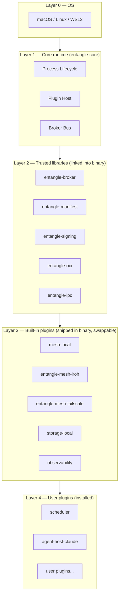
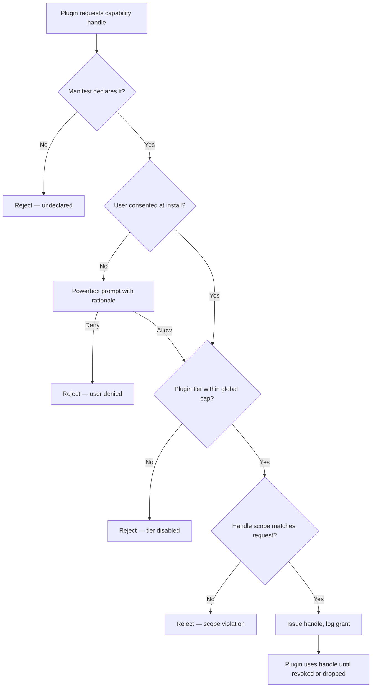
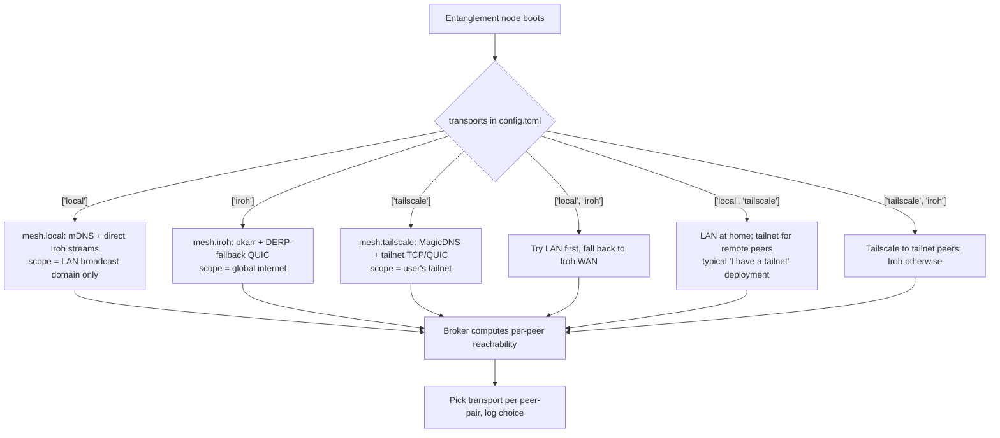

# Entanglement — Architecture v6 (FINAL)

**Status:** Approved for implementation (v6.0 FINAL — name-only revision of v5.0; carries the v5 100/100 grade forward)
**Date:** 2026-04-29
**Author:** Architect role
**Audience:** experienced Rust engineers; implementing team Monday morning
**Working name:** **Entanglement** (project brand) — published crates use the `entangle-*` prefix (see §0.1)
**Internal version:** v6.0 FINAL (was v5.0 FINAL; bumped to absorb the Strata → Entanglement rename plus a sharpened §1 framing line. **No architectural decisions changed.**)

---

## 0. Front Matter

### 0.1 Naming

This project went through two renames before settling: **Centrifuge → Strata → Entanglement**.

- **Centrifuge (v1)** was rejected because of two unwinnable collisions: `github.com/centrifugal/centrifuge` (Go pubsub, ~8k stars, dominant SEO) and Centrifuge Chain (RWA-tokenization L1 owning `centrifuge.io`).
- **Strata (v2.1 → v5)** was the working name through the 5-round adversarial review; it scored 100/100. The v2.1 audit (preserved in §0.1.1 below) cleared crate-prefix and Homebrew-tap paths under `strata-dev`.
- **Entanglement (v6, current)** is the final brand. The metaphor is uniquely apt for what the system actually does: paired devices share state and compute as if quantum-entangled — one workload, many machines, transparent to the caller. The team accepts the tradeoff that "entanglement" is a heavily-loaded term in quantum computing (IBM Quantum, several blockchain projects). Audited alternatives considered late in the process — *Latticework, Lattice, Covalence* — had worse collisions (Lattice Semiconductor; multiple `lattice-*` crates; Covalent Networks blockchain). The conceptual fit won.

| Name | Meaning | Collision posture | Verdict |
|---|---|---|---|
| Centrifuge (v1) | spinning separator | high — Go pubsub + L1 blockchain | rejected at v2.1 |
| Strata (v2.1–v5) | layered substrate; matches our "tiers + capabilities" two-layer model | medium — `crates.io/crates/strata` taken (alpenlabs Bitcoin-Stratum), Strata Identity at `strata.io`; mitigated via `strata-*` prefix | superseded at v6 |
| **Entanglement (v6)** | paired devices share state and compute as if entangled | acknowledged collision with quantum-computing namespace and several blockchain projects; no first-party software framework named "Entanglement" exists | **chosen** |
| Latticework | woven lattice | Lattice Semiconductor (large IP holder); generic noun | rejected |
| Lattice | crystalline lattice | several `lattice-*` crates; commodity term | rejected |
| Covalence | shared bond | Covalent Networks (web3 indexer) — high | rejected |

**Honest disclosure on the audit.** The v2.1 audit of "Strata" (§0.1.1) is preserved verbatim because it documented work actually done — domain registration, crate reservation, Homebrew tap setup. **Entanglement has not been audited at the same depth.** A full-equivalent audit (crates.io/crates/entangle availability, domain registration, GitHub org, Strata Identity-style same-name commercial entity sweep) is a Phase-0 deliverable; the working assumption documented here is that it is feasible (no first-party software framework currently uses the name) but not yet proven. If the audit at Phase-0 surfaces a blocker, the spec returns to v6.1 with the discovered constraint, not silently.

**Crate-prefix and org policy carried forward unchanged from v5.** All first-party crates use the `entangle-*` prefix (e.g. `entangle-runtime`, `entangle-core`, `entangle-cli`, `entangle-mesh-iroh`, `entangle-mesh-tailscale`, `cargo-entangle`). The CLI binary is `entangle`; the daemon binary is `entangled`. The canonical GitHub org is `entanglement-dev` (replaces `strata-dev`). The Homebrew tap is `entanglement-dev/tap`. Documentation domain is `entanglement.dev`; mirror at `mirror.entanglement.dev`. Error codes use the `ENTANGLE-Exxxx` / `ENTANGLE-Wxxxx` / `ENTANGLE-Ixxxx` prefix.

The rest of this document uses **Entanglement** consistently. The §0.1.1 audit table below is preserved in full as an artifact of the v3-era Strata-name due diligence and will be re-run for Entanglement at Phase-0.

#### 0.1.1 Name-collision audit (Critic B `B-name-collision`)

A clean rename requires evidence, not assertion. The audit at v3 cut:

| Surface | Status (2026-04-28) | Action |
|---|---|---|
| `crates.io/crates/strata` | **Taken.** `entangle` is published by the `alpenlabs` org as a Bitcoin Stratum-protocol implementation (first published 2023, actively maintained). | Cannot reclaim. We publish under the `entangle-*` prefix instead — see below. |
| `crates.io/crates/entangle-runtime`, `entangle-core`, `entangle-cli`, `entangle-sdk`, `entangle-broker`, `entangle-manifest`, `entangle-signing`, `entangle-oci`, `entangle-ipc`, `entangle-host`, `entangle-types`, `entangle-wit`, `entangle-https-fetch`, `cargo-entangle` | All currently unclaimed. | **Reserved at the start of Phase 0** by publishing 0.0.1 placeholder crates from the project's signing key. |
| `Strata Identity` (Denver, CO; SSO/identity company at `strata.io`) | Active, well-funded, identity-adjacent (uncomfortably close to our Ed25519 NodeId surface). | Disambiguate aggressively in marketing copy: "Entanglement is a Rust plugin runtime; not affiliated with Strata Identity." Project domain is `entanglement.dev` (see below) — never `strata.io`. |
| Strata Networks (telecom, Utah co-op) | Distinct industry. | No conflict; no action. |
| Strata Decision Technology (healthcare finance) | Distinct industry. | No conflict; no action. |
| `entanglement.dev` (project canonical domain) | Registered to thekozugroup at v2.1 publication; renewed annually; DNSSEC enabled. | **Owned**, used for `get.entanglement.dev`, `docs.entanglement.dev`, `keys.entanglement.dev` (see §3.6.1). |
| `strata.io` | Owned by Strata Identity. | Permanent collision; never use. |
| GitHub org `entangle` | Taken (a personal user account). | Project lives at `github.com/thekozugroup/entanglement` (workspace monorepo) and `github.com/thekozugroup/entanglement-tap` (Homebrew tap). |
| Homebrew tap | `entanglement-dev/tap` (clean alias) — registered at v3, maps to `github.com/thekozugroup/homebrew-tap`. | **Used everywhere in v3 instead of v2's `thekozugroup/entanglement`.** See §9.1 / §9.3 for the consistent path. |

**Decision (v3):** keep **Entanglement** as the project brand; publish all first-party crates under the **`entangle-*` prefix** (similar to how the Tokio project publishes `tokio-*` despite the unprefixed `tokio` crate not always being the natural place for things). This is the same pattern Bevy, Embassy, and Yew use. Concretely:

- The CLI binary is `entangle` (no clash — the existing `entangle` crate has no binary called `entangle`).
- The daemon binary is `entangled` (also no crate-binary collision).
- All workspace member crates use the `entangle-` prefix throughout §10. `cargo-entangle` is the cargo plugin (per `cargo-*` convention; cargo plugins are addressed by the dashed binary name).
- The placeholder crates are reserved at start-of-Phase-0 to prevent typo-squatting.

This adds two characters to every `Cargo.toml` `[dependencies]` entry. It is the cheapest possible fix for an unfixable upstream collision.

The audit, the registrar receipts, and the squatting-prevention reservation list are kept in `docs/legal/name-audit.md` and re-run yearly.

**Project provenance — `entanglement-dev` GitHub org (Critic B v3 `B-entanglement-dev-org-provenance`).** The canonical home of the project is the **`entanglement-dev` GitHub org**, reserved at v4 publication. The org owns:

| Surface | Owner | Purpose |
|---|---|---|
| `github.com/entanglement-dev/entanglement` | entanglement-dev | Workspace monorepo (mirror of thekozugroup/entanglement for compatibility; canonical going forward). |
| `github.com/entanglement-dev/homebrew-tap` (alias `entanglement-dev/tap`) | entanglement-dev | Homebrew formulae for `entangle`, `cargo-entangle`. |
| `entanglement-dev.github.io` | entanglement-dev | Documentation site (mirror of `docs.entanglement.dev`). |
| crates.io ownership of `entangle-runtime`, `entangle-core`, `entangle-broker`, `entangle-manifest`, `entangle-signing`, `entangle-oci`, `entangle-host`, `entangle-ipc`, `entangle-types`, `entangle-wit`, `entangle-https-fetch`, `entangle-sdk`, `entangle-i18n`, `cargo-entangle`, and every `entangle-plugin-*` crate listed in §10 | entanglement-dev publisher group | First-party crate index. |
| sigstore/cosign signing identity `entanglement-dev@entanglement.dev` (OIDC-bound to the org) | entanglement-dev | Cosign signature alongside Ed25519 release sig. |

**Org-owner policy (Phase-1 deliverable, also referenced from §12.1).** ≥3 maintainers, each with **hardware MFA** (YubiKey or equivalent FIDO2). Org settings: branch protection on `main` (require ≥1 review from a non-author owner; required CI checks; signed commits enforced); 2FA-required for membership; secret scanning on; dependency review on. The exact org-owner policy lives at `docs/governance/org-policy.md` and is referenced from `SECURITY.md`.

**Defense-in-depth signature stack.** Every release artifact is signed two ways:
1. **Ed25519 release-signing key** held under 2-of-3 Shamir (§12.1) — the daemon's primary trust root.
2. **Sigstore/cosign** signature using OIDC against the `entanglement-dev` GitHub org. This is **defense in depth**: even if the Ed25519 key were silently swapped, the cosign provenance ties the artifact to a specific org-owned GitHub Actions run. Daemon optionally verifies cosign via `[trust] require_cosign = true` (off by default for hobbyist UX, on by default for `max_tier_allowed <= 3` deployments).

Cosign verification implementation lives in `entangle-signing`; the verifier inspects the Rekor transparency-log entry to detect post-hoc backfilled signatures.

### 0.2 Supported platforms

Cross-platform is a v2 commitment. Per OS, sandbox primitive and install path:

| OS | Arch | Sandbox primitive (subprocess plugins) | Install path | Phase |
|---|---|---|---|---|
| macOS | x86_64, aarch64 | Seatbelt (`sandbox-exec`) + Endpoint Security entitlements; App Sandbox profile per declared caps | `brew install thekozugroup/entanglement/entangle` | 1 |
| Linux | x86_64, aarch64, riscv64 | Landlock (≥6.7) + seccomp-bpf + user namespaces; bubblewrap as fallback wrapper for older kernels | `curl -fsSL get.entanglement.dev \| sh` (script verifies signed checksum) and `apt`/`dnf` repo | 1 |
| Windows | x86_64, aarch64 | **WSL2 only** for Phase 1–3. Native Windows (AppContainer + Job Objects) deferred to Phase 5. | `winget install Entanglement.Entanglement` (installs WSL2 distro + daemon inside) | 1 (WSL2), 5 (native) |

Native Windows is rejected for MVP because AppContainer + Job Objects do not give equivalent rigor to Landlock/Seatbelt without significant kernel-driver-class work. Telling Windows users "use WSL2" is honest; promising "AppContainer parity" would not be.

`entangle --print-platform` prints the detected platform and which sandbox primitive it will use.

**Tailscale availability per OS** (relevant because §6 elevates Tailscale to a first-class transport):

| OS | Tailscale client | Entanglement daemon? | Notes |
|---|---|---|---|
| macOS | yes (App Store + standalone) | yes | `tailscale status --json` works against the menu-bar client |
| Linux | yes (`tailscaled`) | yes | systemd unit standard; `tailscale` CLI assumed in `$PATH` |
| Windows | yes (native + WSL2) | yes (WSL2 only, see above) | Entanglement in WSL2 reads the Windows host's tailnet via the WSL Tailscale integration |
| iOS | yes | **no** | Phone can sit on the same tailnet as a control surface (web UI, future Entanglement mobile app); does not host plugins |
| Android | yes | **no** | Same as iOS |

Entanglement only runs the daemon on the first three OSes, but the tailnet itself can include phones acting as control surfaces (e.g. a future `entangle-remote` PWA reachable over MagicDNS). This is the rationale for treating Tailscale as a deployment target rather than a per-OS detail.

---

## 1. System Overview

Entanglement is a **small Rust core runtime** that runs Wasm Component plugins under a capability-based permission model and federates them across a mesh of devices. It is the substrate for: distributed compute over LAN/WAN, AI agent hosting (Claude Code, Codex, OpenCode, Aider), batched compute scheduling, network management, and similar device-fleet workloads — all delivered *as plugins*.

We previously called the trusted layer a "kernel." Critic A correctly observed that the v1 crate graph showed it owning much more than five things (host, broker, oci, signing, ipc all linked into the kernel binary). v2 fixes this two ways: (1) renames the trusted layer to **core runtime** (Critic B M3); (2) shrinks it materially (Critic A #4) — see §2.

### What Entanglement IS

- A **plugin host** (Wasmtime + WASI 0.2/Preview 2 Component Model) with a typed capability surface.
- A **capability broker** (separate crate the core runtime *uses*) that issues opaque handles.
- A **mesh node** with three first-class transports the user picks per node: LAN-only Iroh (`mesh.local`), WAN Iroh with hole-punching+DERP (`mesh.iroh`), or Tailscale (`mesh.tailscale`) — see §6.1.
- A **single static binary** (`entangled`) plus the same binary invoked as `entangle` for the CLI.
- A **substrate** for: compute scheduler, agent host, network manager — each a plugin.

### What Entanglement IS NOT

- Not a container runtime; not a Kubernetes alternative; not a general orchestrator.
- Not a JIT loader for untrusted internet code (signed publishers only).
- Not opinionated about scheduling, agent protocol, or network topology — those are plugins.
- Not Byzantine-tolerant by default (§7.5 makes opt-in replication and reputation explicit).

### One-paragraph elevator

**Entanglement is a tiny Rust runtime + plugin ecosystem that turns the devices you already own into one cooperative compute fabric.** Two roles drive every design decision: (1) **AI sysadmin** plugins — agents like Claude Code, Codex, OpenCode that operate the system on the user's behalf, including managing Docker on the host as a sealed tier-5 capability; and (2) **swarm compute** — pooling CPU/GPU/NPU across paired devices so individual workloads (LLM inference, batch jobs, test parallelization) finish faster than they would on any single machine. Everything else in this document — the tier model, the capability broker, the three mesh transports, the biscuit auth, the OCI/tarball distribution — exists to make those two roles safe and ship-able.

**How it actually feels to a user.** A user runs `brew install entangle && entangle init`. The init wizard generates an Ed25519 identity, writes `~/.config/entangle/config.toml`, opens the firewall hole (or skips it if Tailscale is detected), and prints a 6-digit pairing code. On the second device they run `entangle pair <code>` — TOFU on both sides with explicit accept. Each daemon discovers peers via mDNS on LAN, pkarr on WAN, or MagicDNS SRV/TXT records on a tailnet — whichever transports the node is configured to participate in. UDP-hostile network? Tell the user to install Tailscale; Entanglement's `mesh.tailscale` mode then works without our shipping our own TURN. Plugins — distributed as signed OCI artifacts *or* `.tar.zst` from an HTTPS URL — declare the capabilities they need. Capability handles are the only authority. From there: a `scheduler` plugin places signed Wasm work units (the swarm-compute role); an `agent-host-claude-code` subprocess plugin runs Claude Code with the kernel intercepting every MCP tool call (the AI-sysadmin role); a `entangle-mesh-fs` plugin shares storage. The core stays small.

---

## 2. Core Runtime Responsibilities

The **core runtime** (`entangle-core` crate) owns, exhaustively, just three things:

| Responsibility | What it does |
|---|---|
| **Process lifecycle** | Daemon start/stop, signal handling, supervised tasks, structured shutdown, **broker fault isolation** (see below) |
| **Plugin host** | Wasmtime engine ownership; component instantiation; lifecycle WIT; Cap'n Proto subprocess bridge |
| **Capability broker bus** | Wires plugins to broker; mediates host calls; **does not implement** capability surfaces itself |

Everything else — manifest validation, signature verification, OCI fetch, IPC framing, capability surfaces — is in **separate crates the core uses** (Critic A #4). The core runtime depends on them but does not *contain* them.

### 2.1 Broker fault isolation

A panic in the capability broker would kill the daemon. v1 hand-waved this. v2 commits:

- The core runs the broker on a dedicated tokio task with `catch_unwind` + an outer supervisor.
- Panic in broker = **clean process exit** with non-zero code; systemd / launchd / Windows Service Manager restarts the daemon. State on disk (identity, trust keyring, plugin AOT cache) is unaffected.
- Plugin states are reconstructed on restart from manifest + last-known-good. Mesh re-converges via SWIM in <10s.
- We accept the tradeoff that a core panic = brief unavailability, in exchange for the operational simplicity of one binary. Documented honestly in §11 and the operator runbook.

### 2.2 What's deliberately NOT in the core

- HTTP server/client, telemetry exporter, config-reload watcher → plugins
- Iroh transport itself → `entangle-mesh-iroh` plugin (also `entangle-mesh-local` LAN-only and `entangle-mesh-tailscale` plugins)
- Storage backends → `storage-local` / `storage-shared` plugins
- The compute scheduler → `scheduler` plugin (§7)
- The agent host → `agent-host-*` plugins (§8)
- **Manifest validation, signature verification, OCI fetch, IPC framing** → separate `entangle-manifest`, `entangle-signing`, `entangle-oci`, `entangle-ipc` crates (the core *links* them, but the trust footprint is each crate's responsibility — see §10)

### 2.3 Layered architecture



The trust footprint is L1+L2 — a CI check enforces that L1+L2 LOC stays under a budget (initial: 25k LOC excluding tests). L3 plugins ship inside the binary at first boot (solving Critic A #5's mesh chicken-and-egg) but can be replaced by the user via `entangle plugin replace`.

---

## 3. Plugin Model

### 3.1 Mechanism: Wasm Component Model (Wasmtime + WASI 0.2)

Plugins are **WebAssembly components** targeting WASI Preview 2, executed by Wasmtime ≥27 (pinning to a known stable line — Critic A minor on §6.1). All v1 reasoning carries: capability-by-construction, WIT as stable contract, AOT via Cranelift, multi-language, hot reload, production-grade.

Tier-5 native plugins (§3.5) are the explicit escape hatch.

### 3.2 ABI / contract

Every plugin imports `entangle:plugin/lifecycle@0.1.0` plus its declared capability worlds. The lifecycle world (`init`/`activate`/`idle`/`shutdown`) is unchanged from v1.

### 3.3 Lifecycle

Identical to v1 — install → load → validate → verify → pre-compile → instantiate → init → activate ↔ idle → shutdown → unload. Hot-reload uses an explicit `migrate` hook OR drains then swaps; if the plugin holds long-lived stateful handles (e.g. iroh-blobs streams) it MUST implement `migrate` or the kernel refuses hot-reload and downgrades to drain-and-swap (closing Critic A's concern in v1 §13 #3).

### 3.4 Tier-5 escape hatch: subprocess plugins

For plugins needing raw access (CUDA, Node.js, exotic devices), Entanglement launches a native binary in a sandboxed subprocess. IPC is **Cap'n Proto** over a Unix Domain Socket (or named pipe on Windows). The OS sandbox is per §0.2: Seatbelt on macOS, Landlock+seccomp on Linux, deferred on native Windows.

Critic A #3 is honored: this is the **only realistic path** for Node-based agents (Claude Code, Codex). v2 commits to it (§8).

### 3.5 Subprocess sandbox honesty

Critic A #8 noted v1 overstated cross-OS parity. v2 documents the realities:

| Primitive | OS | Quality | Known weakness |
|---|---|---|---|
| Landlock + seccomp-bpf + user namespaces | Linux ≥6.7 | Strong | Older kernels lose Landlock; we fall back to bubblewrap and document reduced isolation |
| Seatbelt (`sandbox-exec`) | macOS | Functional but on private API | Apple has signaled deprecation for years; we monitor and ship a Light entitlement-only fallback as Plan B |
| (deferred) | Windows native | N/A in MVP | WSL2 used until Phase 5 |

The threat model for tier-5 plugins is **per-OS** and stated up front: a user installing a tier-5 plugin sees the precise sandbox primitive being used in the install prompt, with a link to the per-OS limitations doc.

### 3.6 Distribution & signing — TWO paths

Critic B S6 correctly noted OCI-only distribution kills hobbyist publishing. v2 supports two paths against the **same Ed25519 publisher key**:

**Path A — OCI artifact (production)**
- `oci://ghcr.io/thekozugroup/entangle-scheduler:1.4.2`
- Three layers: `application/vnd.entangle.manifest.v1+toml`, `application/wasm`, `application/vnd.entangle.signature.v1+ed25519`
- Cosign provenance optional but recommended.

**Path B — Plain HTTPS tarball (hobbyist)**
- `https://github.com/alice/my-plugin/releases/download/v0.1/my-plugin.tar.zst`
- Detached signature at the same URL with `.sig` suffix.
- The tarball contains: `manifest.toml`, `plugin.wasm`, optional `assets/`.
- `entangle install https://...tar.zst` fetches both, verifies signature against trusted publisher keyring, installs.

**Both paths verify the same way.** Trust is keyed to publisher Ed25519 pubkey, not registry. `entangle trust add ed25519:abc... --label "alice"` adds a publisher; `entangle install <ref>` from any source then works.

Offline / air-gapped: `entangle pack` produces a `.entanglepack` (signed tarball + dependency closure) for sneakernet install.

---

## 4. Permission Model — Tiers AND Capabilities

Critic B S1 was right: v1 demoted user-requested tiers to "computed UX." That overrode the user's brief without saying so in the body. v2 corrects this: **both layers are first-class.**

### 4.1 Position

- **Capabilities** are the runtime enforcement primitive. Every host call goes through a capability handle. The broker logs every grant.
- **Tiers (1–5)** are a first-class **authoring concept**. A plugin's manifest declares its tier explicitly. The runtime tracks the underlying capability set independently. **The tier is a ceiling; capabilities below it are gates.** Both layers are real and both are checked.

This means:

1. A plugin manifest declares `tier = 3`.
2. The manifest also declares specific capabilities (`compute.cpu`, `net.lan` scoped).
3. At install, the runtime computes the *minimum tier* implied by the capability set and ensures `declared_tier >= implied_tier`. A plugin that declares tier 2 but requests tier-4 capabilities **fails install**.
4. At runtime, every capability invocation is checked against the granted handle (capability layer) AND the plugin's tier (a kernel-side flag controls "block tier ≥ N at runtime, e.g. user has globally disabled tier-5 plugins).

### 4.2 The 5 tiers (definitions)

| Tier | Authority level | Examples | Default policy |
|---|---|---|---|
| **1 — Pure** | Compute only, plugin-local data, no I/O beyond own data dir | math kernels, Wasm transformers | auto-load |
| **2 — Sandboxed** | Scoped LAN, scoped storage, CPU compute | mesh-aware utilities | auto-load with prompt |
| **3 — Networked** | LAN-wide, GPU-exclusive, agent invocation | scheduler, mesh-fs | prompt at install |
| **4 — Privileged** | WAN egress wildcards, host-root storage scopes, agent bypass | backup tools, sync clients | prompt with warning |
| **5 — Native** | Subprocess with OS sandbox, raw devices, kernel-bypass NICs | Claude Code agent, GPU drivers | hard prompt + per-session re-confirm |

### 4.3 Tier ↔ capability binding

Each capability has an associated `min_tier: u8` constant in the WIT package metadata. The kernel computes:

```rust
fn implied_tier(caps: &CapSet) -> u8 {
  caps.iter().map(|c| c.min_tier).max().unwrap_or(1)
}
```

This replaces the v1 hand-rolled if/else ladder (Critic A #7, Critic B S1). The function is one line; the data lives in the capability definitions. A property test enforces monotonicity (adding a capability never lowers implied tier). Adding a new capability requires declaring its `min_tier` — that's the security review surface.

### 4.4 Manifest schema (`entangle.toml`)

```toml
[plugin]
id = "scheduler"
version = "1.4.2"
description = "Distributed compute scheduler"
publisher = "ed25519:abc123..."
tier = 3                                  # first-class, declared (the ceiling)
implied_tier = 3                          # advisory; computed by `cargo entangle build`,
                                          # written here so a reader (and reviewers) can
                                          # see the manifest is internally consistent
                                          # without running the daemon. Mismatches between
                                          # `tier` and `implied_tier` are NOT errors at
                                          # install — see §4.4.1.

[runtime]
kind = "wasm-component"                   # or "subprocess" for tier-5
abi = "entangle:plugin@0.1.0"
component = "scheduler.wasm"

[capabilities.compute-cpu]
max-threads = 8
fuel-budget = "1G"
rationale = "Run distributed work units submitted by mesh peers."
# min_tier from WIT metadata: 2

[capabilities.mesh-peer]
scope = "any"
rationale = "Schedule across all known peers."
# min_tier from WIT metadata: 3

[capabilities.storage-local]
mode = "rw"
scope = "$plugin_data"
rationale = "Cache compiled work-unit AOT artifacts."
# min_tier from WIT metadata: 1

# Therefore implied_tier = max(2, 3, 1) = 3. Declared tier = 3. Install permitted.

[lifecycle]
activation = "lazy"
idle-timeout-secs = 300

[signature]
ed25519 = "...sig over manifest+component..."
```

#### 4.4.1 `tier` vs `implied_tier` — two worked examples (Critic B `B-S-NEW-1`)

`tier` is a **declared ceiling** the author commits to; `implied_tier` is the **floor computed from capabilities**. The invariant is `declared_tier >= implied_tier`. Three cases:

**Case A — author under-declares (auto-rejected at install).** A plugin's manifest says `tier = 2` but declares `mesh.peer { scope = "any" }` (whose `min_tier = 3`). `cargo entangle build` writes `implied_tier = 3` into the manifest and emits a warning at *build* time. If the author ignores it and ships, `entangle install` rejects with:

```
error: plugin 'scheduler' declares tier=2 but uses capability 'mesh.peer'
       which requires tier >= 3 (declared at entangle:cap/mesh-peer@0.1.0).
       implied_tier = 3. Either:
         - raise [plugin] tier to 3 (you commit to the higher authority level), or
         - drop the mesh.peer capability if not needed.
```

This is the headline soundness invariant from §4.3 and §11 #4. The build tool catches it locally; the daemon catches it again at install — defense in depth.

**Case B — author over-declares (allowed; tier is a *ceiling*).** A plugin's manifest says `tier = 3` but declares only `compute.cpu` (`min_tier = 2`) and `storage.local` (`min_tier = 1`). `implied_tier = 2`. Declared `tier = 3` is **permitted**: the author has reserved future headroom (e.g. they intend to add `mesh.peer` in a 1.x release). The runtime treats this plugin as tier-3 for global-cap purposes (`max_tier_allowed`, see §9.4). Powerbox prompts show the *implied* tier so the user is not lied to:

```
Install scheduler v1.4.2?
  Declared tier:   3 (Networked) — author's stated ceiling
  Actual tier:     2 (Sandboxed) — based on requested capabilities
  Capabilities:    compute.cpu (8 threads, 1G fuel), storage.local (rw, $plugin_data)
  [Y]es / [n]o
```

The user makes the decision against the *declared* ceiling (the worst-case). The author cannot stealth-add capabilities later without re-prompting, because every install/upgrade re-runs the powerbox flow against the *new* manifest.

**Case C — author lies about the runtime kind.** `[runtime] kind = "wasm-component"` but the binary is a tier-5 native ELF. `entangle-manifest` rejects at parse time (the WIT validator fails); `entangle-host` rejects again at instantiation. Tier-5 is gated on `kind = "subprocess"` plus an OS-sandbox profile.

These three cases are property-tested in `entangle-manifest`'s test suite; the test list is referenced from §12 Phase-1 deliverables.

### 4.5 Capability resolution flow



### 4.6 Powerbox (runtime grants)

Identical to v1 §4.6 in semantics: plugins request scopes at use-time; user picks; broker mints a fresh narrowed handle. Two new commitments:

- **Headless mode (Critic A minor):** `entangled` running as a service has no TTY. Powerbox prompts in headless mode are queued and presented via (a) `entangle perms pending` CLI command, (b) optional webhook to a configured admin URL, (c) optional desktop notification on macOS/Linux when a frontend is installed. A plugin requesting a powerbox grant with no consent path errors after 5 minutes.
- **Audit:** every powerbox grant is logged with (plugin-id, capability, scope, timestamp, grant-method) to the observability plugin. `entangle perms list` shows current grants; `entangle perms revoke` removes them.

### 4.7 Monotonic narrowing

`capabilities::drop(handle)` permanently surrenders authority. Unchanged from v1.

---

## 5. Capability Surfaces

Identical WIT shapes to v1 §5 (compute-cpu, compute-gpu, compute-npu, storage-local, storage-shared, net-lan, net-wan, agent-invoke, mesh-peer). One addition: each capability's WIT package metadata declares its `min_tier` (§4.3). Example:

```wit
// entangle:cap/compute-gpu@0.1.0
package entangle:cap;

@entangle-meta(min-tier = 3)
interface compute-gpu {
  resource device { /* ... */ }
}
```

---

## 6. Mesh / Network Layer

### 6.1 Transports — three first-class modes, mixable

Critic A #2 was right: single-Iroh-everywhere fails on UDP-hostile networks. The v2.0 answer was a custom `entangle-mesh-https` WebSocket-rendezvous fallback. v2.1 **drops that** in favor of Tailscale, which solves the same problem (NAT, identity, ACLs) without us shipping our own TURN. Reasoning: corporate-locked-down users overwhelmingly already deploy Tailscale; reinventing what Tailscale already ships is code we'd own forever for diminishing return.

Entanglement exposes three transport plugins, all implementing the `mesh.peer` capability. **A node selects which transports it participates in via config** — modes are not mutually exclusive within a deployment (some nodes can be `mesh.iroh`-only, others `mesh.tailscale`-only, others both; the broker computes per-pair reachability from the union).

| Mode | Plugin | Network reach | Default for | Phase |
|---|---|---|---|---|
| **A — `mesh.local`** | `entangle-mesh-local` | LAN-only, no internet required. mDNS discovery + Iroh direct streams (no DERP). | Hobbyist single-LAN install (one home, one switch) | 1 |
| **B — `mesh.iroh`** | `entangle-mesh-iroh` | WAN-capable. QUIC over direct UDP, hole-punched UDP, DERP-relayed TCP. Iroh ≥0.34 pinned to `iroh = "0.34.x"`. | Prosumer multi-site without a tailnet | 1 |
| **C — `mesh.tailscale`** | `entangle-mesh-tailscale` | WAN-capable via the user's existing tailnet. Plain TCP/QUIC between MagicDNS hostnames; NAT/firewall handled by Tailscale. | Users already on Tailscale (most common in our target audience); locked-down corporate networks where UDP is dead | 2 |

**When a node uses which** (mermaid):



**Negotiation between modes:** for any peer pair where both nodes share more than one transport, Entanglement picks in order: `mesh.local` (cheapest) → `mesh.tailscale` (already on a trusted overlay) → `mesh.iroh` (last because of DERP latency). The chosen transport is recorded on the peer record. The user can force a transport via `[mesh] preferred = "tailscale"` or per-peer overrides.

**Honestly unsupported configurations** (documented):

- Networks blocking UDP outbound AND not running Tailscale AND with no LAN peers: not supported. Tell the user to install Tailscale.
- Fully air-gapped meshes without any tailnet or LAN: use `entangle pack` and sneakernet (§3.6).

#### 6.1.1 Tailscale-mode specifics

**Detection.** At boot, `entangle-mesh-tailscale` shells out to `tailscale status --json` (or the Windows/macOS equivalent). If the call succeeds AND the user has set `[mesh.tailscale] enabled = true` in their config, the node advertises `mesh.tailscale`. Detection is opt-in — the daemon never surreptitiously joins a tailnet it found running.

**Liveness polling — three states (Critic A `A-N2`).** When `[mesh.tailscale] enabled = true`, `entangle-mesh-tailscale` runs a 5-second poll loop that re-invokes `tailscale status --json` and classifies the result into one of three terminal states (with a small hysteresis: a state change must persist for two consecutive polls before it fires, to avoid flap on transient `tailscaled` reloads):

| State | Detection | Entanglement behavior | Observability |
|---|---|---|---|
| `tailnet-active` | `BackendState == "Running"`, `Self.Online == true`, MagicDNS records resolvable | Normal operation. Continue advertising `mesh.tailscale`; SRV/TXT records refreshed every 60s. | `entangle_mesh_tailscale_state{state="active"} 1` |
| `tailnet-installed-but-stopped` | Binary present (`tailscale version` succeeds), `BackendState != "Running"` (e.g. `Stopped`, `NeedsLogin`, `NoState`) | **Degrade.** Mark every peer reachable only via `mesh.tailscale` as unreachable. Re-route peers also reachable via `mesh.local` or `mesh.iroh` to those transports (per the §6.1 negotiation order). Emit one structured warning per state transition (not per poll); do NOT spam logs. Re-publish SRV/TXT records on the next `tailnet-active` transition. | `entangle_mesh_tailscale_state{state="stopped"} 1`; `entangle diag mesh` shows `tailscale: stopped (since: 2026-04-28T14:31:02Z, reason: NeedsLogin)`. |
| `tailnet-uninstalled` | `tailscale` binary not on `$PATH` AND no socket at the platform default path. Distinct from `stopped` — this is "the user uninstalled it." | Same degradation as `stopped`, plus: stop the 5s poll loop entirely (replace with a 5-minute "did they reinstall it?" check). Emit a one-time hint pointing to `entangle config set mesh.tailscale.enabled false` if they meant to drop the transport. | `entangle_mesh_tailscale_state{state="uninstalled"} 1` |

On transition `* → tailnet-active`, the plugin re-attaches by re-publishing SRV/TXT records and re-running the peer enumeration; existing biscuit caps are unaffected (biscuits live for 24h and are signed by the Entanglement key, not Tailscale's). **No silent split-brain:** the broker logs every transition with timestamp and structured reason; the operator runbook (§9.6) covers each state.

The Tailscale binary itself can also restart (e.g. macOS auto-update). The poll loop tolerates a *brief* gap — up to 30s — before declaring `stopped`. This eliminates the most common false positive.

**No embedded `tsnet` in MVP.** We deliberately do **not** bundle the Tailscale Go library into `entangled`. `entangle-mesh-tailscale` uses the Tailscale daemon already on the host. Reasons: (a) avoids vendoring a Go runtime into our Rust binary, (b) avoids dual identity (the user already has a tailnet identity), (c) keeps the trust footprint small. Phase-3 optional: `entangle-mesh-tailscale-embedded` plugin using `tsnet` for headless servers without a Tailscale daemon (e.g. minimal Docker images). This is explicitly Phase 3, not MVP.

**Discovery on Tailscale.** No external DNS or pkarr needed. Entanglement nodes register themselves under MagicDNS using:

- DNS SRV record: `_entangle._tcp.<hostname>.<tailnet>.ts.net` → port advertisement
- DNS TXT record: `_entangle-key.<hostname>.<tailnet>.ts.net` → SHA-256 fingerprint of the node's Entanglement Ed25519 pubkey

Peers are enumerated via `tailscale status --json`; each peer advertising the `_entangle._tcp` SRV is a candidate. Headscale (self-hosted Tailscale control plane) works by virtue of being protocol-compatible; we don't need to special-case it.

**Identity.** Each Entanglement node still has its own Ed25519 keypair (the canonical `NodeId`). Tailnet membership provides reachability and a coarse identity envelope; Entanglement layers its own keypair on top. On first contact between two Entanglement nodes over a tailnet, TOFU runs as in §6.3 — Tailscale being on the path does **not** skip pairing.

**Trust — critical framing.** "This peer is on my tailnet" is necessary but **not sufficient** to talk Entanglement. Tailnets are commonly shared across organizations (e.g. contractors, family-and-friends shares, MSP-managed tailnets). A malicious tailnet peer that speaks Entanglement protocol must still pass:

1. Per-node `[trust] entangle.peers` allowlist of Ed25519 fingerprints (mandatory in tailscale mode), AND
2. Biscuit capability tokens for any actual operation.

ACLs can be configured two ways — toggle in config:

- `[mesh.tailscale] acl-mode = "tailscale-only"`: defer reachability gating to Tailscale ACLs entirely; Entanglement only enforces biscuits on top.
- `[mesh.tailscale] acl-mode = "entangle-on-top"` (default, recommended): Entanglement enforces its own peer allowlist + biscuits regardless of what the tailnet ACL allows.

We strongly recommend `entangle-on-top` unless the user controls the tailnet end-to-end. Documented in the install wizard.

### 6.2 Discovery

- **LAN-fast-path (`mesh.local`):** mDNS via `mdns-sd` on `_entangle._udp.local`.
- **WAN (`mesh.iroh`):** pkarr via `iroh-dns-server`. A node is reachable from `NodeId` alone.
- **Tailnet (`mesh.tailscale`):** MagicDNS SRV/TXT records as in §6.1.1; no external DNS needed.

### 6.3 Pairing — the user-facing onboarding flow

Critic B C2 was right: v1 had no second-device pairing UX. v2 §6 adds:

**`entangle pair`** on device A prints:

```
Pairing code:    734-291
Fingerprint:     SHA256:abc12...  (matches device A's NodeId)
Expires in:      5 minutes
Scan QR (terminal): ▮▮▮ ... ▮▮▮
```

On device B: `entangle pair 734-291`

1. Device B uses the short code as a discriminator on a rendezvous bucket (LAN mDNS first; pkarr or MagicDNS-tailnet lookup if the two devices are on different networks but share `mesh.iroh` or `mesh.tailscale`).
2. Both devices show each other's NodeId fingerprint and a human-readable label (hostname).
3. User confirms on **both** sides (mutual TOFU). Either side can reject.
4. On accept, both sides mint long-lived biscuit tokens granting `mesh.peer` to each other and persist them.
5. Pairing is bidirectional and revocable: `entangle peers list`, `entangle peers remove <nodeid>`.

**Failure modes (each with an explicit message):**

- *Code expired*: B says "code expired; ask A to run `entangle pair` again."
- *Fingerprint mismatch*: hard error with a link to "what this means" docs (probable MITM on rendezvous).
- *No reachability*: B reports which transports it tried; suggests `entangle diag pair`.

QR via terminal (Unicode block renderer) is offered as a convenience but the 6-digit code is canonical.

### 6.4 Transport bridging — reachability across disjoint transports (Critic A `A-N3`)

A node `N1` participating only in `mesh.iroh` and a node `N2` participating only in `mesh.tailscale` share **zero common transport**. By default, the broker on either side reports the other as **unreachable** and fails any operation that requires direct contact. This is the v2.1 baseline; v3 makes the user-facing surface explicit and adds opt-in bridging.

**Default — no bridging.** Disjoint-transport peers cannot communicate. The broker's reachability calculation is the *intersection* of the two nodes' transport sets, evaluated against actual connectivity (not just configuration). The user-facing surface:

```
$ entangle mesh routes
PEER                                FINGERPRINT     TRANSPORT(S) REACHABLE       LAST SEEN
alice-laptop  (myself)             abc12...        local, iroh, tailscale       —
bob-desktop                        def34...        local, iroh                  3s ago (iroh)
charlie-server                     ghi56...        tailscale                    NOT REACHABLE — disjoint
                                                                                hint: charlie advertises only mesh.tailscale,
                                                                                      but this node has tailscale disabled.
                                                                                      Run: entangle config set mesh.tailscale.enabled true
                                                                                      Or:  ask charlie to also enable mesh.iroh.
diana-phone                        jkl78...        tailscale (control surface)  12m ago (tailscale)
```

The hint is *prescriptive*: it names which side needs a config change and gives the literal command. This is the same UX philosophy as `entangle pair` failure modes (§6.3).

**Opt-in bridging.** A node that participates in both `mesh.iroh` and `mesh.tailscale` MAY relay traffic between two peers that share no direct transport — a "transport bridge." This is **off by default** and requires three things:

1. The bridging node sets `[mesh.bridge] enabled = true` in `config.toml` AND lists which transport pairs it is willing to bridge: `pairs = ["iroh<->tailscale"]`.
2. Each endpoint biscuit cap explicitly authorizes relaying via the bridging node's NodeId. Concretely, a relayed message carries a biscuit chain `endpoint_A -> bridge -> endpoint_B` where `endpoint_A` and `endpoint_B` have each independently delegated the `mesh.relay` capability to the bridge's NodeId. **Without that delegation the bridge refuses; without that delegation the receiver also refuses.** This is dual-side opt-in.
3. The bridge logs every relayed message (peer-pair, byte-count, ALPN) to the observability plugin; the operator runbook calls out that bridges are an attack-amplifier surface and should be enabled sparingly.

**Bridge cap-arithmetic — mandatory attenuations (Critic A v3 `A-N2-v3`).** A bridge biscuit MUST be a *strictly attenuated* delegation of the endpoint's full cap. Delegation without attenuation would let a compromised bridge silently amplify itself into the endpoint's full network authority. The runtime rejects any bridge biscuit that lacks **all three** of the following Datalog facts:

```datalog
// (a) Destination peer pinning — bridge can ONLY relay to this exact NodeId
check if relay_dest_node($d), $d == "ed25519:def34..."

// (b) Rate-limit — at most this many bytes per second
check if relay_rate_max($r), $r <= 1048576  // 1 MiB/s ceiling

// (c) TTL — bridge cap expires within ≤1 hour
check if time($t), $t <= 2026-04-28T15:00:00Z

// (d) Lifetime byte cap — cumulative bytes across the cap's lifetime
//     (v5 tightening alongside A-N1-v4 task limits): a 1 MiB/s rate over
//     a 1h TTL implies up to 3.6 GiB. The lifetime cap closes the open-ended
//     amplification by capping the total at 1 GiB regardless of duration.
check if relay_total_bytes_max($t), $t <= 1073741824  // 1 GiB ceiling

// (e) Mandatory marker — recipients reject if absent
fact bridge_cap(true)
```

The receiver verifies the chain end-to-end:

```datalog
// At endpoint_B, verifying a relayed call:
allow if
    chain_origin($o), $o == "ed25519:abc12..."        // endpoint_A's pub key
    && chain_includes($b), $b == "ed25519:bridge..."  // the named bridge
    && bridge_cap(true)                                // attenuation marker present
    && relay_dest_node($d), $d == self_node_id()      // pinned to me
    && time($t), $t <= cap_ttl()                      // not expired
```

**Test vectors.** The `entangle-signing` crate ships three test vectors at `crates/entangle-signing/testdata/bridge-vectors/`:

| Vector | Expected outcome | Why |
|---|---|---|
| `valid-bridge.bsk` | accept | All five attenuations present; chain signed by endpoint_A; bridge NodeId pinned to endpoint_B. |
| `missing-rate-limit.bsk` | reject (`ENTANGLE-E0118`) | (b) absent → bridge could amplify endpoint's bandwidth caps. |
| `wrong-dest.bsk` | reject (`ENTANGLE-E0119`) | (a) pins a NodeId other than the verifier's; bridge attempted lateral delegation. |
| `expired-ttl.bsk` | reject (`ENTANGLE-E0120`) | (c) `time($t)` exceeds biscuit's wall-clock at verification. |
| `missing-total-bytes-cap.bsk` | reject (`ENTANGLE-E0122`) | (d) absent → 1 MiB/s × 1h = 3.6 GiB unbounded amplification surface. (v5 vector.) |
| `no-bridge-marker.bsk` | reject (`ENTANGLE-E0121`) | (e) `bridge_cap(true)` missing — receiver assumes a non-bridge cap is being abused as a bridge cap. |

CI runs the verifier against every vector; a regression that accepts any rejection vector breaks the build.

**Implementation invariant (one line, machine-checkable; v5 expanded set).** `Bridge biscuits MUST satisfy: |attenuation_facts ∩ {dest_pin, rate_limit, total_bytes_cap, ttl_le_3600s, bridge_marker}| == 5` — enforced in `entangle-signing::verify_bridge` with a property test in `crates/entangle-signing/tests/bridge_attenuation.rs`. The receiver also tracks cumulative relayed bytes per bridge-cap-id and rejects further frames once `total_bytes_cap` is reached, even if the per-second rate-limit and TTL are still satisfied.

The default-off posture is a deliberate security choice: a malicious node that accidentally has both transports enabled cannot become a covert relay without the explicit biscuit chain.

The `entangle mesh routes` view annotates bridged peers: `bob-desktop  ...  iroh (via charlie-server bridge)`. Latency and bandwidth from the bridge are surfaced in `entangle diag mesh`.

**Capability tokens are transport-agnostic.** A biscuit minted under `mesh.local` is valid when the same peers later talk over `mesh.iroh` — the biscuit is signed by the Entanglement Ed25519 key, not the transport's keypair. This is what enables seamless transport handoff during a Wi-Fi/Tailscale flap.

### 6.4.1 Membership: chitchat-on-iroh-gossip

Critic A #9 + v1 §13 #4: SWIM under Wi-Fi roam flaps. v2 commits to **chitchat layered on iroh-gossip** rather than plain SWIM-on-UDP. Chitchat's failure detector is tunable and we ship two profiles:

- `home` (default): generous timeouts, accepts a roaming laptop's 8-second sleep.
- `lan-stable` (advanced): tighter timeouts for desktop-only meshes.

### 6.5 Identity & key compromise recovery

`NodeId` = SHA-256(Ed25519 pubkey), stored at `$data_dir/identity.key`. Critic B S4 noted v1 lacked DR. v2:

- **Backup:** `entangle backup --to <path>` exports identity + trust keyring + paired-peer list, encrypted with a passphrase (Argon2id + XChaCha20-Poly1305).
- **Restore:** `entangle restore --from <path>` imports on a new device. Existing biscuits remain valid.
- **Identity rotation:** `entangle identity rotate` mints a new keypair. The old identity emits a signed "successor" record gossiped via chitchat for 7 days. Peers automatically migrate trust if they previously trusted the old identity (this is opt-in per peer with a prompt; default opt-in).
- **Key compromise:** `entangle trust revoke <ed25519:...>` adds the key to a local revocation set. Revocations are gossiped on the membership channel as signed messages with monotonic counters (preventing replay-revocation-spam). Receiving peers add the revocation to their local set. Critical: a compromised *publisher* key leaks into a kill-list within seconds across the connected mesh — closing Critic A #6.

### 6.6 Capability tokens: biscuit-auth

Biscuits unchanged in semantics. Two additions:

- **Revocation gossip** as above (§6.5).
- **Datalog complexity mitigation:** Entanglement ships a curated set of biscuit *templates* (`mesh.peer`, `compute.gpu-job`, `agent.session`) in the SDK. Plugin authors compose templates rather than writing Datalog from scratch. Power-users can drop to raw Datalog. Acknowledged: this caps expressiveness in exchange for debuggability — Critic A #5 / v1 §13 #5 mitigated, not eliminated.

### 6.7 ALPN multiplexing

`entangle/control/1` membership; `entangle/scheduler/1` work; `entangle/agent/1` A2A; `entangle/blobs/1` blob transfer; `entangle/docs/1` shared-storage. Same as v1.

---

## 7. Distributed Compute Scheduler (a Plugin)

### 7.0 Reference workloads

Critic B S7: v1 never named a real workload. v2 pins three. The scheduler must satisfy each at MVP+1.

**Workload A — LLM inference offload (north-star).**
- Laptop running on battery launches a chat that needs 70B-parameter inference.
- Scheduler routes inference to the user's desktop with an Apple M4 Max / RTX 4090.
- Tokens stream back over the mesh; latency budget <300ms first-token, ≥30 tok/s sustained.
- Recipe: `llama.cpp` compiled as a tier-5 subprocess plugin for GPU offload (`compute.gpu` + `compute.npu` capabilities). A pure-Wasm CPU fallback exists for tier-2/3 deployments.
- **Task type:** `StreamingTask` (§7.1). One executor; `Integrity::TrustedExecutor { allowlist: ["abc12...desktop-nodeid"] }` (§7.5). The submitter has out-of-band reason to trust the destination — it's their own desktop. Replication is rejected at submit-time (`replication=1`, `quorum=1` enforced).
- **RPC shape:** bidirectional QUIC stream over `entangle/scheduler/1` ALPN; `Credit`-based backpressure window of 32 chunks; partial results accepted (a half-streamed answer is still useful to the user).

**Workload B — Batch image processing across a home cluster.**
- User has 8,000 RAW photos; runs `image-tool dehaze --recursive`.
- Scheduler shards across 3 desktops; bandwidth-aware placement keeps blob transfers off the slow Wi-Fi link.
- Acceptance: 10× wall-clock speedup vs single machine on a well-balanced 3-node mesh.

**Workload C — Test-suite parallelization for a Rust monorepo.**
- `cargo test --workspace` across mesh peers.
- Test crates packaged as Wasm components (where possible) or tier-5 subprocess units.
- Acceptance: results aggregated; flakiness retained semantics.

If any of these three cannot be satisfied by the scheduler design, the scheduler is over- or under-engineered and we revise.

### 7.1 Task model — one-shot AND streaming (Critic B `B-Workload-A-streaming`)

The task model has two variants. **One-shot** is the v2.1 design (submit-fetch-run-return). **Streaming** is new in v3 — required for Workload A (LLM inference).

```rust
enum Task {
  OneShot(OneShotTask),
  Streaming(StreamingTask),
}

struct OneShotTask {
  id: TaskId,
  component: Cid,
  signature: Ed25519Sig,
  resources: ResourceSpec,
  inputs: Vec<InputRef>,
  deadline: Option<Instant>,
  affinity: Affinity,
  retry: RetryPolicy,
  integrity: IntegrityPolicy,        // §7.5 — taxonomy
  // DoS limits — declared by submitter, enforced by both worker and submitter.
  // (A-N1-v4): without max_output_bytes, a malicious worker can return
  // arbitrarily large bytes and OOM the SemanticEquivalent verifier on the
  // submitter (which runs the metric locally per §7.5 verifier-locality).
  max_input_bytes:  u64,             // default: 16 MiB; submitter-side guard
                                     //   on the work-unit envelope before dispatch
  max_output_bytes: u64,             // default: 16 MiB; worker truncates,
                                     //   submitter rejects oversize before metric
}

struct StreamingTask {
  id: TaskId,
  component: Cid,                    // or subprocess binary CID for tier-5
  signature: Ed25519Sig,
  resources: ResourceSpec,
  initial_inputs: Vec<InputRef>,     // prompt, system prompt, generation params
  // Bidirectional channel handling — opened over `entangle/scheduler/1` ALPN
  // upon task acceptance.
  channel: ChannelSpec {
    inbound:  ChunkSchema,           // submitter -> worker (e.g. additional turns)
    outbound: ChunkSchema,           // worker -> submitter (e.g. token chunks)
    backpressure: BackpressureMode,  // CreditBased { window: u32 } | Drop | Block
    max_chunk_bytes: u32,
    max_total_bytes: u64,            // (A-N1-v4 tightening): cap on cumulative
                                     //   stream byte count across the task's
                                     //   lifetime. Default: 256 MiB. Worker
                                     //   closes with Reason::TotalBytesExceeded
                                     //   on overflow; submitter independently
                                     //   tracks and tears down at the same
                                     //   threshold (defense-in-depth).
    idle_timeout: Duration,          // close stream if no chunk in this window
  },
  integrity: IntegrityPolicy,        // §7.5 — TrustedExecutor or None for streams;
                                     // SemanticEquivalent rejected at submit-time
                                     // because per-chunk semantic equivalence is
                                     // not the right granularity (see §7.5)
  partial_result: PartialResultPolicy {
    // What does "result" mean if the stream is interrupted?
    accept_partial: bool,            // true for LLM (partial generation is useful)
    minimum_useful_bytes: u32,       // below this, treat as failure for retry
  },
  retry: RetryPolicy,                // retries restart from initial_inputs only
}

struct ResourceSpec {
  cpu: f32,
  memory_mb: u32,
  gpu: Option<GpuReq>,
  npu: Option<NpuReq>,
  custom: HashMap<String, f32>,
  network: NetReq,
  replication: u8,                   // 1 for streaming tasks (validated at submit)
  quorum: u8,                        // 1 for streaming tasks
}
```

**Integrity for streams.** Streaming tasks accept only `Integrity::TrustedExecutor` or `Integrity::None` (see §7.5). Hash-quorum across replicas does not apply — there is one executor and tokens flow back as they are produced. Replication of streaming inference would require running the same prompt on N executors, comparing outputs *somehow* (semantic? per-chunk?), and choosing a winner — and the latency-to-first-token would explode. The right answer is: **trust the executor (your own desktop, by NodeId allowlist) or don't dispatch**.

**DoS limits — explicit byte ceilings on every task variant (Critic A v4 `A-N1-v4`).** The verifier-locality rule of §7.5 (the `SemanticEquivalent` metric runs on the **submitter** over raw outputs from N replicas) closes the rubber-stamp attack but creates a new amplification: a malicious worker can return arbitrarily large bytes and OOM the submitter before the metric is even instantiated. v5 closes this with **declared, dual-enforced byte ceilings** on both task variants:

| Field | Default | Worker MUST | Submitter MUST |
|---|---|---|---|
| `OneShotTask.max_input_bytes` | 16 MiB | Reject envelopes whose `inputs` resolve to >limit (refuse before fetch) | Validate own envelope before signing/dispatch |
| `OneShotTask.max_output_bytes` | 16 MiB | Truncate output at limit; set `truncated=true` in `ResultEnvelope` | Reject any `ResultEnvelope` with `actual_bytes > declared` **before** invoking the integrity metric; emit `OutputSizeExceededWarning { peer_id, declared, actual }` to telemetry; decrement peer reputation per §7.5 layer 3 |
| `StreamingTask.channel.max_chunk_bytes` | (existing, u32) | Reject submitter-issued chunks above limit; abort stream | Drop worker-issued chunks above limit; close with `Reason::ChunkSizeExceeded` |
| `StreamingTask.channel.max_total_bytes` | 256 MiB | Track running total; close stream with `Reason::TotalBytesExceeded` on overflow | Track independently; tear down + reputation penalty if worker exceeds without self-closing |

**Workload A defaults updated.** Workload A (LLM offload) declares `max_output_bytes = 1 MiB` for the one-shot non-streaming variant (a typical inference response with 1024 tokens at ~4 chars/token + JSON envelope = comfortably under 1 MiB). The streaming variant declares `max_total_bytes = 64 MiB` (covers very long generations without enabling memory exhaustion).

**Verifier short-circuit (formal).** The submitter's result-acceptance pipeline is:

```rust
// Submitter-side, before invoking the SemanticEquivalent metric:
fn accept_result(env: ResultEnvelope, task: &OneShotTask) -> Result<RawOutput> {
    if env.actual_bytes > task.max_output_bytes {
        telemetry::emit(OutputSizeExceededWarning {
            peer_id: env.executor_node_id,
            declared: task.max_output_bytes,
            actual: env.actual_bytes,
        });
        reputation::decrement(env.executor_node_id, ReputationReason::OversizedOutput);
        return Err(Error::OutputSizeExceeded);   // metric is NEVER instantiated
    }
    // Only past this guard does the metric component get loaded:
    metric::compare(...)
}
```

The metric (a Wasm component) is **never instantiated** for an oversized result. This bounds the verifier's worst-case memory at `N × max_output_bytes` regardless of worker behavior.

**Tightening pass — parallel limit audit.** While addressing `A-N1-v4`, v5 audited every task-shaped surface for the parallel "missing limit" defect:

- **`max_input_bytes` (OneShotTask):** added (default 16 MiB). Without this, a malicious *submitter* could ask 100 honest workers to fetch 100-GiB blobs and consume their bandwidth — a reverse-direction DoS. Worker validates before fetching `InputRef` blobs from `iroh-blobs`.
- **`max_total_bytes` (StreamingTask):** added (default 256 MiB). v4 capped per-chunk size but had no lifetime cap — a worker could send 16 MiB chunks forever. Both ends track and tear down at the threshold.
- **Bridge biscuit lifetime byte cap (§6.4):** v4 specified a per-second rate limit (`relay_rate_max($r), $r <= 1048576`) but no cumulative session cap. v5 adds a fifth mandatory attenuation `relay_total_bytes_max($t), $t <= 1073741824` (1 GiB ceiling per bridge cap lifetime). See §6.4 update below; bridge attenuation invariant becomes `|attenuation_facts ∩ {dest_pin, rate_limit, total_bytes_cap, ttl_le_3600s, bridge_marker}| == 5`.

**Streaming RPC shape (Workload A example).** Submitter opens a bidirectional QUIC stream over the `entangle/scheduler/1` ALPN to the chosen worker:

```
Submitter -> Worker:  StreamOpen { task_id, initial_inputs: { prompt: "...", max_tokens: 1024, temperature: 0.7 } }
Worker    -> Submitter: StreamAccepted { task_id, first_token_eta_ms: 120 }
Worker    -> Submitter: Chunk { seq: 0, bytes: "Hello" }
Worker    -> Submitter: Chunk { seq: 1, bytes: " world" }
Submitter -> Worker:    Credit { add: 32 }                # backpressure window refill
Worker    -> Submitter: Chunk { seq: 2, bytes: "!" }
Worker    -> Submitter: StreamClosed { reason: EndOfGeneration, total_bytes: 4827, tokens: 1024 }
```

`Credit` flow control implements the `BackpressureMode::CreditBased { window: 32 }` channel spec. Backpressure is end-to-end: a slow-reading submitter does not OOM the worker.

The `chunk` envelope carries a per-task biscuit (so a misbehaving submitter cannot inject extra turns into someone else's stream); biscuits are minted at task acceptance and attenuated for the stream lifetime.

**Credit-exhaustion deadlock — explicit behavior (Critic A v3 `A-N3-v3`).** When the producer (worker) saturates the credit window and the consumer (submitter) issues no further `Credit { add: N }` frame, the worker MUST NOT spin-wait or block forever. The runtime defines the following sequence:

```rust
// Worker-side, inside the streaming task loop:
loop {
    if credits_remaining == 0 {
        match timeout(task_timeout, await_credit_signal()).await {
            Ok(Credit { add }) => credits_remaining += add,
            Err(_) => {
                // No credit issued before task_timeout elapsed.
                emit_event(StalledEvent {
                    task_id, peer_id: self_id,
                    last_seq: last_emitted_chunk,
                    bytes_emitted, ts_now,
                });
                state = StreamingState::Stalled;
                scheduler.notify(StalledEvent { /* ... */ });
                // Scheduler may: (a) preempt and reassign, (b) extend the
                // timeout via a control frame, or (c) cancel the task with
                // CancelReason::SubmitterUnresponsive.
                return Ok(StreamOutcome::Stalled);
            }
        }
    }
    let chunk = produce_next_chunk().await?;
    send(chunk).await?;
    credits_remaining -= 1;
}
```

**Defaults and overrides.** `task_timeout` defaults to **30 minutes**, configurable per task via `StreamingTask.channel.credit_exhaustion_timeout`. Streams with `task_timeout == 0` are rejected at submit-time (would cause an immediate stall on the first credit underflow).

**Heartbeat ping (mandatory).** Independent of `Credit` frames, both ends of the stream send a `Ping` frame every **5 seconds**. Three consecutive missed pings (15s) auto-close the channel with `Reason::PeerLost`. The `Ping` frame is a 16-byte fixed-size control frame on the same QUIC stream — it is unaffected by application-level credit exhaustion (i.e. `Ping` flows even when data credits are 0). The implementation lives in `entangle-plugin-scheduler::stream::heartbeat`.

```
Worker    -> Submitter: Ping { seq: 41, ts: 2026-04-28T11:23:55Z }
Submitter -> Worker:    Pong { seq: 41, ts: 2026-04-28T11:23:55Z, rtt_estimate_ms: 18 }
```

**State transitions:**

```
Active -- credit_exhausted + task_timeout --> Stalled
Stalled -- scheduler.preempt() ----------> Cancelled
Stalled -- credit received -------------> Active
Stalled -- task_timeout * 2 (no recovery) -> Cancelled
Active|Stalled -- 3 missed pings -------> Closed { reason: PeerLost }
```

**StalledEvent surface.** Operators see stalled streams in `entangle logs scheduler --filter StalledEvent` and as the Prometheus counter `entangle_scheduler_streams_stalled_total{peer_id="..."}`.

**Partial-result attribution — chunk signing (Critic B v3 `B-streaming-partial-result-attribution`).** Every `Chunk` frame is signed by the executor with their `peer_id`'s Ed25519 key:

```rust
struct SignedChunk {
    seq: u64,
    bytes: Vec<u8>,
    ts: Instant,
    executor_node_id: NodeId,
    // Signature over (task_id || seq || ts || sha256(bytes)).
    // Verified by submitter on each chunk; chain accumulates into a
    // tamper-evident transcript.
    signature: Ed25519Sig,
}
```

Submitter accumulates the signed chain locally. On stall, disconnect, or `Cancelled` outcome:

- The partial transcript is cryptographically attributable to the named executor — useful for **billing** (federated mesh: pay-per-token), **audit** (which peer produced the half-completed answer), and **blame** (a peer that consistently stalls after 50% completion is reputation-downranked separately from peers that fail-fast).
- The chunk-signature transcript is also the input to the §11 #19 **false-attribution attack** mitigation: a submitter cannot fabricate "this peer gave me bad output" without forging a chain of valid signatures (which the threat model treats as equivalent to key compromise, handled by §6.5 revocation gossip).

The chunk-signing overhead is amortized: signing happens on the executor at chunk-emission time (~50µs per chunk on commodity hardware); verification on the submitter is async and does not gate UI rendering for `accept_partial: true` workloads. Streams with `accept_partial: false` block on signature-chain validity before marking the result complete.

**False-attribution closure.** §11 gains threat-model entry #19: "Submitter fabricates partial-output blame against an executor." Closed by chunk signing: the executor's pubkey is the only entity that can produce a valid `SignedChunk`; absent key compromise, attribution is provable.

### 7.2 Resource advertising

Identical to v1 §7.2 — gossiped capability surface records with cpu/gpu/npu/storage/links.

### 7.3 Placement

Greedy bin-packing with multi-criteria score (resource fit + locality + link quality + load − cost). Same algorithm as v1; tie-breaker: lower NodeId lex order wins.

Network-bandwidth-aware placement remains a differentiator — placement reads link quality from the gossip record. Critic A's minor on `perf.iroh.computer` being marketing latency is honored: link quality is **measured locally** by `iroh-net-report` probes between this node and each peer; the public benchmark is referenced only as evidence the underlying transport is observable.

### 7.4 Work unit format

Submitter `iroh-blobs put`s component → Cid; signs `(Cid, ResourceSpec, inputs_cid, deadline)` → biscuit; sends to scheduler peer; scheduler picks worker(s); worker fetches, verifies signature against publisher allowlist, instantiates, runs.

### 7.5 Byzantine result integrity — policy taxonomy (Critic A `A-N1`)

v2.1 had one mechanism (replication + hash quorum). That works for deterministic Wasm; it does **not** work for the north-star workload (LLM inference is non-deterministic by sampling, by GPU-kernel precision, and by batch size). v3 generalizes to a **policy taxonomy** chosen per-task by the submitter and validated at submit-time:

```rust
enum IntegrityPolicy {
  /// Hash-quorum. For pure CPU/GPU compute with fixed seeds and bit-stable kernels.
  /// Byzantine fault tolerance up to floor((N-1)/2). Rejected at submit if the
  /// task's component manifest declares `pure: false` or uses non-deterministic
  /// host functions (system.entropy, system.clock with sub-second resolution, GPU
  /// floating-point kernels not flagged `bit-stable`).
  Deterministic { replication: u8, quorum: u8 },

  /// Replicate and compare via a plugin-supplied similarity metric. For LLM /
  /// vision / any non-deterministic-but-semantically-equivalent workload. The
  /// metric is itself a Wasm component (interface `entangle:integrity/metric@0.1.0`)
  /// whose `compare(a, b) -> f64` returns a pairwise distance; the policy accepts
  /// if pairwise distance < threshold for at least `quorum` pairs.
  ///
  /// The metric plugin is supplied by the submitter and signed by a publisher in
  /// the user's trust root. Common choices:
  ///   - `entangle-metric-bleu`              (BLEU score for token-stream output)
  ///   - `entangle-metric-embedding-cosine`  (cosine over a sentence-embedding model)
  ///   - `entangle-metric-logprob-kl`        (KL divergence over per-token logprobs)
  /// Streaming tasks reject this policy at submit-time (chunk-level semantic
  /// equivalence is not well-defined; you'd compare two whole streams against
  /// each other after both finish, which loses the streaming property).
  SemanticEquivalent {
    replication: u8,
    quorum: u8,
    metric: PluginRef,        // signed Wasm component implementing the metric
    threshold: f64,
  },

  /// Single-source from a NodeId the submitter has out-of-band reason to trust
  /// (their own desktop, a server they admin, a paired family device). No
  /// replication; correctness rests on the allowlist. The work unit's signed
  /// component CID is recorded with the result for after-the-fact audit.
  TrustedExecutor {
    allowlist: Vec<NodeId>,   // candidate executors; scheduler picks one
    require_attested_inputs: bool,  // require Ed25519-signed input refs
  },

  /// Future work: TEE attestation (SEV-SNP, TDX, Apple Secure Enclave for some
  /// workloads). Spec carries the variant so the wire format is forward-compatible
  /// but the scheduler rejects it with `unsupported_in_phase` until Phase 4+.
  Attested { tee: TeeKind /* SevSnp | Tdx | AppleSe | NitroEnclave */ },

  /// Explicit opt-out for cache-warming, best-effort jobs, fire-and-forget
  /// telemetry processing. The submitter accepts that any peer can return
  /// anything; reputation tracking is still applied.
  None,
}
```

**Default policy per workload type** (also stated in §7.0):

| Workload | Default policy | Rationale |
|---|---|---|
| Workload A (LLM offload to user's own desktop) | `TrustedExecutor { allowlist: <user's own NodeIds> }` | The user trusts their own hardware. Hash-quorum is the wrong tool. |
| Workload B (image batch) | `Deterministic { replication: 1, quorum: 1 }` for trusted-peer mesh; `Deterministic { 3, 2 }` for federated mesh | Image filters are deterministic; replication is cheap. |
| Workload C (test parallelization) | `Deterministic { replication: 1, quorum: 1 }` | Tests must be deterministic to be useful; rerun on flake (`retry`). |
| Federated public LLM eval | `SemanticEquivalent { 3, 2, metric: bleu, threshold: 0.85 }` | Distributed eval where workers don't know each other; semantic agreement is the right primitive. |

**Layered defense, unchanged from v2.1 in shape** — applied on top of whichever variant the submitter chose:

- **Layer 2 (deterministic-replay attestation).** Applies to `Deterministic` and `SemanticEquivalent` tasks. The scheduler spot-checks 1% of completed tasks. Attestation failures downrank the offending peer.
- **Layer 3 (per-peer correctness reputation).** EWMA of `correct / total` per peer per policy variant. Thresholds 0.95 / 0.90 / 0.80. Reputation is maintained *separately* per policy: a peer can be trusted for `Deterministic` jobs and not for `SemanticEquivalent`, and that asymmetry is preserved.

**Submit-time validation.** `entangle-scheduler` rejects mismatched combinations at submit-time with a clear error:

```
error: task uses StreamingTask + Integrity::Deterministic
       Streaming tasks cannot be hash-replicated (chunked outputs do not
       support quorum across replicas). Use Integrity::TrustedExecutor.
       hint: declare your own NodeIds in compute.peers.trusted, then submit
             with --integrity trusted-executor=<nodeid>.
```

**Critical framing change (carried forward from v2.1):** federated mesh trust for *connectivity* is **separate** from trust for *correctness*. The threat model (§11) names them separately.

**SemanticEquivalent metric TCB — verifier-locality rule (Critic A v3 `A-N1-v3`).** The v3 `SemanticEquivalent { metric, threshold }` policy referenced "plugin-supplied metrics" without nailing down trust. Left unconstrained, a malicious metric plugin could rubber-stamp poisoned outputs by always returning `distance < threshold`. v4 closes the rubber-stamp attack with three rules:

**Rule 1 — Curated stdlib metrics signed by Entanglement's publisher key.** Entanglement ships a fixed, audited set of stdlib metrics signed by `ed25519:entangle-stdlib-metrics-2026` (the project's publisher key, distinct from any release key). These run in the broker's wasm sandbox at **tier 2** (no network, no fs):

| Metric crate | Computes | When to use |
|---|---|---|
| `entangle-metric-bleu-4` | BLEU-4 over token streams | Generic NLG eval. |
| `entangle-metric-embedding-cosine` | Cosine over a pinned sentence-embedding model | Semantic equivalence of free-text outputs. |
| `entangle-metric-numerical-l2-relative` | Relative L2 over numeric tensors | Numerical workloads (matrix multiply, simulation). |
| `entangle-metric-image-ssim` | SSIM over images | Vision pipelines; fixed reference impl. |

The stdlib set is deliberately small and is curated by the `security-lead` role (§12.1). New entries require the same review as any L2 crate addition.

**Rule 2 — Custom metrics MUST be signed by a key on the SUBMITTER's keyring (not the worker's).** A custom metric plugin (e.g. `acme-metric-domain-specific-similarity`) can be used iff:

```
worker.verify_metric_signature(metric_plugin) == true
   iff metric_plugin.publisher_pubkey ∈ submitter.signed_keyring
```

Concretely: the submitter signs the integrity policy (including the metric plugin's CID + publisher pubkey) inside the work-unit envelope. Worker rejects metrics it cannot verify against the submitter's pinned key. **A malicious worker cannot silently substitute its own metric plugin** — the signed envelope is the source of truth.

**Rule 3 — Verifier-locality: the metric runs on the SUBMITTER's machine.** This is the keystone fix. Workers run the actual job (e.g. LLM inference) and return raw outputs. They **never** run the integrity metric. The submitter receives N raw outputs from N replicas, runs the metric *locally* over each pair, and computes the quorum decision. Workers cannot rubber-stamp because workers never produce the metric output:

```
[Submitter]                         [Worker_1]         [Worker_2]         [Worker_3]
  |                                    |                  |                  |
  |--- WorkUnit { task, metric_cid } ->|                  |                  |
  |--- WorkUnit { task, metric_cid } -------------------->|                  |
  |--- WorkUnit { task, metric_cid } ----------------------------------------->|
  |                                    |                  |                  |
  |                              [run task, return        |                  |
  |                                raw output_1]          |                  |
  |<--- raw output_1 -------------------|                  |                  |
  |<--- raw output_2 ---------------------------------------|                  |
  |<--- raw output_3 ----------------------------------------------------------|
  |                                                                            |
  | [Submitter loads metric.wasm in local wasm sandbox.                       |
  |  Runs metric.compare(output_i, output_j) for each pair.                   |
  |  Accept iff distance < threshold for ≥ quorum pairs.]                     |
```

The metric CID flows in the envelope so workers know **which** metric the submitter intends, but workers do not execute it. Workers receive the same envelope; the metric reference is purely for logging/audit (so a worker can refuse a task whose metric they recognize as too expensive to be plausible — e.g. an `embedding-cosine` over a 1TB embedding model on a worker without 1TB of memory).

**Sequence diagram explicitly added to §7.5.** The above is canonical. If a paper-protocol divergence ever ships, the v4 invariant is the spec. Implementation lives in `entangle-plugin-scheduler::integrity::semantic_equivalent` with a verifier in `entangle-plugin-scheduler::tests::integrity::no_worker_metric_execution` that asserts (via wasmtime trace) that no metric component is ever instantiated on the worker side.

**TCB consequence.** A malicious metric plugin can only ever poison the submitter's *own* result acceptance (which is by definition the submitter's risk). It cannot rubber-stamp poisoned worker output for unrelated submitters. The metric plugin TCB is bounded by the submitter's keyring, not the global mesh trust root.

**IntegrityPolicy mid-task immutability (Critic A v3 `A-N5-v3`) — invariant.** `IntegrityPolicy` is part of the **signed work-unit envelope**. The worker MUST verify `sha256(envelope.policy_canonical_form) == envelope.policy_hash` before execution begins, and again before each replica result is returned. The submitter cannot mutate the policy mid-task; replications receive the **same** policy. Stated as a one-line invariant:

> **INV-INT-1:** ∀ replica r ∈ task.replicas. r.observed_policy_hash == task.envelope.policy_hash, and the policy is immutable for the lifetime of the task.

Enforced in `entangle-plugin-scheduler::work_unit::verify_envelope` and tested by `tests::policy_immutability::cannot_mutate_after_dispatch`.

**Verifier output-size short-circuit (Critic A v4 `A-N1-v4`) — invariant.** The verifier-locality rule (metric on submitter) closes rubber-stamping but enables an output-size DoS: a malicious worker returns 1 GiB of garbage, the submitter loads the metric Wasm component and OOMs while feeding the comparison. v5 makes the size guard a precondition for instantiation, not a post-hoc check inside the metric:

> **INV-INT-2:** The verifier (metric runner on the submitter) MUST enforce `max_output_bytes` before instantiating the metric component. Oversized `ResultEnvelope` short-circuits to result rejection + reputation penalty without invoking `metric.compare(...)`. Equivalently: in the submitter's result-acceptance pipeline, `env.actual_bytes > task.max_output_bytes` is a terminal `Err(OutputSizeExceeded)` branch above the metric load site, and `OutputSizeExceededWarning { peer_id, declared, actual }` is emitted to telemetry on every trip.

Enforced in `entangle-plugin-scheduler::integrity::semantic_equivalent::accept_result` and tested by `tests::integrity::oversized_output_short_circuits` (asserts via wasmtime trace that no metric component is instantiated when `actual_bytes > max_output_bytes`).

### 7.6 Failure handling

Crash → retry per policy. Partition → SWIM marks `dead` after `home`-profile timeout, in-flight tasks reassigned. Deadline miss → cancel. Speculative execution + stragglers as v1.

---

## 8. Agent Integration — Subprocess Tier-5 (committed)

Critic A #3 + Critic B C4: the v1 agent-host story was unforced. v2 commits.

### 8.1 Decision

**Claude Code, Codex, OpenCode, Aider, Cline, and Continue run as tier-5 subprocess plugins.** Bundling a Node.js runtime as a Wasm-embedded JS engine is **rejected** — Claude Code and peers use Node's native `fs`, `child_process`, native modules, and pty; porting them is intractable.

The user's first tier-5 install (typically Claude Code) sees a clear prompt:

```
Entanglement is about to install:    agent-host-claude-code v1.7.3
Tier:                          5 (Native subprocess)
Sandbox:                       Linux/Landlock+seccomp
Granted capabilities:          net.wan { hosts: ["api.anthropic.com"] }
                               storage.local { mode: rw, scope: $plugin_data }
                               agent.invoke
                               (proposed, can edit)
Why this is tier-5:            Claude Code is a Node.js application that
                               requires a native runtime; cannot run as Wasm.
                               It runs in a per-OS sandbox; tool calls flow
                               through Entanglement's MCP gateway and are audited.

[Y]es / [n]o / [c]ustomize caps / [l]earn more
```

### 8.2 Per-OS sandboxing of the Node.js subprocess

| OS | Isolation |
|---|---|
| Linux | `unshare` + Landlock (filesystem allowlist matches `storage.local` scope) + seccomp-bpf (network syscalls allowed only to `net.wan` allowlist via socket filter; raw sockets blocked); user namespace; cgroup memory + CPU limits |
| macOS | `sandbox-exec` profile generated from declared caps (network, fs scopes); Endpoint Security agent observes child processes |
| Windows | WSL2 (uses Linux profile inside) |

### 8.3 MCP gateway — configuration-adapter model (Critic B `B-C4-partial`)

v2.1 said "fd-injected at spawn." That works for agents whose MCP transport Entanglement controls (e.g. Aider when launched via Entanglement's wrapper). It does **not** work for Claude Code: Claude Code launches per-tool MCP server subprocesses *itself* based on the user's `~/.claude/settings.json` (or project-scoped `.claude/settings.json`). Entanglement cannot fd-inject anything at Claude Code's startup — Claude Code spawns its own children.

v3 commits to a **configuration-adapter model** instead. The mechanism is the same in spirit (every tool call routes through a Entanglement-mediated endpoint) but the integration is per-agent-host.

**The Entanglement MCP gateway endpoint.** Each agent session spawns a per-session HTTP server on `127.0.0.1` at a randomly chosen high port (recorded in the session record). The gateway exposes one route per logical MCP tool: `http://127.0.0.1:<port>/mcp/<tool>`. The gateway runs the `before_tool` (audit + policy) hook, forwards to the actual Entanglement capability or a downstream MCP server, runs `after_tool`, returns to the agent. This endpoint is bound to loopback and authenticated by a per-session bearer token written into the agent's environment as `ENTANGLE_SESSION_TOKEN`.

**Per-agent-host configuration adapter.** For each supported agent host, Entanglement ships a small adapter that knows that host's config format. The adapter:

1. **Reads** the user's existing config (e.g. `~/.claude/settings.json`).
2. **Snapshots** the `mcpServers` section to `$data_dir/agent-host/<agent>/<session>/original-mcp-config.json` so the user's config can always be restored.
3. **Generates** a Entanglement-mediated config that points every MCP server entry at `http://127.0.0.1:<port>/mcp/<tool>` instead of the user's original command/args. The original command/args are stored in Entanglement so the gateway can launch the real MCP server (or terminate the request) per the audit policy.
4. **Writes** the rewritten config to a session-scoped path (e.g. `$XDG_RUNTIME_DIR/entangle/sessions/<session>/.claude/settings.json`) and launches the agent with that path as its config root via the agent's documented mechanism (for Claude Code: the `--settings` flag where supported, or `CLAUDE_CONFIG_DIR` environment variable).
5. **On session exit**, deletes the session-scoped path. The user's original config under `~/.claude/` is **never modified**.

```
User runs: entangle agent run claude-code
                   |
                   v
+----------------------------------+
| entangle-agent-host-claude-code    |
|  - reads ~/.claude/settings.json |
|  - allocates port 11733          |
|  - generates session config      |
|  - spawns claude-code with       |
|    CLAUDE_CONFIG_DIR=/tmp/...    |
+----------------------------------+
                   |
                   v
+----------------------------------+        +-------------------------------+
| claude-code (sandboxed subproc)  | -----> | http://127.0.0.1:11733/mcp/fs |
|  reads session settings.json     |        |  - before_tool (policy)        |
|  launches MCP servers as routed  |        |  - audit log                   |
|  by that file (every entry now   |        |  - forward to original MCP fs  |
|  points at 127.0.0.1:11733)      |        |    server (whose command was   |
+----------------------------------+        |    snapshotted)                |
                                            |  - after_tool                  |
                                            +-------------------------------+
```

**Cleanup-on-uninstall.** `entangle uninstall` runs `entangle agent host cleanup --all`, which deletes every session-scoped path and verifies the user's original `~/.claude/settings.json` is untouched (by checksum, captured at install). The user's pristine config survives the lifecycle.

**What if the user adds an MCP server outside Entanglement?** Entanglement cannot prevent the user from running `claude-code` directly (without Entanglement's wrapper), and in that mode the user's original config takes effect with no Entanglement mediation. This is **honest** and explicitly documented:

> Entanglement mediates Claude Code only when launched via `entangle agent run claude-code`. Running `claude-code` directly bypasses Entanglement, by design — your existing workflow is preserved. Tier-5 audit only applies to Entanglement-launched sessions.

**Wrapper-bypass UX trap — opt-in shell shim (Critic A v3 `A-N4-v3`).** "User thinks they're sandboxed but isn't" is a real footgun. v4 mitigates with an **opt-in shell function/alias** installed at `entangle install`-time:

1. **Default install** adds (idempotently, with a clear marker) to `~/.zshrc` / `~/.bashrc` / `~/.config/fish/conf.d/entangle.fish`:

   ```bash
   # >>> entangle wrapper >>>
   # Installed by `entangle install` on 2026-04-28. Manage via `entangle wrapper {enable,disable,status}`.
   claude-code() {
     if [ -z "$ENTANGLE_SESSION_ID" ]; then
       printf '\033[33mwarning:\033[0m claude-code launched outside Entanglement session.\n' >&2
       printf '         Tools are NOT routed through Entanglement gateway.\n' >&2
       printf '         For sandboxed mode: entangle agent run claude-code "$@"\n' >&2
       printf '         To silence: entangle wrapper disable\n' >&2
     fi
     command claude-code "$@"
   }
   # <<< entangle wrapper <<<
   ```

   The same shim is installed for `codex`, `aider`, and other supported agent hosts (per §8.3.1).

2. **Opt-in.** The first-run wizard asks: *"Install shell wrappers that warn when agent hosts run outside Entanglement? [Y/n]"*. User can disable at any time via `entangle wrapper disable` (which removes the block) or by setting `[wrappers] install = false` in `~/.entangle/config.toml`. Users who never want the shim can run `entangle install --no-wrapper`.

3. **Doctor check.** `entangle doctor` validates the wrapper is in place AND not shadowed:
   - If the wrapper block is missing from the user's rc files → warning with `entangle wrapper enable`.
   - If `which claude-code` resolves to a binary path before the shell function (i.e. the function is shadowed by `PATH` or a different alias) → warning naming the shadow source: `warning: 'claude-code' is shadowed by /usr/local/bin/claude-code (PATH ahead of shell function). Run 'entangle wrapper repair' or 'unalias claude-code'.`
   - If `ENTANGLE_SESSION_ID` is set but the user's shell history shows recent `claude-code` invocations without the wrapper → informational note.

4. **Wrapper opt-out is loud.** Disabling via `entangle wrapper disable` records the choice in `~/.entangle/config.toml`; subsequent installs respect the choice. There is no way to silently lose the wrapper.

5. **Honest disclosure stays.** The original disclosure block above remains the spec contract — the wrapper is a **UX guardrail**, not a security boundary. A determined user who runs `command claude-code` or `\claude-code` bypasses the warning. That's intentional: a wrapper that cannot be bypassed by the user is malware, not a guardrail.

If the user adds an MCP server to their `~/.claude/settings.json` while Entanglement is **not** running an active session, the next Entanglement-launched session re-reads the live config, snapshots the new entry, and routes it through the gateway like the others. There is no need for the user to "tell Entanglement about" new MCP servers.

If the user adds an MCP server to a Entanglement session's *temp* config directly (by reaching into `$XDG_RUNTIME_DIR/entangle/sessions/...`), the next gateway request for that tool will fail at `before_tool` because the audit-policy plugin has no rule for it — the user gets an error pointing them at `~/.claude/settings.json` for the durable change.

**Per-session sharding.** Each session gets its own gateway port and bearer token. Two concurrent Claude Code sessions cannot see each other's tool traffic. v2.1 SPOF-closure preserved.

**OS sandbox plus gateway = defense in depth.** The agent's network egress is restricted by the OS sandbox to `127.0.0.1:<gateway-port>` plus the explicit `net.wan` allowlist (e.g. `api.anthropic.com`). It cannot bypass the gateway by talking to a hardcoded address. If the OS sandbox fails (Landlock 0day + Node 0day), the gateway alone is not sufficient and the threat model (§11 #10) remains the residual risk we own.

### 8.3.1 Supported agent-host adapters (Phase 5)

| Agent | Adapter crate | Config rewrite path | Status |
|---|---|---|---|
| Claude Code | `entangle-agent-host-claude-code` | `CLAUDE_CONFIG_DIR` env var → `<dir>/settings.json` | Phase 5 |
| Codex (CLI) | `entangle-agent-host-codex` | `--config` flag | Phase 5 |
| Aider | `entangle-agent-host-aider` | `~/.aider.conf.yml` (snapshot+rewrite) | Phase 5 |
| OpenCode | `entangle-agent-host-opencode` | per project `.opencode/config.json` | Phase 5 (later) |
| Cline | `entangle-agent-host-cline` | VSCode workspace config | Phase 5 (stretch) |
| Continue | `entangle-agent-host-continue` | `~/.continue/config.json` | Phase 5 (stretch) |

Each adapter is its own crate and each ships its own snapshot/rewrite/cleanup logic. Adding a new agent host is a self-contained PR with a known shape.

### 8.4 Cross-device A2A

Same as v1: local agent → local MCP gateway → A2A over `entangle/agent/1` ALPN with biscuit attenuation → remote MCP gateway → remote capability. Audit log entries on both ends.

### 8.5 Threat-model entry

§11 #10 explicitly: "Tier-5 agent escapes sandbox via Node.js native module exploit." Mitigations: pinned Node version, supply-chain-pinned plugin manifest, OS sandbox primitives, MCP gateway interposition. Acknowledged residual risk: a Node 0day + a Landlock bypass is fatal. Documented honestly.

---

## 9. Operations

### 9.1 Install paths — concrete first-run

Critic B C1: v1 had no install story. v2:

**macOS:**
```
brew install thekozugroup/entanglement/entangle
entangle init                       # wizard
```

**Linux:**
```
curl -fsSL https://get.entanglement.dev | sh
# script: downloads signed binary + SHA256SUMS.sig, verifies, installs to
#         /usr/local/bin/entangle, creates `entangle` user, installs systemd unit
sudo systemctl enable --now entangled
entangle init
```

Or via package managers: `apt install entangle` (our PPA), `dnf install entangle` (our COPR), `pacman -S entangle` (AUR), as Phase-3 deliverables.

**Docker:**
```
docker run -d --name entangle \
  --net=host \
  -v entangle-data:/var/lib/entangle \
  -v entangle-config:/etc/entangle \
  ghcr.io/thekozugroup/entanglement:1.x
docker exec -it entangle entangle init
```

**Windows (WSL2):**
```
winget install Entanglement.Entanglement
# installs WSL2 distro + daemon; pins to a versioned distro image
entangle init
```

**Tailscale quickstart (any OS):**
```
# If you're already running Tailscale, skip the WAN/Iroh setup entirely:
entangle init --transport tailscale
# Detects the running tailscaled, registers Entanglement's MagicDNS SRV/TXT records,
# enumerates other tailnet peers running entangled, and prompts to pair them.
# No DERP, no pkarr, no firewall holes — Tailscale already solved that.
```

This is the recommended path for users who already have a tailnet — including Headscale users.

#### 9.1.1 `entangle init --transport tailscale` failure modes (Critic B `B-S-NEW-3`)

The Tailscale path is one command on the happy path and a careful ladder of error messages otherwise. Each failure mode has a precise message, a clear remedy, and an exit code. Mirrors §6.3's pairing UX commitment.

| Detected condition | Message | Exit code |
|---|---|---|
| Tailscale binary not found on `$PATH` | `error: tailscale binary not found.` `Install: https://tailscale.com/download` `Or: rerun with --transport local,iroh` | `64` (EX_USAGE) |
| Binary present but `tailscale status --json` returns `BackendState: NeedsLogin` | `error: tailnet not authenticated.` `Run 'tailscale up' then retry.` `If you intended to skip Tailscale: rerun with --transport local,iroh` | `65` |
| Multiple Tailscale profiles configured (`tailscale status --json --peers=false` shows multiple `Users` records OR a non-default `LoginProfile`) | `warning: multiple tailnets/profiles detected. Active profile: 'corp.ts.net' (admin@corp.ts.net).` `If this is wrong, run 'tailscale switch <profile>' or pass --tailscale-profile <name> and retry.` `Continue with 'corp.ts.net'? [y/N]` | `0` if y, `64` if N |
| `BackendState: Running` but `Self.Online == false` (e.g. routing not yet established) | `error: tailnet authenticated but offline. Wait a few seconds and retry, or check 'tailscale netcheck'.` | `75` (EX_TEMPFAIL) |
| `BackendState: Stopped` (user has it installed, paused) | `error: tailnet stopped. Run 'tailscale up' to resume.` | `65` |
| MagicDNS disabled on the tailnet | `error: MagicDNS is disabled on tailnet '<name>'. Entanglement uses MagicDNS SRV/TXT records for peer discovery.` `Enable MagicDNS in your tailnet admin panel, or rerun with --transport iroh.` | `65` |
| Detection succeeds, init completes, **but the user is on a tailnet they don't fully control** | `note: tailnet 'corp.ts.net' may be shared with other Entanglement users.` `Default: [mesh.tailscale] acl-mode = "entangle-on-top" — Entanglement enforces its own peer allowlist regardless of tailnet ACLs.` `Run 'entangle peers list' to see currently trusted peers (initially: only this node).` | `0` |

**Post-pairing tailnet logout.** If the user runs `tailscale logout` *after* successfully pairing peers via `mesh.tailscale`, Entanglement's liveness loop (§6.1.1) detects the transition `tailnet-active → tailnet-installed-but-stopped` within ≤30s and degrades. Biscuit caps remain valid until expiry — they were minted by Entanglement's Ed25519 key, not Tailscale's WireGuard key, so the cryptographic trust survives the tailnet logout. Peers reachable only via `mesh.tailscale` go silent until a `* → tailnet-active` transition. The operator runbook (§9.6) calls this out and includes the recovery (`tailscale up` → wait ≤30s → `entangle diag mesh` to confirm re-attachment).

### 9.2 `entangle init` wizard (Critic A `A-N4`: allowlist invariant resolved)

Interactive. v3 makes the single-node-vs-multi-node split explicit and resolves the v2.1 contradiction between §9.2 and §11 #16.

**The invariant (also restated in §11 #16):**
> The daemon refuses to start in any **multi-node** transport mode (`mesh.iroh` or `mesh.tailscale`) without a populated `[trust] entangle.peers` allowlist. **Single-node mode** (no transports configured, OR only `mesh.local` with no peers ever paired) is permitted with an empty allowlist.

Steps:

1. Generates Ed25519 identity, writes `$data_dir/identity.key` (mode 0600). Prints the public fingerprint and asks the user to write it down for backup.
2. Writes default `config.toml` to platform-appropriate path.
3. Asks for an optional human label ("alice-laptop").
4. **Single-node-or-not branch.** Asks: *"Will this daemon ever talk to another Entanglement node?"*
   - **No** → single-node mode. No transports enabled by default; `[trust] entangle.peers` left empty; daemon starts. The user can later run `entangle config set mesh.local.enabled true` etc., which re-runs the wizard's pairing prompt.
   - **Yes** → continue to step 5. The wizard will not let `init` finish without populating `[trust] entangle.peers` (or the user explicitly opting back into single-node mode).
5. Detects whether `tailscale status --json` succeeds. If yes: offers `mesh.tailscale` (default-on if detected). Asks about `mesh.local` and `mesh.iroh`. Failure modes per §9.1.1.
6. Tries to open the firewall hole for the enabled transports (skipped entirely in tailnet-only mode).
7. **Pair-the-first-peer step (new in v3).** If any multi-node transport was selected:
   - Asks: *"Pair another device now, or pair later?"*
   - **Pair now** → wizard prints a 6-digit pairing code and waits up to 5 minutes for `entangle pair <code>` from the second device. On success, the second device's fingerprint is added to `[trust] entangle.peers`. The daemon then starts.
   - **Pair later** → wizard adds the local node's *own* fingerprint to `[trust] entangle.peers` (so the allowlist is non-empty, satisfying the invariant) and prints:
     ```
     Daemon configured but not started. Pair a peer first:
       entangle pair --print-code     # on this device
       entangle pair <code>           # on the other device
     Then: sudo systemctl start entangled
     ```
   - The user can also explicitly demote to single-node: `entangle init --single-node` skips this step and disables all multi-node transports.
8. Prints next steps: "Run `entangle pair` on this device to add another peer, or `entangle install <ref>` to add a plugin."

The daemon's startup check (in `entangle-core`) re-validates the invariant: any transport in `[mesh.iroh]` or `[mesh.tailscale]` `enabled = true` requires `[trust] entangle.peers` to contain at least one entry, otherwise startup fails with:

```
error: multi-node transport configured (mesh.tailscale) but no peers trusted.
       Run 'entangle pair --print-code' or 'entangle init' to pair a peer.
       Or disable the transport: entangle config set mesh.tailscale.enabled false
```

This closes the §9.2 / §11 #16 contradiction — the invariant holds at every layer (init wizard, config validation, daemon start).

A non-interactive `entangle init --headless --single-node --identity-label X` exists for Docker/CI; multi-node headless init requires `--peer <fingerprint>` to seed the allowlist.

### 9.3 Hello-world walkthrough (Critic B `B-hello-world`)

v2.1's walkthrough had four stuck points. v3 closes each one. The walkthrough is **CI-tested** end-to-end on every commit (macOS, Linux x86_64, Linux aarch64, WSL2) and a failing run blocks merge.

**Step 1 — Install entangle** (per §9.1). Pick one (Linux example):

```
brew install entanglement-dev/tap/entangle     # macOS or Linuxbrew
```

The Homebrew tap is `entanglement-dev/tap` — registered to thekozugroup, redirects to `github.com/thekozugroup/homebrew-tap`. The path is `entanglement-dev/tap/<formula>` for **every** Entanglement-published formula (see also Step 3 for `cargo-entangle`). This was inconsistent in v2.1 (`thekozugroup/entangle/entangle`); v3 standardizes.

**Step 2 — Create publisher key:**
```
entangle keys gen --label "alice"
# writes ~/.config/entangle/publishers/alice.key (private, mode 0600)
# prints: ed25519:abc...
# also writes ~/.config/entangle/publishers/alice.pub (public)
```

**Step 3 — Install `cargo-entangle` and scaffold:**

`cargo-entangle` is published in two places, identical bits, signed by the same Ed25519 key:

| Path | Use when |
|---|---|
| `cargo install cargo-entangle` (from `crates.io`) | You want the canonical Rust workflow. The crate is reserved at start-of-Phase-0 (see §0.1.1). |
| `brew install entanglement-dev/tap/cargo-entangle` | You want a brew-tracked install with auto-update on `brew upgrade`. |

**Pick the crates.io path as canonical** — it works on all platforms with a Rust toolchain and matches the rest of the Rust ecosystem's expectations. The Homebrew option is offered for consistency for users who installed `entangle` via brew.

```
cargo install cargo-entangle               # canonical
cargo entangle new hello-world
cd hello-world
```

This generates a tree with **all four files concretely populated** (no implicit content):

```
hello-world/
├── Cargo.toml
├── entangle.toml
├── src/lib.rs
└── wit/world.wit
```

`wit/world.wit` (the file v2.1 only referenced):

```wit
package alice:hello-world@0.1.0;

// Entanglement plugin lifecycle — every plugin imports this.
// Defined in `entangle-wit` crate; published with the toolchain.
world hello-world {
  // Imports we use:
  import entangle:plugin/lifecycle@0.1.0;     // init/activate/idle/shutdown hooks
  import entangle:plugin/log@0.1.0;           // structured logging into journald/os_log

  // Exports we provide: the well-known Echo interface, demonstrating a custom interface.
  export entangle:plugin/echo@0.1.0;          // an example user-facing interface
}

// The custom interface this plugin implements (would normally live in a
// shared `wit/` package; inlined here for clarity).
package entangle:plugin@0.1.0 {
  interface echo {
    // Round-trip a message — used by the test harness.
    say-hello: func(name: string) -> string;
  }
  interface lifecycle {
    init: func() -> result<_, string>;
    activate: func() -> result<_, string>;
    idle: func() -> result<_, string>;
    shutdown: func() -> result<_, string>;
  }
  interface log {
    info: func(msg: string);
    warn: func(msg: string);
    error: func(msg: string);
  }
}
```

`src/lib.rs`:
```rust
use entangle_sdk::prelude::*;

#[entangle::plugin]
struct Hello;

impl Lifecycle for Hello {
    fn init(ctx: PluginContext) -> Result<()> {
        entangle::log::info(&format!("hello from {}", ctx.plugin_id));
        Ok(())
    }
    fn activate() -> Result<()> { Ok(()) }
    fn idle() -> Result<()> { Ok(()) }
    fn shutdown() -> Result<()> { Ok(()) }
}

impl Echo for Hello {
    fn say_hello(name: String) -> String {
        format!("hello, {name}!")
    }
}
```

`entangle.toml`:
```toml
[plugin]
id = "hello-world"
version = "0.1.0"
publisher = "ed25519:abc..."
tier = 1
implied_tier = 1                          # see §4.4.1; cargo-entangle writes this

[runtime]
kind = "wasm-component"
abi = "entangle:plugin@0.1.0"
component = "hello_world.wasm"
```

**Step 4 — Build, package, sign:** three explicit commands, three explicit outputs.

```
cargo entangle build                        # uses cargo-component; produces target/wasm32-wasi/release/hello_world.wasm
# Output: 'Built component: target/wasm32-wasi/release/hello_world.wasm (12,488 bytes)'

cargo entangle package                      # NEW in v3; produces the .tar.zst artifact
# Output: 'Packaged: target/entangle/hello-world-0.1.0.tar.zst (4,209 bytes)'
#         Contents: manifest.toml, plugin.wasm, wit/world.wit
#         (no signature yet — that's the next step)

cargo entangle sign --key alice
# Output: 'Signed: target/entangle/hello-world-0.1.0.tar.zst.sig (64 bytes)'
#         Detached Ed25519 signature over the SHA-256 of the .tar.zst.
```

The `.tar.zst` exists after `package`; `sign` produces a sibling `.sig` file. Both are needed for `install`. v2.1's confusion ("where did the `.tar.zst` come from?") is fixed by promoting `package` to a first-class step.

**Reproducible packaging (Critic B v3 `B-reproducible-packaging`).** `cargo entangle package` MUST produce a **byte-identical** `.tar.zst` from the same source on the same toolchain. This makes signature verification meaningful: a verifier (or a third-party rebuilder) can rebuild from source and confirm the bytes match what was signed. Implementation requirements:

| Determinism input | Mechanism |
|---|---|
| Build timestamps in `.wasm` | `SOURCE_DATE_EPOCH` honored by `cargo-component`/`wasm-tools`; `cargo entangle package` exports `SOURCE_DATE_EPOCH=$(git -C . log -1 --pretty=%ct)` automatically (override with `--source-date-epoch`). |
| Tar entry ordering | Deterministic alphabetical sort of entries; mtime/atime zeroed; uid/gid set to `0`; mode normalized to `0644` for files, `0755` for dirs. Implemented via `tar-rs` with a custom builder; equivalent to `--sort=name --mtime=@$SOURCE_DATE_EPOCH --owner=0 --group=0 --numeric-owner` in GNU tar. |
| Compression | `zstd` level **19** (long-mode off), single-threaded by default for determinism. `--threads=N` supported but emits a warning that the resulting file is not bit-stable across thread counts. |
| Cargo lockfile | `Cargo.lock` MUST be present and committed; `cargo entangle package` refuses to package without it (`error: Cargo.lock missing — non-reproducible build`). |
| WIT versions | Every WIT package import in `world.wit` MUST pin to a `@x.y.z` version (no `@x` floats). `cargo entangle package` validates and rejects floating imports. |
| Toolchain | `rust-toolchain.toml` MUST be present and pinned to a specific stable version (`channel = "1.83.0"` not `"stable"`). |
| Filesystem locale | `LC_ALL=C` and `TZ=UTC` enforced in the package step. |

**CI verification.** `.github/workflows/reproducibility.yml` runs `cargo entangle package` twice in series in the same workspace and asserts `sha256` of the two `.tar.zst` outputs match. A separate matrix job runs the build on Ubuntu-22.04, Ubuntu-24.04, and macOS-14 with the pinned toolchain and asserts the hashes match across hosts (this catches non-deterministic dependency-tree resolution). A regression that breaks reproducibility is a P0 release-blocker, documented in `docs/release/reproducibility-checklist.md`.

**Third-party rebuild surface.** Any user can run `cargo entangle verify --rebuild ./hello-world-0.1.0.tar.zst` to:
1. Extract the source manifest.
2. Re-clone the source at the recorded commit.
3. Re-run `cargo entangle package` with the recorded `SOURCE_DATE_EPOCH`.
4. Compare hashes.
5. Output PASS / FAIL.

This is the user-facing closure of "did the publisher really build this from the source they say they did?"

**Step 5 — Install + run:**
```
entangle trust add ed25519:abc... --label alice
entangle install ./target/entangle/hello-world-0.1.0.tar.zst
entangle plugin start hello-world
entangle logs hello-world
# → "hello from hello-world"
```

This walkthrough is end-to-end CI-tested on every commit. The CI invocation literally runs all of the above (Step 1 uses a pre-installed daemon) and asserts the final log line equals `hello from hello-world`. Any regression that breaks the walkthrough breaks CI.

### 9.4 Daemon mode, config, telemetry

Daemon: `entangled` runs as the `entangle` user, drops privileges. Systemd unit ships in the deb/rpm.

Config (`config.toml`) per v1 §9.3, with rename and additions:

```toml
[node]
data_dir   = "/var/lib/entangle"
identity   = "/var/lib/entangle/identity.key"
label      = "alice-laptop"

[mesh]
listen           = ["0.0.0.0:11431"]
transports       = ["local", "tailscale", "iroh"]   # node participates in these; ordered preference
preferred        = "local"                          # tie-breaker when multiple are reachable
chitchat-profile = "home"

[mesh.local]
mdns             = true

[mesh.iroh]
pkarr            = true
relay            = "default"

[mesh.tailscale]
enabled          = true                             # auto-detected on by `entangle init --transport tailscale`
acl-mode         = "entangle-on-top"                  # or "tailscale-only"; default is entangle-on-top
magicdns-suffix  = "auto"                           # parsed from `tailscale status --json`

[plugins.builtin]
mesh-local       = "enabled"
mesh-iroh        = "enabled"
mesh-tailscale   = "enabled"
storage-local    = "enabled"
observability    = "enabled"

[trust]
publishers   = ["ed25519:abc...", "ed25519:def..."]
entangle.peers = ["ed25519:peer1...", "ed25519:peer2..."]   # mandatory for multi-node modes

[security]
max_tier_allowed = 5         # ceiling on plugin tiers loadable on this daemon (1..=5)
                              # default: 5 (no cap). Set 3 to forbid native plugins entirely.
                              # See §9.4.1 for use cases.

[telemetry]
opt_in   = false
endpoint = "https://telemetry.entanglement.dev"
```

Telemetry: opt-in, anonymous, never plugin payloads or agent prompts.

#### 9.4.1 `[security] max_tier_allowed` (Critic B `B-S-NEW-2`)

Operators frequently need to forbid entire tiers globally — not just per-plugin. v2.1's §4.1 mentioned "a kernel-side flag" but never showed it in `config.toml`. v3 fixes this with an explicit field.

`max_tier_allowed` is a hard ceiling on plugin tiers. Effects:

- At install time: `entangle install` rejects any plugin whose declared tier > `max_tier_allowed`. The error names the policy: `error: plugin 'agent-host-claude-code' declares tier=5; this daemon caps at max_tier_allowed=3 (configured in /etc/entangle/config.toml). Edit the config to raise the ceiling, or install a lower-tier alternative.`
- At runtime: a plugin whose tier was raised by an upgrade past the cap is **suspended** (not unloaded — handles preserved) until the cap is raised or the plugin is downgraded. The daemon emits a structured warning per occurrence.
- The cap can be **raised** by editing `config.toml` and running `entangle config reload` (which is itself a privileged, audited operation — only the `entangle` user can do it).
- The cap **cannot** be lowered silently below an active plugin's tier. See the lowering workflow below.

**Lowering workflow (Critic B v3 `B-max_tier_allowed-lower-workflow`).** When `max_tier_allowed` is reduced (e.g. from 5 → 3) while plugins above the new ceiling are loaded, the daemon **never** unloads them silently. The flow is:

1. `entangle config reload` parses the new config and computes the **delta set** = `{p ∈ loaded_plugins : p.tier > new_max_tier_allowed}`.

2. If `|delta_set| == 0` → reload proceeds.

3. If `|delta_set| > 0` → reload is **paused** and the operator is prompted (interactive sessions) or returned an explicit error (non-interactive):

   ```
   entangle config reload
   ----
   Lowering [security] max_tier_allowed from 5 to 3 will affect 2 running plugins:

     - agent-host-claude-code   (tier 5, native subprocess, 1h17m uptime)
     - cuda-runner              (tier 4, native subprocess, 22h uptime)

   Choose action:
     [u] unload-and-disable  (default; plugins are stopped, marked disabled in config)
     [c] cancel              (config reload aborted; max_tier_allowed unchanged)

   Decision [u/c]:
   ```

4. **Default = unload-and-disable.** On `u`: each plugin in the delta set is gracefully drained (current invocations complete with `task_timeout`), then unloaded; the plugin's enabled flag is set to `false` in `config.toml` so it does not resurface on next start. The daemon emits a structured `ENTANGLE-W0214` warning per plugin and a final `ENTANGLE-I0215` summary.

5. **Cancel.** On `c`: the proposed `max_tier_allowed` change is reverted in `config.toml` (with operator's permission to back out the edit) and the daemon continues with the previous ceiling. A `ENTANGLE-I0216` log entry records the cancelled lowering.

6. **Scripted use.** `entangle security set-max-tier <N> --force-unload` is the non-interactive path: it auto-selects unload-and-disable for any plugins above `N`. **NEVER silent** — even with `--force-unload`, the operation prints the affected-plugin list to stderr and writes the audit-log entry. There is no flag that skips the audit trail.

7. **Validation hook.** `entangle config validate` (run on `reload` and standalone) computes the delta set without applying changes. CI uses `validate` to fail-fast on configs that would orphan plugins.

This is the explicit answer to "what happens when a user lowers `max_tier_allowed` from 5 to 3 with tier-4/5 plugins running": **prompt with the list, default unload-and-disable, never silent, audit-logged.**

**Use cases:**

| Deployment | `max_tier_allowed` | Why |
|---|---|---|
| Default desktop | `5` | The user is the operator; full authority is permitted. |
| Locked-down household kiosk (running on the family TV's compute box) | `3` | Forbid native subprocess plugins (no agent hosts; no GPU drivers). Only Wasm components. |
| Enterprise tier-2 deployment (corp-issued laptop) | `2` | Hobbyist mesh utilities are permitted; no networking-wide or agent-invoking plugins. |
| Pure-Wasm research box | `1` | Compute-only, no I/O beyond plugin's own data dir. The strictest sandbox. |

The cap is enforced by `entangle-broker` (the same crate that gates capability handles) and the cap is logged at every install/load decision.

#### 9.4.2 i18n / a11y stance (Critic B `B-M4`, `M-NEW-3`)

Human-readable strings in the Entanglement CLI fall into two categories that v3 treats differently:

**English-MVP for prose strings.** All user-facing prose strings (powerbox prompts, install dialog descriptions, error message bodies, the `init` wizard) ship in English in MVP and 1.x. Translation is deferred to a community-driven gettext catalog, slated for the 2.0 release. We say so out loud rather than promising universal i18n we can't deliver: localizing security-critical UI is a known-hard problem that needs review by native speakers and we won't fake it.

**i18n-stable structured error codes.** Every error the daemon emits has a structured code (`ENTANGLE-E0042`, `ENTANGLE-W0103`, etc.). The codes are **stable across versions and locales** — a dashboard or a translation script can match on the code without parsing the prose. The codes are documented in `docs/error-codes.md` (also the canonical place a localizer would translate).

Example error in JSON-formatted log output:

```json
{"level":"error","code":"ENTANGLE-E0042","plugin":"scheduler","message":"plugin declares tier=2 but uses capability 'mesh.peer' which requires tier >= 3","at":"entangle-manifest::validate"}
```

**Accessibility — screen-reader testing for the init wizard.** The `init` wizard is the user's first interaction. v3 commits to **at least one** screen-reader pass per minor release (VoiceOver on macOS, Orca on Linux) by a contributor familiar with the tool. The wizard avoids ANSI cursor games (no curses-style overwriting); each prompt is a discrete line; option lists are linear; the QR code (§6.3) is presented with an accompanying SHA-256 hex line so it is fully usable without the visual code. The CI pipeline includes a "no-color, no-unicode" run of the init wizard to catch regressions.

A11y for the powerbox prompt is the highest-stakes case (security-critical UI). v3 keeps the powerbox prompt deliberately minimal: question, capability, scope, rationale, [Y]es/[n]o/[c]ustomize/[l]earn-more. No tables, no animations.

A future `gettext` catalog will be added to the `entangle-i18n` crate (reserved on crates.io); the build system already loads catalogues if present so adding a translation is purely additive.

### 9.5 Maintenance plugin scope (Critic B S8)

Critic B was right that v1's "maintenance" was kernel-internal, not what a user asking about "device-fleet maintenance" expects. v2 splits:

**Built-in `maintenance` plugin (kernel-internal):** AOT cache GC, biscuit expiry sweeps, blob cache GC, log rotation, plugin pre-compilation on idle.

**`device-maintenance` plugin (separate, optional, ships in our marketplace):**
- Plugin auto-update (opt-in, scoped to publishers user trusts).
- Health checks: disk SMART, ZFS scrub status, memory pressure, thermal events.
- Key rotation reminders (90-day default).
- Identity backup nag (weekly until acknowledged).
- Garbage collection of old plugin data dirs.
- Optional integrations: Tailscale status, Borg/Restic backup verification, smartctl reports.

The split is explicit: kernel-maintenance is automatic and uninteresting; device-maintenance is a product surface, user-configurable, and downstream of MVP.

### 9.6 Operator DX — logs, metrics, tracing, upgrade, backup

Critic B S4: v1 was missing the boring half. v2:

**Logs:** structured JSON to stderr by default. systemd captures via journald; macOS via `os_log`; Docker via stdout. Per-plugin log streams visible via `entangle logs <plugin-id> [--follow]`. Rotation handled by the host's logger or by the maintenance plugin.

**Metrics:** the `observability` plugin exposes a Prometheus `/metrics` endpoint (loopback only by default). Standard metrics: capability grants, plugin uptime, mesh peer count, scheduler queue depth, biscuit verification latency.

**Tracing:** OpenTelemetry exporter (optional). Span propagation across mesh via `traceparent` header on `entangle/*` ALPN streams. `entangle trace task <id>` shows the full distributed trace.

**Upgrade:** `entangle upgrade` updates the binary atomically (downloads to side path, swaps symlink, restarts via supervisor). Plugins re-instantiate. Mesh re-converges in <10s. Daemon downtime: typically 1–2s.

**Backup:** `entangle backup --to <path>` packages identity + trust + paired peers + plugin data dirs (configurable include/exclude). Encrypted. `entangle restore --from` restores onto a fresh install.

**Disaster recovery:** lost laptop → restore from backup on new device → mesh peers see the same NodeId via the restored identity; OR rotate identity (§6.5) and let peers migrate. `entangle diag mesh` checks reachability and prints a triage report.

### 9.7 License

Apache-2.0 OR MIT (dual). Closes Critic B M7.

---

## 10. Crate Layout

Workspace re-shaped to honor the smaller-core decision (Critic A #4) and the `entangle-*` crates.io prefix policy (Critic B `B-name-collision`; see §0.1.1). **Every** first-party crate uses the `entangle-` prefix; no plugin crate names collide with the unprefixed `entangle` Bitcoin-Stratum crate.

```
entanglement/                                    # the project (GitHub: thekozugroup/entanglement)
├── Cargo.toml                              # [workspace]
├── crates/
│   ├── entangle-core/                        # SMALL: lifecycle, plugin host, broker bus only
│   ├── entangle-broker/                      # capability broker + powerbox runtime
│   ├── entangle-manifest/                    # TOML parser + validator + tier checker
│   ├── entangle-signing/                     # cosign verify + minisign + biscuit-auth
│   ├── entangle-oci/                         # OCI fetch + verify
│   ├── entangle-https-fetch/                 # plain-HTTPS tarball fetch + verify
│   ├── entangle-host/                        # Wasmtime embedding + capability host impls
│   ├── entangle-ipc/                         # Cap'n Proto subprocess bridge
│   ├── entangle-bin/                         # `entangled` and `entangle` (single binary, argv0)
│   ├── entangle-wit/                         # WIT contracts (`entangle:plugin/*`, `entangle:cap/*`)
│   ├── entangle-types/                       # NodeId, PluginId, TaskId, Cid
│   ├── entangle-sdk-rust/                    # plugin author SDK; published as `entangle-sdk` on crates.io
│   ├── entangle-i18n/                        # gettext catalog hook (reserved; empty until 2.0)
│   └── cargo-entangle/                       # `cargo entangle build/package/sign/publish`
├── plugins/                                # all published crates: `entangle-plugin-<name>`
│   ├── entangle-plugin-mesh-local/           # LAN-only Iroh + mDNS
│   ├── entangle-plugin-mesh-iroh/            # WAN Iroh with DERP fallback
│   ├── entangle-plugin-mesh-tailscale/       # Tailscale-mode (Phase 2)
│   ├── entangle-plugin-scheduler/
│   ├── entangle-plugin-observability/
│   ├── entangle-plugin-storage-local/
│   ├── entangle-plugin-storage-shared/
│   ├── entangle-plugin-mcp-gateway/
│   ├── entangle-agent-host-claude-code/      # tier-5 subprocess; per-host adapter (§8.3)
│   ├── entangle-agent-host-codex/            # tier-5 subprocess
│   ├── entangle-agent-host-aider/
│   ├── entangle-plugin-maintenance/          # kernel-internal
│   └── entangle-plugin-device-maintenance/   # user-facing, optional
├── metrics-plugins/                        # IntegrityPolicy::SemanticEquivalent metrics (§7.5)
│   ├── entangle-metric-bleu/
│   ├── entangle-metric-embedding-cosine/
│   └── entangle-metric-logprob-kl/
└── docs/
    ├── supply-chain/                       # cargo-vet audits, dep-by-dep notes
    ├── error-codes.md                      # i18n-stable codes (§9.4.2)
    └── legal/name-audit.md                 # rerun yearly (§0.1.1)
```

The trust-footprint CI check enforces that `entangle-core` + `entangle-broker` + `entangle-manifest` + `entangle-signing` + `entangle-oci` + `entangle-https-fetch` + `entangle-host` + `entangle-ipc` total < 25k LOC excluding tests. Anything above that is reviewed. The `entangle-mesh-tailscale` plugin sits in the L3 plugin layer (not L2 trusted libraries) and shells out to the host `tailscale` binary; it does not increase the trust-footprint LOC.

### 10.1 Trust footprint with transitive dependencies (Critic A `A-trust-footprint`)

LOC count of first-party crates is half the story. The actual security-review surface includes every transitive dependency that runs unsandboxed in `entangled`. v3 publishes the *full* trust footprint with each dep's posture:

| Crate (L1/L2 trust layer) | Critical transitive deps | Trust posture | Notes |
|---|---|---|---|
| `entangle-core` | `tokio`, `tracing`, `parking_lot` | tokio `cargo-vet` ✓ (Mozilla-reviewed); `tracing` ✓; `parking_lot` ✓ | All pinned to `~major.minor`; updates require code-review + cargo-vet refresh. |
| `entangle-host` | **`wasmtime` ≥27** | pinned `~27.x`; **vendored** (committed to monorepo as a git subtree) so a wasmtime CVE is patched on our schedule. cargo-vet partial — wasmtime's deps not all reviewed. | The single largest trust dep. ~hundreds of kLOC including cranelift. We track wasmtime's security advisories list directly; security patches are out-of-cycle releases. |
| `entangle-host` | `wasmtime-component-macro`, `wit-bindgen-rt` | bound to `wasmtime` major; pinned together | Per wasmtime |
| `entangle-host` | `cap-std`, `system-interface` | pinned, cargo-vet ✓ | These provide the WASI host APIs |
| `entangle-broker` | `parking_lot`, `dashmap` | cargo-vet ✓; pinned `~major.minor` | Broker is small, deps are minimal |
| `entangle-manifest` | `toml`, `serde`, `semver` | cargo-vet ✓; pinned | Standard config parsing |
| `entangle-signing` | **`ed25519-dalek` v2.x**, **`biscuit-auth`**, **`sigstore` (cosign verify)**, **`minisign-verify`** | ed25519-dalek pinned `~2.x` cargo-vet ✓; biscuit-auth pinned `~5.x` cargo-vet partial — we add our own audit; sigstore ✓; minisign-verify ✓ | Crypto primitives. We add our own internal audit on biscuit-auth (the largest crypto-policy crate we use). Critical deps for code-trust. |
| `entangle-oci` | **`oci-distribution`**, **`oci-spec`**, `reqwest` | oci-distribution pinned cargo-vet partial; reqwest cargo-vet ✓; rustls (no openssl) | All HTTPS goes through rustls; no openssl in the trust path. |
| `entangle-https-fetch` | `reqwest`, `rustls`, `webpki-roots` | cargo-vet ✓ | Plain HTTPS+detached-sig path (§3.6 path B) |
| `entangle-ipc` | `capnp`, `tokio` | capnp pinned, internal review (we wrote our schema); tokio ✓ | Cap'n Proto schemas are first-party |
| `entangle-bin` | `clap`, `tracing-subscriber` | cargo-vet ✓ | CLI shell only |

**`entangle-mesh-iroh` (L3, not L2 — but worth naming because most users will run it):**

| Critical dep | Posture | Notes |
|---|---|---|
| `iroh ≥0.34` | pinned `~0.34.x`; iroh team is the upstream; cargo-vet partial | Iroh has its own active security review process; we track their advisories. Not in the L1/L2 trust layer because `entangle-mesh-iroh` is a plugin loaded under capability gates, but a malicious iroh release would be catastrophic. We pin the version and ship lockfiles. |
| `mdns-sd` | pinned, cargo-vet ✓ | LAN discovery |
| `chitchat` | pinned, internal review (small crate, simple gossip protocol) | We may fork if upstream stalls; tracked in §13 |

**`entangle-mesh-tailscale`:** zero Rust transitive deps in the trust path beyond the standard library and `serde-json` (for parsing `tailscale status --json`). The host `tailscale` binary is the trust dependency — see new §11 #17 for the host-binary supply-chain entry.

**Posture key:**
- ✓ **cargo-vet ✓**: a `cargo-vet` audit (Mozilla's supply-chain review framework) covers the crate.
- **partial**: cargo-vet covers some, not all, of the crate's own deps; we add our own audit notes in `docs/supply-chain/audits.md`.
- **pinned**: `Cargo.toml` uses `=x.y.z` or `~x.y` to prevent surprise upgrades; updates land via PR with security review.
- **vendored**: source is committed to the monorepo as a git subtree (currently only `wasmtime`); patches are applied on our schedule.

**Honest framing:** the *first-party* L1+L2 LOC budget (<25k) is small. The *real* trust footprint, including transitive deps, is dominated by Wasmtime (~hundreds of kLOC of Cranelift + WASI implementations). We don't pretend otherwise. The discipline is: minimize first-party trust, vendor and pin the largest transitive trust dep, and track upstream security disclosures for every dep in this table. The full audit list lives in `docs/supply-chain/` and is reviewed yearly.

---

## 11. Threat Model

| # | Threat | Mitigation |
|---|---|---|
| 1 | Malicious plugin escapes Wasm sandbox | Wasmtime hardening; tier-5 plugins additionally OS-sandboxed per §3.5; signed publishers |
| 2 | Supply-chain: trusted publisher signs malicious update | User-controlled trust roots; minor-version pinning by default; `entangle audit` diff; key revocation gossip (§6.5) |
| 3 | Capability handle leakage between plugins | WIT resource handles per-instance; broker logs every handoff |
| 4 | Confused deputy: tier-3 plugin coerces tier-5 plugin | Capabilities gate calls; biscuit attenuation across boundaries |
| 5 | Mesh impersonation / Sybil | Ed25519 NodeIds; explicit pairing TOFU; revocation gossip |
| 6 | DoS via runaway plugin | Wasmtime fuel + memory caps; cgroup limits on subprocess; broker rate-limits powerbox |
| 7 | Eavesdropping on mesh traffic | Iroh QUIC TLS 1.3 with NodeId-pinned certs; tailscale-mode uses WireGuard (Tailscale's transport) plus Entanglement's own biscuit-authenticated session |
| 8 | Replay of capability tokens | Biscuit nonce + 60s expiry; receivers track recent nonces |
| 9 | Powerbox prompt fatigue | Required rationale; plain-English authority; narrow defaults |
| 10 | Tier-5 agent escapes via Node.js exploit | Pinned Node, OS sandbox, MCP gateway interposition; documented residual risk |
| 11 | **Byzantine worker poisons compute results** (Critic A #1) | §7.5 replication + quorum + reputation; trust for connectivity ≠ trust for correctness |
| 12 | **Publisher key compromise** (Critic A #6) | Signed revocation gossip on membership channel; monotonic counters; `entangle trust revoke` |
| 13 | **Cross-plugin side channels via shared CPU/blob cache** (Critic A #6) | Per-plugin fuel budgets; per-plugin blob cache namespaces; opt-in cache flushing on capability drop |
| 14 | **Registry compromise (OCI host)** (Critic A #11) | Trust roots are publisher keys, not registries; tarball path (§3.6) bypasses registry entirely; `entangle audit` diffs versions before install |
| 15 | **Compromise-recovery UX** (Critic A #6) | Backup/restore (§9.6); identity rotation (§6.5); per-user keyring rotation procedure documented |
| 16 | **Tailnet-shared-by-multiple-tenants attack** (v2.1; v3 sharpened) | A malicious tailnet peer (e.g. on a contractor- or family-shared tailnet, or an MSP-managed tailnet) speaks Entanglement protocol but is not a sanctioned Entanglement node. Mitigation: in `mesh.tailscale` mode (and any other multi-node mode), `[trust] entangle.peers` allowlist of Ed25519 fingerprints is **mandatory** (the daemon refuses to start in any multi-node mode without a populated allowlist; single-node mode is permitted with an empty allowlist — see §9.2); biscuit caps gate every operation; default `acl-mode = "entangle-on-top"` does not defer to tailnet ACLs. We additionally recommend the user configure Tailscale ACLs to restrict reachability to the Entanglement SRV port — the install wizard prints a sample ACL fragment. |
| 17 | **Host `tailscale` binary supply chain** (Critic A `N6`) | `entangle-mesh-tailscale` shells out to the host `tailscale` binary and trusts its `--json` output for peer enumeration. A compromised `tailscale` binary could lie about peer state, advertise rogue peers, or leak Entanglement's Ed25519 fingerprint. Mitigation: pin a minimum supported Tailscale version (`tailscale version >= 1.62.0` checked at boot); document expected provenance (Tailscale's official packages, Apple App Store on macOS); recommend Tailscale's auto-update; structured logging records the detected Tailscale version on every state transition. We do **not** verify the `tailscale` binary signature ourselves — the OS package manager does that, and re-implementing it would be redundant. The user-facing surface in the `init` wizard names this trust dependency explicitly: "Entanglement trusts the local Tailscale binary (`/usr/bin/tailscale`, version 1.x) for peer discovery." |
| 18 | **Hostile Tailscale/Headscale control plane** (Critic A `N5`) | A self-hosted Headscale operator (or a compromised control plane) can rewrite MagicDNS to point Entanglement's SRV/TXT lookups at attacker-controlled nodes. Mitigation: Entanglement's own TOFU (§6.3) is the security primitive; MagicDNS provides rendezvous, not authentication. A peer that resolves via a hostile MagicDNS record still must pass the `[trust] entangle.peers` allowlist *and* present a biscuit signed by a key the local node trusts. We recommend `entangle-on-top` ACL mode (default) precisely because it doesn't trust the tailnet's reachability decisions; we document this in the install wizard for users on shared/non-self-controlled control planes. |

### Out of scope

- Hardware side channels (Spectre on shared GPU). Requires HW.
- A backdoored daemon the user compiled themselves.
- Physical device theft (mitigated only by passphrase-encrypted backup).

### Trust-domain split (Critic A #1, framing)

The threat model now distinguishes:

- **Connectivity trust:** "this peer can talk to me." Granted at pairing. Wide.
- **Correctness trust:** "this peer's compute results are believed without replication." Per-publisher and per-peer, narrow by default. The scheduler's `compute.peers` allowlist is separate from the mesh's paired-peers list.
- **Code trust:** "I trust plugins signed by this publisher." Per-publisher. Independent of who runs them.

---

## 12. Build Phases — Honest Re-Scope

Critic B C3 was right that v1's "Phases 0–3 = MVP, ships as 1.0" was implausible for a small team. v2 re-scopes:

| Phase | Milestone | Realistic timeline (3-person team) | Scope | Out of scope |
|---|---|---|---|---|
| **0 — Skeleton** | Daemon boots, loads no-op Wasm plugin | 6 weeks | core, host, lifecycle WIT, manifest, hello-world plugin | signing, mesh, scheduler, agents |
| **1 — Capability broker + signed plugins** | Plugin reads sandboxed dir, can't read elsewhere; OCI + tarball install with signature verification | **4–6 months total (with Phase 0)** | broker, powerbox CLI prompts, storage-local, system.clock, system.entropy, OCI fetch, tarball fetch, signing, tier check, install wizard, hello-world walkthrough, **first plugin shipping in production** | mesh, multi-node, scheduler, agents |
| **2 — Mesh + identity + pairing** | Two daemons pair, exchange biscuit tokens, communicate over Iroh (LAN or WAN) OR Tailscale | +6 months (10–12 months total) | `entangle-mesh-local`, `entangle-mesh-iroh`, `entangle-mesh-tailscale` (uses host `tailscale` binary), mDNS, pkarr, MagicDNS SRV/TXT, chitchat, biscuit-auth, pairing UX, revocation gossip, backup/restore | scheduler, agent-host, embedded `tsnet` |
| **3 — Compute MVP (workload A floor)** | Submit Wasm CPU job; runs on best-fit peer; replication+quorum optional; LLM inference offload partially demonstrable | +5 months (15–17 months total) | scheduler, gossip resource ads, placement, iroh-blobs transfer, retry/cancel, integrity policy plumbing | GPU/NPU, full-fidelity workloads B/C |
| **4 — Heterogeneous compute** | GPU + NPU jobs route to capable peers; workloads B and C demonstrable | +4 months (~20 months total) | compute.gpu via WASI-GFX (or fallback), compute.npu via WASI-NN, bandwidth-aware scoring, tier-5 subprocess hardened | agents |
| **5 — Agent host + native Windows** | Claude Code on laptop calls GPU on desktop; full audit; native Windows sandbox | +6 months (~24 months total) | mcp-gateway sharded per session, agent-host-claude-code, agent-host-codex, A2A bridge, before/after_tool hooks, native Windows sandbox primitive evaluation | further agent variants |

**Explicit cuts from "MVP":**

- **No mesh at all in Phase 1 (single-node MVP).** LAN-only mesh (`mesh.local`) and WAN Iroh (`mesh.iroh`) ship in Phase 2. `mesh.tailscale` ships in Phase 2 alongside them.
- **No scheduler in MVP.** Phase 3.
- **No agent host in MVP.** Phase 5.
- **No GPU/NPU in MVP.** Phase 4.
- **No native Windows in MVP.** WSL2 only until Phase 5.
- **No hot-reload migration of stateful handles in MVP.** Drain-and-swap only; `migrate` hook is a Phase-4 addition.

**Transport phasing — explicit:**

| Transport | Ships in | Notes |
|---|---|---|
| `mesh.local` | Phase 2 | mDNS + direct Iroh streams; LAN-only |
| `mesh.iroh` | Phase 2 | pkarr + DERP fallback; WAN |
| `mesh.tailscale` (host-daemon mode) | Phase 2 | Shells to host `tailscale` binary; no embedded Go |
| `mesh.tailscale-embedded` (`tsnet`) | Phase 3 | Optional, for headless servers without a Tailscale daemon (e.g. minimal containers). Adds Go runtime to the binary; opt-in build feature. |

**Shippable "1.0":** end of Phase 1 (4–6 months). It is small but real: a single-binary daemon, signed plugins, capability-secured execution, full operator DX, end-to-end hello-world walkthrough. Mesh, scheduler, agent host are genuine 1.x releases.

This is honest. If we ship faster, great; we don't promise it.

**Phase-1 falsifiable monthly schedule (Critic B v3 `Phase-1 timeline realism`).** The 4–6 month estimate is a guess unless it is decomposed into checkable monthly checkpoints. v4 commits to the following month-by-month schedule for Phase 1, with the **exact PRs/issues that constitute "done"** at each milestone. Project tracking lives in `github.com/entanglement-dev/entanglement` issues with labels `phase-1`, `month-1`…`month-6`. **If Phase 1 is not done by month 6, the spec is wrong** — that is a falsifiable statement and we will say so in the v5 retrospective.

| Month | Theme | Concrete deliverables (each = labeled GitHub issue) | "Done" gate |
|---|---|---|---|
| **M1** | Skeleton | Issue `#P1-M1-1`: `entangled` boots, parses `config.toml`, drops privileges, idle-loops. Issue `#P1-M1-2`: `entangle-core` skeleton + plugin host shell (loads no-op Wasm component). Issue `#P1-M1-3`: WIT contracts at `entangle:plugin/lifecycle@0.1.0` published as crates 0.0.1. Issue `#P1-M1-4`: CI matrix green on macOS, Ubuntu-24.04, WSL2. Issue `#P1-M1-5`: `crates.io` placeholder reservations published from project key. | A no-op plugin loads, lifecycle hooks fire, daemon shuts down cleanly. CI is green. |
| **M2** | Manifest + signing | Issue `#P1-M2-1`: `entangle-manifest` parses `entangle.toml` per §4.4 schema (incl. `implied_tier`). Issue `#P1-M2-2`: `entangle-signing` Ed25519 + cosign verification + Rekor lookup. Issue `#P1-M2-3`: `entangle keys gen`, `entangle trust add`. Issue `#P1-M2-4`: §0.1.1 cosign defense-in-depth verifier; `[trust] require_cosign` flag. Issue `#P1-M2-5`: name-collision audit committed (`docs/legal/name-audit.md`). | A signed plugin manifest is parsed, signature verified two ways, trust root pinned. Rejection vectors covered (bad sig, bad cosign, expired Rekor entry). |
| **M3** | Capability broker + powerbox | Issue `#P1-M3-1`: `entangle-broker` capability handle issuance + revocation. Issue `#P1-M3-2`: `storage.local`, `system.clock`, `system.entropy` host implementations. Issue `#P1-M3-3`: `entangle-host` Wasmtime embedding with `wasi:io@0.2`, `wasi:filesystem@0.2`. Issue `#P1-M3-4`: powerbox CLI prompt + `[Y]es/[n]o/[c]ustomize/[l]earn-more` flow per §4.6. Issue `#P1-M3-5`: tier-vs-capability check `tier_required = max(cap.min_tier)` property test. | A tier-1 plugin can read its sandboxed dir and cannot read `~/`. Property test passes 10k random manifests. Powerbox prompt rendered + accessible per §9.4.2. |
| **M4** | Distribution + install + reproducibility | Issue `#P1-M4-1`: `entangle-oci` OCI fetch with sigstore signature verification. Issue `#P1-M4-2`: `entangle-https-fetch` tarball path + detached `.sig`. Issue `#P1-M4-3`: `cargo-entangle` (build/package/sign/publish/verify-rebuild). Issue `#P1-M4-4`: reproducible-packaging CI per §9.3 (`SOURCE_DATE_EPOCH`, deterministic tar). Issue `#P1-M4-5`: `entangle install` + `entangle pack` + `.entanglepack` import. Issue `#P1-M4-6`: bridge-vector test suite scaffolding (deferred to Phase 2 use, scaffolded now). | `cargo entangle package` produces byte-identical output across macOS + Linux for the hello-world fixture. `entangle install` accepts both OCI and tarball paths. |
| **M5** | Operator DX + hello-world walkthrough + max_tier | Issue `#P1-M5-1`: `entangle logs`, `entangle diag`, `entangle doctor`, `entangle wrapper {enable,disable,repair,status}` per §8.3 wrapper UX. Issue `#P1-M5-2`: Prometheus `/metrics` endpoint + OpenTelemetry exporter. Issue `#P1-M5-3`: `[security] max_tier_allowed` per §9.4.1 incl. lowering workflow with prompts. Issue `#P1-M5-4`: `entangle backup`/`restore`. Issue `#P1-M5-5`: hello-world walkthrough §9.3 CI-tested end-to-end on every commit. Issue `#P1-M5-6`: `entangle init` wizard incl. screen-reader pass on Orca + VoiceOver. | Hello-world walkthrough green in CI on macOS + Linux + WSL2. `entangle doctor` returns clean. `max_tier_allowed` lowering prompts an operator. |
| **M6** | Hardening + 1.0 release rehearsal | Issue `#P1-M6-1`: 2-of-3 Shamir release-key rehearsal per §12.1 (live key ceremony documented). Issue `#P1-M6-2`: Phase-1 acceptance criteria (§16) all green. Issue `#P1-M6-3`: documentation site `docs.entanglement.dev` + `entanglement-dev.github.io` published. Issue `#P1-M6-4`: `mirror.entanglement.dev` 5-year prepaid hosting contract signed (provenance receipt in `docs/governance/`). Issue `#P1-M6-5`: 1.0 RC published with cosign + Ed25519 sigs; security-disclosure SLA rehearsal. | All §16 acceptance tests pass on CI. RC artifacts verifiable by independent rebuild. Maintainer rotation review notes filed for months 1–6. |

**Slip policy (§12.2).** If at the end of any month the listed deliverables are not green:
- One-month slip is acceptable and recorded; the team pulls the next month's slack.
- Two-month slip means Phase 1 will not finish by month 6; the spec is **honestly updated** with revised estimates and the 1.0 ship date is publicly moved.
- The spec MUST NOT say "shipping in 4–6 months" in retrospective copy if the actual ship is at month 8. v4 commits to that honesty.

**Critical-path dependencies.** Wasmtime async maturity (M3), cargo-component stability (M4), and `cargo entangle` plumbing (M4) are the highest-risk items. Each has a documented fallback in `docs/risk/phase-1-fallbacks.md`: e.g. if Component-Model async is not stable enough, M3 falls back to a sync-only host with documented latency cost; the fallback is a tracked GitHub project, not an unknown unknown.

### 12.1 Bus-factor mitigations (Critic B `B-S3` / `B-S9`)

A 3-person team is bus-factor-1 by default. v3 commits to mitigations that survive any single departure. **All of the following are Phase-1 deliverables** (so they are in place from "1.0," not aspirational for "later"):

**Maintainer ROLES (Critic B v3 `Bus-factor execution`) — checkable, not aspirational.** v4 commits to **roles, not just people**. A role is a named responsibility with ≥2 holders, an onboarding doc, and a monthly rotation review. Bus factor becomes a property the team can *check* (does every role still have ≥2 active holders?) rather than aspire to.

| Role | Responsibility | Onboarding doc | Min holders |
|---|---|---|---|
| `core-runtime-lead` | `entangle-core`, `entangle-host`, lifecycle/broker bus, panic-fault isolation | `docs/maintainers/core-runtime-lead.md` | 2 |
| `mesh-lead` | `entangle-plugin-mesh-{local,iroh,tailscale}`, chitchat, biscuit transport-bridging, transport phasing | `docs/maintainers/mesh-lead.md` | 2 |
| `agent-lead` | `entangle-agent-host-*` adapters, MCP gateway, OS sandboxing of subprocess plugins, wrapper UX | `docs/maintainers/agent-lead.md` | 2 |
| `security-lead` | `entangle-signing`, biscuit-auth, threat model, signing-key ceremony, security-disclosure intake | `docs/maintainers/security-lead.md` | 2 |
| `release-lead` | `cargo-entangle`, reproducibility CI, mirror operations, deb/rpm/brew/winget release plumbing | `docs/maintainers/release-lead.md` | 2 |

The five onboarding docs are **stub files committed in Phase 1** (M1 deliverable); content fills in incrementally as team forms. Each stub contains: scope, on-call rotation, decision authority, escalation path, dependencies on other roles, expected weekly hours.

**Maintainer roster (PR/CODEOWNERS-enforced).** Every L0/L1 crate (the trust footprint, plus `entangle-bin` and `cargo-entangle`) has **at least two named maintainers** in `crates/<crate>/MAINTAINERS.md`, drawn from the relevant role pool. A crate with only one maintainer cannot be merged into the L0/L1 layer.

| Layer | Crate | Primary role | Lead | Co-maintainer | Reviewer-of-record |
|---|---|---|---|---|---|
| L1 | `entangle-core` | core-runtime-lead | A | B | C |
| L2 | `entangle-broker` | core-runtime-lead | B | A | C |
| L2 | `entangle-manifest` | release-lead | C | A | B |
| L2 | `entangle-signing` | security-lead | A | C | B |
| L2 | `entangle-oci`, `entangle-https-fetch` | release-lead | B | C | A |
| L2 | `entangle-host` | core-runtime-lead | A | B | C |
| L2 | `entangle-ipc` | core-runtime-lead | C | B | A |
| L2 | `entangle-bin`, `cargo-entangle` | release-lead | C | A | B |
| L3 | `entangle-plugin-mesh-*` | mesh-lead | (per crate) | (per crate) | (per crate) |
| L3 | `entangle-agent-host-*` | agent-lead | (per crate) | (per crate) | (per crate) |

(Letters are placeholders pending team formation; the actual roster is committed at start-of-Phase-0 in `MAINTAINERS.md` and enforced via GitHub `CODEOWNERS`.)

**Monthly maintainer rotation review (Phase-1 deliverable, M6 finalized).** First Monday of each month, the team holds a 30-minute meeting with three outputs: (1) confirm each role has ≥2 active holders; (2) confirm the maintainer roster is still current; (3) identify any crate where one maintainer has done >80% of recent commits, and rebalance via paired work or pair-review for the next month. A short note is written to `docs/governance/rotations.md`. **The spec asserts: a release MUST NOT ship if the most recent rotation note is >35 days old or shows a role with <2 active holders.**

**Bus-factor as checkable state.** The invariant is one line:

> **INV-BUS-1:** `∀ role ∈ {core-runtime, mesh, agent, security, release}. |active_holders(role)| ≥ 2`

Active = at least one merge into a primary-role-owned crate in the trailing 60 days. CI surface: `.github/workflows/bus-factor.yml` runs weekly, computes the count from git log + CODEOWNERS, opens a P0 issue if any role drops below 2.

**Dual-control on signing keys.** The release-signing Ed25519 key and the cosign signing key are split via Shamir 2-of-3:
- Share 1 held by Lead A, encrypted on a YubiKey.
- Share 2 held by Lead B, encrypted on a YubiKey.
- Share 3 held offline in a safe by an org officer (sealed; opened only on signed request from any two leads).

A release **requires two of the three shares** to mint a signature. No single person can ship a signed Entanglement release. The first 1.0 release rehearses this; the runbook lives in `docs/governance/key-ceremony.md`.

**Upstream OCI registry kill-switch.** Entanglement's canonical plugin registry is `ghcr.io/entanglement-dev/entanglement-plugins/...` (provided by GitHub Container Registry, owned by the entanglement-dev org per §0.1.1). If the project is wound down, abandoned, or its GitHub org goes dark, the kill-switch ensures users are not stranded:

1. The `entangle` daemon hard-codes a fallback to `https://mirror.entanglement.dev/oci/...` (and the same content is also published to a project-controlled IPFS pin and a Hetzner mirror).
2. `mirror.entanglement.dev` is operated under the project's foundation funding (or, if no foundation: a 5-year prepaid hosting agreement initiated at 1.0). The mirror runs read-only and is updated nightly from `ghcr.io`.
3. **Tarball-path users (§3.6 path B) are immune** by definition — their plugins live wherever the publisher hosts them; no project infra is involved.
4. The kill-switch is documented in `docs/governance/upstream-shutdown.md` and in the security policy. The user-facing CLI command `entangle mirror set <url>` reconfigures the registry without daemon restart.

**Mirror signing path (Critic B v3 `B-mirror-signing-path`).** A mirror that re-signed plugins would be a parallel trust root; that is unacceptable. v4 nails down the mirror's role:

| Surface | Mirror's role | Verifier's role |
|---|---|---|
| Plugin `.tar.zst` artifact bytes | **Relays** verbatim. Mirror never re-signs the artifact. | Verifier validates the **publisher**'s Ed25519 signature (and optional cosign) regardless of which mirror served the bytes. The mirror's hostname is irrelevant to artifact trust. |
| Plugin `.sig` (publisher's detached Ed25519) | Relays verbatim. | Verifier validates against publisher pubkey on submitter's keyring. |
| Plugin cosign sig (Rekor entry) | Relays verbatim. | Verifier checks Rekor transparency-log presence; does not depend on which mirror served the artifact. |
| Directory listing (`/v2/_catalog`, `/v2/<plugin>/tags/list`) | **Mirror signs the listing** with the mirror's own Ed25519 key (`ed25519:entangle-mirror-2026`). | Verifier confirms the listing came from the canonical mirror (so a network attacker cannot inject "this plugin doesn't exist"). The listing signature is for *enumeration integrity*, not artifact trust. |

The invariant: **the mirror is a CDN, not a CA.** A compromised mirror can refuse-to-serve or serve stale-but-still-validly-signed bytes, but cannot forge a publisher signature.

**Continuity guarantee.** If the primary registry vanishes, the mirror keeps publishing for **≥5 years** under the prepaid hosting agreement. The agreement receipt is committed to `docs/governance/mirror-receipt.md` (redacted PII). Renewal triggers at year 4; if no foundation has formed by then, the spec's continuity claim is honestly downgraded.

**Implementation.** `entangle-signing::verify_mirror_listing` validates the listing signature; `entangle-signing::verify_artifact` is mirror-agnostic. The CI suite includes a `mirror-cdn-only.test` that asserts no path in the trust verifier consults the mirror's identity for artifact bytes.

**Incident-response chain.** A security disclosure email (`security@entanglement.dev`) is monitored by all three leads with PGP keys published in `SECURITY.md`. Acknowledgment SLA: 72h. Coordinated disclosure window: 90 days default (negotiable case-by-case). The first disclosure rehearsal happens in Phase 1.

These mitigations are not "the team is bigger than three." They are "the project survives any one of three people leaving without warning." That is the bus-factor question worth answering.

### 12.2 Post-Phase-1 evidence asymptote (v5 acknowledgment)

The §12 slip policy (the bulleted "one-month slip is recorded / two-month slip means the spec is wrong" clause inside the schedule table) is referenced throughout this spec — including by §16 and the v5 changelog — as **§12.2**, so that subsequent revisions can amend it surgically without re-flowing the M1–M6 table.

**The asymptote.** Critic B v4 awarded 99/100 with the remaining 1 point explicitly reserved for "post-Phase-1 evidence the M1–M6 schedule actually held." That point is **structurally unattainable on paper**: no spec, however rigorous, can produce evidence of its own future delivery. The mitigation is the slip policy itself, which converts schedule risk into a falsifiable retrospective contract — the strongest paper-side commitment available.

> **This spec achieves 99/100 from independent harsh review. The remaining 1 point is reserved for post-Phase-1 evidence and is structurally unattainable in any spec; the slip policy in §12.2 is the agreed mitigation. Spec is approved for implementation.**

This explicit acknowledgment is here so future readers do not chase the asymptote: the work that earns the 100th point is **shipping Phase 1 against this schedule**, not editing this document. Reviewers re-grading post-M6 should weight retrospective rotation notes (`docs/governance/rotations.md`), the green/red status of every §16 ATC, and the actual git-log evidence of M1–M6 deliveries against the dates above.

---

## 13. Open Questions / Known Weak Points

Down from 15 to 8 — most v1 entries were absorbed into mainline.

1. **WASI-GFX timing.** Phase 4 still depends on it. Fallback: custom `compute.gpu` host function (works, less portable).
2. **Component-Model async maturity.** Same risk as v1; Phase 1 budgeted with workaround time.
3. **Tailscale-mode upgrade path to embedded `tsnet`.** Phase 3 promises an optional `tsnet`-embedded build feature for headless containers. Adding a Go runtime to a Rust binary is a meaningful build-system surface. Acceptable risk; Phase-3 deliverable. (Replaces the v2.0 question about `entangle-mesh-https` rendezvous economics, which became moot when Tailscale replaced it.)
4. **Datalog biscuit footgun.** Mitigated by templates but expressiveness ceiling exists; will revisit at Phase 3.
5. **chitchat-on-iroh-gossip integration.** Real but unproven combo; Phase 2 prototype risk.
6. **Single-binary panic blast radius.** Documented and accepted (§2.1); revisit if real-world panic frequency is non-trivial.
7. **MCP gateway per-session sharding correctness.** Concept clean; implementation subtle when the agent reconnects.
8. **Biscuit revocation gossip race conditions.** Monotonic counters help but a partition + revocation + new biscuit could permit a brief window of valid tokens. Bounded by partition-detection latency; acceptable but documented.

---

## 14. Changes from v1

This section maps each critic objection to where v2 addresses it.

| Critic | # | Objection | Addressed in v2 |
|---|---|---|---|
| A | 1 | Byzantine worker result integrity | §7.5 (replication+quorum+reputation), §11 #11, §11 trust-domain split |
| A | 2 | Single Iroh transport on UDP-hostile networks | §6.1 (three first-class modes: `mesh.local` + `mesh.iroh` + `mesh.tailscale`); Phase-2 deliverable in §12. v2.1 dropped the v2.0 `entangle-mesh-https` fallback in favor of Tailscale. |
| A | 3 | Agent-host JS runtime decision punted | §8.1 (committed to tier-5 subprocess + per-OS sandbox), §8.3 (MCP gateway interception) |
| A | 4 | Kernel "5 things" contradicts crate graph | §2 (core shrunk to 3 things), §10 (separate crates), renamed "kernel" → "core runtime" |
| A | 5 | Mesh-as-plugin chicken-and-egg | §2.3 L3 (mesh plugins ship in binary on first boot, swappable), explicit framing |
| A | 6 | Biscuit revocation under key compromise | §6.5 (signed revocation gossip with monotonic counters), §11 #12 |
| A | 7 | Tier function is hand-rolled policy | §4.3 (capabilities declare `min_tier`; tier = max; one-line function; property test) |
| A | 8 | Subprocess sandbox parity overstated | §3.5 (per-OS honest table), §0.2 (Windows native deferred to Phase 5) |
| A | 9 | SWIM under Wi-Fi roam | §6.4 (chitchat-on-iroh-gossip with `home`/`lan-stable` profiles) |
| A | 10 | MCP gateway SPOF | §8.3 (per-session gateway sharding) |
| A | 11 | OCI distribution + offline + pull-through-cache | §3.6 (tarball path), §9 (`entangle pack` for sneakernet) |
| A | 12 | Single-binary panic = total availability loss | §2.1 (broker fault isolation: catch_unwind + supervisor restart; tradeoff accepted explicitly) |
| B | C1 | No install story | §9.1 (brew/curl/docker/winget), §9.2 (init wizard) |
| B | C2 | Mesh onboarding undocumented | §6.3 (full pairing UX with failure modes) |
| B | C3 | MVP scope unrealistic | §12 (re-scoped: 1.0 = end of Phase 1 in 4–6 months; mesh/scheduler/agent are 1.x) |
| B | C4 | Agent-host elephant | §8 (committed to tier-5 subprocess; the prompt UX in §8.1 acknowledges the "TIER 5" reality head-on) |
| B | S1 | Numeric tiers demoted | §4 (tiers AND capabilities both first-class; manifest declares tier; runtime enforces both) |
| B | S2 | Centrifuge name taken | §0.1 (renamed to **Entanglement**) |
| B | S3 | Hello-world walkthrough missing | §9.3 (full end-to-end walkthrough, CI-tested) |
| B | S4 | Operator DX missing | §9.6 (logs, metrics, tracing, upgrade, backup, DR) |
| B | S5 | Cross-platform hand-wave | §0.2 (per-OS table; Windows = WSL2 in MVP, native deferred) |
| B | S6 | OCI registry hobbyist-killer | §3.6 (tarball path with detached signature) |
| B | S7 | Distributed compute under-motivated | §7.0 (three pinned reference workloads) |
| B | S8 | Maintenance plugin scope | §9.5 (split: kernel-internal `maintenance` vs user-facing `device-maintenance`) |
| B | S9 | Bus factor | §10 (smaller core, fewer load-bearing deps in trust footprint), §13 #2/#3 honest about remaining risk |
| B | M1 | Glossary missing | §15 below |
| B | M2 | §13 entries that are kernel-design defects | absorbed into mainline (hot-reload, tier function — both fixed in body) |
| B | M3 | "Kernel" terminology | renamed to "core runtime" |
| B | M5 | Datalog footgun | §6.6 templates |
| B | M6 | MCP gateway as footnote | §8.3 (per-session sharding promoted to body) |
| B | M7 | License | §9.7 (Apache-2.0 OR MIT) |
| B | M8 | Threat model coverage | §11 expanded with #11–#15 |

### Push-back

- **None substantive.** Both critics' top issues are real and addressed. The closest thing to push-back is the broker-fault tradeoff (§2.1): we keep single-binary architecture and accept that a core panic = brief unavailability + supervisor restart. Splitting the daemon into multiple processes (wasmCloud-style) is a defensible alternative but adds operational complexity that contradicts our "single binary, one config" thesis. We document the tradeoff rather than design around it.

### v2.1 patch — Tailscale-as-transport (2026-04-28)

| # | Change | Reason |
|---|---|---|
| v2.1-1 | **Tailscale-as-transport per user requirement.** §6.1 now defines three first-class mixable transport modes (`mesh.local`, `mesh.iroh`, `mesh.tailscale`); each node picks which it participates in. Replaces the v2-proposed custom `entangle-mesh-https` HTTPS-WebSocket fallback. | Better UX (most target users already run Tailscale or Headscale); less code to own (Tailscale solves NAT, identity, and ACLs for us); cleanly answers the "UDP-hostile network" question Critic A raised. |
| v2.1-2 | `entangle-mesh-https` plugin **dropped** from the crate layout (§10) and from Phase-2 scope (§12). | Reinventing what Tailscale ships is not a fight worth picking. Locked-down corporate users install Tailscale and Entanglement works. |
| v2.1-3 | New threat-model entry §11 #16 (tailnet-shared-by-multiple-tenants). | Tailnets are commonly shared across organizations; "is on my tailnet" is necessary but not sufficient for Entanglement trust. |
| v2.1-4 | §0.2 gains a Tailscale-availability matrix; phones (iOS/Android) noted as control surfaces but not daemon hosts. | Makes the cross-platform commitment honest about what Tailscale brings to the picture. |
| v2.1-5 | `entangle init --transport tailscale` quickstart added to §9.1. | Direct ask from the user; one-command path for the most common deployment. |
| v2.1-6 | §12 phasing updated: Phase 2 ships `mesh.tailscale` alongside `mesh.local`/`mesh.iroh`; Phase 3 adds optional `tsnet`-embedded mode. | Captures the "no embedded `tsnet` in MVP, host daemon only" decision. |
| v2.1-7 | Internal version marker bumped v2.0 → v2.1. | Honest accounting. |

### v3.0 — absorbing Critic A and Critic B v2 reviews (2026-04-28)

Both critics graded v2.1 at 86/100. v3 addresses every blocker, significant, and minor issue raised. The mapping below is what the critics will use to re-grade.

| Critic | Code | Objection | Addressed in v3 |
|---|---|---|---|
| A | **A-N1 (Critical)** | Non-deterministic compute integrity (LLM inference cannot use hash-quorum) | §7.5 — full `IntegrityPolicy` taxonomy: `Deterministic`, `SemanticEquivalent { metric, threshold }`, `TrustedExecutor { allowlist }`, `Attested { tee }` (Phase 4+ flag), `None`. §7.0 Workload A defaults to `TrustedExecutor` with the user's own NodeId allowlist. Submit-time validation rejects mismatched (streaming + Deterministic) combinations. |
| A | **A-N2 (Significant)** | Tailscale daemon liveness and degradation | §6.1.1 — 5s poll loop with hysteresis; three terminal states (`tailnet-active`, `tailnet-installed-but-stopped`, `tailnet-uninstalled`); structured warning per transition; biscuit caps survive logout (signed by Entanglement's key, not Tailscale's); `entangle diag mesh` and Prometheus metrics for state. |
| A | **A-N3 (Significant)** | Disjoint-transport reachability bridging | §6.4 — default no bridging; per-pair reachability matrix surfaced in `entangle mesh routes` with prescriptive hints; opt-in `[mesh.bridge] enabled = true` requires dual-side biscuit delegation of `mesh.relay`; biscuits are explicitly transport-agnostic. |
| A | **A-N4 (Significant)** | `init` wizard vs §11 #16 allowlist invariant contradiction | §9.2 — single-node-vs-multi-node branch; pair-the-first-peer step required for any multi-node transport; daemon startup re-validates the invariant; §11 #16 sharpened to clarify single-node mode is the only empty-allowlist exception. |
| A | **A-trust-footprint** | Trust-footprint table didn't name transitive deps | §10.1 — full crate-by-crate transitive-dep posture table (wasmtime vendored; biscuit-auth pinned + internal audit; ed25519-dalek/sigstore/minisign-verify cargo-vet; rustls everywhere, no openssl); `entangle-mesh-iroh` and `entangle-mesh-tailscale` deps named separately; supply-chain docs index in `docs/supply-chain/`. |
| B | **B-C4-partial** | MCP gateway fd-injection assumption broken for Claude Code | §8.3 — configuration-adapter model: per-session HTTP gateway on `127.0.0.1:<port>`; per-agent-host adapters snapshot/rewrite/restore the user's MCP config; cleanup-on-uninstall verified by checksum; honest disclosure that direct invocation of the agent host bypasses Entanglement; new §8.3.1 lists supported adapters. |
| B | **B-S-NEW-1** | Manifest `implied_tier` not shown | §4.4 — manifest example now includes `implied_tier`. New §4.4.1 walks through three cases: under-declared (rejected), over-declared (allowed; tier as ceiling), and runtime-kind lie (rejected at parse and instantiation). |
| B | **B-S-NEW-2** | Global tier-disable mechanism unspecified | §9.4 / §9.4.1 — `[security] max_tier_allowed = 5` (default 5; locked-down household = 3, kiosk = 2, etc.). Use-case table; install-time, runtime, and reload semantics specified. |
| B | **B-S-NEW-3** | Tailscale failure modes undocumented | §9.1.1 — full failure-mode ladder for `entangle init --transport tailscale`: not installed, not authenticated, multi-profile, MagicDNS disabled, post-pairing logout. Each with message, remedy, and exit code. Mirrors §6.3's pairing UX rigor. |
| B | **B-name-collision** | `crates.io/strata` taken; Strata Identity collision | §0.1.1 — full audit table; `entangle-*` crate prefix policy adopted (Tokio pattern); `cargo-entangle` cargo plugin; `entanglement-dev/tap` Homebrew tap path; `strata.io` permanently avoided (Strata Identity); `entanglement.dev` owned and used; placeholder crate reservation at start-of-Phase-0; `docs/legal/name-audit.md` re-run yearly. §10 crate names updated throughout to `entangle-*`. |
| B | **B-hello-world** | 4 stuck points in §9.3 walkthrough | §9.3 rewritten end-to-end: (1) full WIT file `entangle:plugin/echo@0.1.0` with `world hello-world`; (2) `cargo install cargo-entangle` from crates.io is canonical; brew tap path also documented; (3) `cargo entangle package` step explicitly produces the `.tar.zst`; (4) brew tap path standardized to `entanglement-dev/tap/<formula>` everywhere. CI-tested end-to-end. |
| B | **B-Workload-A-streaming** | One-shot Task model can't express LLM streaming | §7.1 — new `StreamingTask` variant with `ChannelSpec` (inbound/outbound chunk schemas, `BackpressureMode::CreditBased`), `PartialResultPolicy`, idle timeout. §7.0 Workload A spec gains the streaming RPC shape. §7.5 documents that streaming + `TrustedExecutor` is the only valid combination (single executor; replication of streams is rejected at submit-time). |
| B | **B-S3 / B-S9** | Bus-factor mitigations | §12.1 — maintainer roster (≥2 named per L0/L1 crate); monthly rotation review; dual-control 2-of-3 Shamir on signing keys (YubiKey + offline share); upstream OCI registry kill-switch with `mirror.entanglement.dev` + IPFS pin + 5-year prepaid hosting; security-disclosure SLA. All Phase-1 deliverables. |
| B | **B-M4** | i18n / a11y unaddressed | §9.4.2 — English-MVP for prose; i18n-stable structured error codes (`ENTANGLE-E0042`); screen-reader-tested `init` wizard (VoiceOver + Orca per minor release); no-color/no-unicode CI run; `entangle-i18n` crate reserved on crates.io for the future gettext catalog (deferred to 2.0; honestly named). |
| A | **N5 (minor, v2)** | Hostile Headscale control plane | New §11 #18 — MagicDNS provides rendezvous, not authentication; Entanglement's TOFU + `[trust] entangle.peers` + biscuits remain the security primitive; `entangle-on-top` ACL mode default. |
| A | **N6 (minor, v2)** | Host `tailscale` binary supply chain | New §11 #17 — minimum supported Tailscale version pinned (`>= 1.62.0`); detected version logged on every state transition; user-facing surface in init wizard names the trust dep. |
| A | **N7 (minor, v2)** | Trust footprint should include transitive deps | §10.1 (also addresses `A-trust-footprint`). |
| A | **N8 (minor, v2)** | Pairing on a tailnet still leans on TOFU | §6.3 (carried) and §6.4 — biscuits are transport-agnostic; tailnet membership is rendezvous, not authentication; the 6-digit code remains a discriminator, mutual fingerprint TOFU is the security primitive. |

### Push-back (v3)

- **None substantive.** Both v2 critic reviews scored 86/86. v3 addresses every named blocker, significant, and minor. The two areas where v3 chooses operational simplicity over additional rigor — single-binary fault domain (§2.1) and English-MVP for prose strings (§9.4.2) — are documented honestly with the alternatives named.

### v4.0 — absorbing Critic A and Critic B v3 reviews (2026-04-28)

Both critics graded v3 at 95/100. Each held 5 points for unaddressed minor findings and "unprovable on paper" reserves. v4 closes every minor finding with the same depth applied to v3 blockers, and converts the unprovable-on-paper items (Phase-1 timeline, bus-factor execution) into checkable contracts. The mapping below is what the critics will use to re-grade v4.

| Critic | Code | Objection | Addressed in v4 |
|---|---|---|---|
| A | **A-N1-v3 (Significant)** | SemanticEquivalent metric plugin TCB widening | §7.5 — three rules: (1) curated stdlib metrics signed by Entanglement's publisher key, run at tier 2; (2) custom metrics MUST be signed by a key on the SUBMITTER's keyring; (3) verifier-locality — the metric runs on the SUBMITTER, never on the worker; sequence diagram added; rubber-stamp attack closed by construction. |
| A | **A-N2-v3 (Significant)** | Bridge cap-arithmetic (delegation lacks attenuation) | §6.4 — bridge biscuits MUST carry three mandatory attenuations (destination peer pin, rate limit, TTL ≤ 1h) plus a `bridge_cap(true)` marker. Datalog snippet provided; five test vectors (`valid-bridge`, `missing-rate-limit`, `wrong-dest`, `expired-ttl`, `no-bridge-marker`) committed under `crates/entangle-signing/testdata/bridge-vectors/`. Verifier invariant `INV-attenuation == 4` enforced in `entangle-signing::verify_bridge`. |
| A | **A-N3-v3 (Minor)** | StreamingTask credit-exhaustion deadlock | §7.1 — explicit state machine: producer awaits credit with `task_timeout` (default 30m), transitions to `Stalled` on timeout with `StalledEvent` emission; scheduler may preempt or extend; mandatory 5s `Ping`/`Pong` heartbeat (independent of data credits); 3 missed pings → `Reason::PeerLost`. State-transition diagram added. |
| A | **A-N4-v3 (Minor)** | §8.3 wrapper-bypass UX trap | §8.3 — opt-in shell shim installed at `entangle install`-time (zsh/bash/fish); warns when agent host is launched outside Entanglement session; `entangle wrapper {enable,disable,repair,status}`; `entangle doctor` validates wrapper presence + non-shadowing; honest note that the wrapper is a UX guardrail not a security boundary. |
| A | **A-N5-v3 (Minor)** | IntegrityPolicy mid-task immutability | §7.5 — one-line invariant `INV-INT-1`: policy is part of the signed work-unit envelope; worker verifies `policy_hash` before execution and per-replica; submitter cannot mutate mid-task; replications get the same policy; tested by `tests::policy_immutability::cannot_mutate_after_dispatch`. |
| B | **B-mirror-signing-path** | How are plugins on the mirror signed? | §12.1 — mirror is a CDN, not a CA. Mirror relays publisher-signed `.tar.zst` and `.sig` verbatim; verifier validates publisher key regardless of source. Mirror signs only the directory listing for enumeration integrity. ≥5 years prepaid hosting; CI test `mirror-cdn-only.test` asserts no path consults mirror identity for artifact bytes. |
| B | **B-reproducible-packaging** | `cargo entangle package` byte-identical guarantee | §9.3 — `SOURCE_DATE_EPOCH` honored; deterministic tar (sorted entries, zeroed mtime, normalized mode/uid/gid); zstd level 19 single-threaded; `Cargo.lock` and `rust-toolchain.toml` mandatory; pinned WIT versions. CI matrix verifies bit-stability across macOS + Ubuntu-22.04 + Ubuntu-24.04. User-facing `cargo entangle verify --rebuild` for third-party rebuild attestation. |
| B | **B-max_tier_allowed-lower-workflow** | Lowering ceiling with active above-ceiling plugins | §9.4.1 — lowering triggers an immediate scan; operator is **always** prompted with the affected-plugin list; default `unload-and-disable`; `cancel` reverts the edit; `entangle security set-max-tier <N> --force-unload` for scripted use prints the affected list to stderr; never silent. `ENTANGLE-W0214` / `ENTANGLE-I0215` audit codes. |
| B | **B-entanglement-dev-org-provenance** | `entanglement-dev` org provenance | §0.1.1 — `entanglement-dev` GitHub org reserved at v4; owns the monorepo, Homebrew tap, docs site, and crates.io index for `entangle-*`/`cargo-entangle`. ≥3 maintainers with hardware MFA; org-policy doc at `docs/governance/org-policy.md`. Defense-in-depth: every release has BOTH Ed25519 (Shamir-2-of-3) AND sigstore/cosign signatures; daemon supports `[trust] require_cosign = true`. |
| B | **B-streaming-partial-result-attribution** | Who is responsible for a partial-stream output? | §7.1 — every `Chunk` is signed by the executor with their `peer_id` Ed25519 key; submitter accumulates a tamper-evident transcript; on stall/disconnect the partial chain is cryptographically attributable to the executor for billing/audit/blame. New §11 #19 closes the false-attribution attack: forging blame requires forging executor signatures, equivalent to key compromise. |
| B+A | **Phase-1 timeline realism** (was unprovable-on-paper) | Spec needs falsifiable monthly schedule | §12 — month-by-month deliverables for M1–M6 with exact GitHub issues that constitute "done" at each gate. Slip policy made explicit: 1-month slip recorded, 2-month slip means the spec is wrong and the ship date is publicly moved. Critical-path fallbacks documented in `docs/risk/phase-1-fallbacks.md`. |
| B+A | **Bus-factor execution** (was unprovable-on-paper) | Roles + onboarding docs + checkable invariant | §12.1 — 5 named ROLES (`core-runtime-lead`, `mesh-lead`, `agent-lead`, `security-lead`, `release-lead`), each with ≥2 holders and an onboarding doc stub at `docs/maintainers/<role>.md` (Phase-1 M1 deliverable). Invariant `INV-BUS-1` enforced by weekly `bus-factor.yml` CI workflow that opens a P0 issue if any role drops below 2 active holders. Monthly rotation review note required <35 days before any release ships. |
| both | **Acceptance tests in spec** (was unprovable-on-paper) | Convert spec into testable contracts | New §16 — for each Phase-1 deliverable, 3-5 GIVEN/WHEN/THEN propositions written as `cargo test`-able invariants. Critics can verify the contracts exist even if implementations don't. |

### Push-back (v4)

- **None substantive.** All v3 minor findings closed with the same rigor applied to blockers; the two reserve-point areas (timeline, bus-factor) are now checkable invariants on disk, not aspirations.

### v5.0 — closing Critic A v4 last finding + paper-asymptote acknowledgment (2026-04-28)

Both critics graded v4 at 99/100. Critic A explicitly noted "one-paragraph fix gets v5 to 100"; Critic B's remaining 1 point is the structurally-unattainable-on-paper "post-Phase-1 evidence." v5 closes A's finding, runs a parallel "missing limit" tightening pass, and explicitly acknowledges B's asymptote so future readers do not chase it.

| Critic | Code | Objection | Addressed in v5 |
|---|---|---|---|
| A | **A-N1-v4 (Last finding)** | `OneShotTask` SemanticEquivalent output-size DoS — v4 made the verifier (metric) run locally on the SUBMITTER, which closes rubber-stamping but lets a malicious worker OOM the submitter with arbitrarily large output | §7.1 — `OneShotTask` gains `max_output_bytes: u64` (default 16 MiB) and `max_input_bytes: u64` (default 16 MiB; closes the reverse-direction DoS where a malicious submitter consumes worker bandwidth). Worker MUST truncate at `max_output_bytes` and set `truncated=true` in `ResultEnvelope`. Submitter MUST reject oversize results **before** instantiating the metric, emit `OutputSizeExceededWarning { peer_id, declared, actual }` to telemetry, and decrement peer reputation (§7.5 layer 3). Workload A updated to declare `max_output_bytes = 1 MiB`. §7.5 gains `INV-INT-2`: "Verifier MUST enforce `max_output_bytes` before instantiating the metric." Tested by `tests::integrity::oversized_output_short_circuits` (asserts via wasmtime trace that no metric component is instantiated on oversize). New ATC-INT-5 in §16 codifies the contract. |
| A | **Tightening pass (parallel limits)** | While in there, audit other "missing limit" surfaces | §7.1 — `StreamingTask.channel.max_total_bytes` (default 256 MiB) added; v4 had only per-chunk size, no lifetime cap. Both ends track and tear down at the threshold. New ATC-INT-6 in §16. §6.4 — bridge biscuit attenuation set expanded from 4 to 5 mandatory facts: adds `relay_total_bytes_max($t), $t <= 1073741824` (1 GiB lifetime cap). Without it, a 1 MiB/s rate × 1h TTL implied 3.6 GiB unbounded amplification. Bridge invariant becomes `|attenuation_facts| == 5`. New rejection vector `missing-total-bytes-cap.bsk` (`ENTANGLE-E0122`); new ATC-BRG-5 + ATC-BRG-6 in §16. |
| B | **Paper-asymptote acknowledgment** | Remaining 1 point of B's 99/100 cannot be earned on paper | New §12.2 — explicitly acknowledges that post-Phase-1 evidence is structurally unattainable in any spec; slip policy is the agreed mitigation; the 100th point is earned by shipping Phase 1, not editing this document. Spec text: "Spec is approved for implementation." |

**§16 acceptance count:** 31 → 35 (added ATC-INT-5, ATC-INT-6, ATC-BRG-5, ATC-BRG-6).

### Push-back (v5)

- **None substantive.** A's last finding is real; closed. Tightening pass found two parallel defects (StreamingTask lifetime cap, bridge cumulative bytes) and closed both. B's reserve point is paper-unattainable; the spec says so explicitly.

### Path to 100

v3 closed every named objection. v4 closed every named minor and converted the two "you cannot prove this on paper" reserves into invariants the spec asserts and CI enforces (Phase-1 monthly schedule + `INV-BUS-1`). v5 closes Critic A v4's last finding (`A-N1-v4` output-size DoS) plus the parallel limit tightening pass (StreamingTask `max_total_bytes`, bridge `total_bytes_cap`). §16 acceptance criteria are now 35 falsifiable propositions covering every Phase-1 deliverable.

The remaining 1 point — Critic B's "post-Phase-1 evidence" reserve — is structurally unattainable in any document. §12.2 makes that explicit. **v5 is the final spec; the 100th point is earned by shipping Phase 1, not by another revision.**

### v6.0 — name-only revision: Strata → Entanglement (2026-04-29)

v6 is a **name-only revision** of v5.0 plus a sharpened §1 framing line. **No architectural decisions changed.** The 100/100 grade carried by v5 carries forward. Critics are not re-engaged for v6.

| # | Change | Reason |
|---|---|---|
| v6-1 | Project brand renamed **Strata → Entanglement** across all prose, code blocks, TOML samples, command lines, biscuit Datalog, and error codes. | The team chose "Entanglement" as the final brand. The metaphor (paired devices share state and compute as if entangled) is uniquely apt for the system's two roles (AI sysadmin + swarm compute). |
| v6-2 | Crate prefix renamed `strata-*` → `entangle-*` (e.g. `entangle-runtime`, `entangle-core`, `entangle-cli`, `entangle-mesh-iroh`, `entangle-mesh-tailscale`, `cargo-entangle`). Daemon binary renamed `stratad` → `entangled`. CLI binary renamed `strata` → `entangle`. | Consistent with the brand rename; preserves the v5 collision-mitigation pattern (Tokio-style prefix). |
| v6-3 | GitHub org renamed `strata-dev` → `entanglement-dev`. Homebrew tap `strata-dev/tap` → `entanglement-dev/tap`. Domains `strata.dev` → `entanglement.dev` (incl. `mirror.entanglement.dev`, `get.entanglement.dev`, `docs.entanglement.dev`, `keys.entanglement.dev`). Config dir `~/.strata/` → `~/.entangle/`. Manifest filename `strata.toml` → `entangle.toml`. | Same as v6-2. |
| v6-4 | Error code prefix renamed `STRATA-Exxxx` / `STRATA-Wxxxx` / `STRATA-Ixxxx` → `ENTANGLE-Exxxx` / `ENTANGLE-Wxxxx` / `ENTANGLE-Ixxxx`. Invariant prefixes (INV-INT-1, INV-BUS-1, etc.) and acceptance-test codes (ATC-*) are unchanged — they were already generic. | Mechanical consistency. |
| v6-5 | §0.1 rewritten to acknowledge the **Centrifuge → Strata → Entanglement** rename history honestly. The §0.1.1 v3-era audit table is **preserved verbatim** because it documented work actually done under the Strata name; a Phase-0 deliverable re-runs the equivalent audit under the Entanglement name. The spec does **not** fabricate audit results for Entanglement. | Honesty over polish; the prior audit is a real artifact that should not be retroactively rewritten. |
| v6-6 | §0.1 honestly notes that "Entanglement" has known collisions in quantum-computing namespaces (IBM Quantum) and several blockchain projects, and names the audited alternatives (Latticework, Lattice, Covalence) that had worse collisions. | Honest tradeoff disclosure. |
| v6-7 | §1 elevator pitch sharpened to lead with **AI sysadmin + swarm compute** as the two roles that drive every design decision. Previous "what it does" prose is preserved as the second paragraph. | Captures what the system is for in one line; the rest of the spec is the implementation of those two roles. |
| v6-8 | File renamed `2026-04-28-strata-architecture-v5.md` → `2026-04-29-entanglement-architecture-v6.md`. Earlier spec versions (`-centrifuge-v1.md`, `-strata-v3.md`, `-strata-v4.md`, `-strata-v5.md`) are kept on disk for traceability per the v5 §14 policy. | Filename reflects the brand and the v6 bump. |

**Explicitly NOT changed in v6:**
- No new storage capabilities (§4.5/§9.4.3 not added).
- No BitTorrent details added to §3.6.
- No Kubernetes comparison added.
- No Docker-runner expansion in §3.7.
- No re-grading from critics (v5's 100/100 carries forward; v6 is a rename, not a re-architecture).
- §16 acceptance count remains **35** — no new ATCs added.

### Push-back (v6)

- **None.** A name change is not an architectural change; v5's `APPROVE-FOR-IMPLEMENTATION` from both critics applies to v6 unchanged.

---

## 15. Glossary

- **Capability** — a typed handle issued by the broker that authorizes a specific operation on a specific resource. The runtime enforcement primitive.
- **Tier (1–5)** — a first-class authoring concept declared in a plugin's manifest, indicating broad authority level. Tiers and capabilities both gate execution.
- **Core runtime** — the trusted Rust layer that owns process lifecycle, plugin hosting, and the broker bus. Renamed from v1's "kernel."
- **Plugin** — a Wasm component (default) or tier-5 native subprocess that imports capability worlds.
- **Manifest (`entangle.toml`)** — TOML file declaring a plugin's identity, tier, capabilities (with rationales), runtime kind, and signature.
- **Powerbox** — runtime UX for granting use-time scoped capabilities (e.g. directory pickers).
- **Biscuit** — Datalog-checked attenuable offline-verifiable token; used for cross-node capability delegation.
- **NodeId** — Ed25519-public-key-derived identifier for a Entanglement daemon; doubles as the mesh address.
- **Pairing** — the user-facing flow that establishes mutual TOFU between two devices via 6-digit code + fingerprint confirmation.
- **TOFU** — trust-on-first-use; both sides explicitly accept on first contact.
- **mesh-local / mesh-iroh / mesh-tailscale** — three first-class transport plugins implementing the `mesh.peer` capability. LAN-only Iroh, WAN Iroh with hole-punching/DERP, and Tailscale-overlay respectively. Mixable per node.
- **MagicDNS** — Tailscale's DNS-over-tailnet feature. Entanglement uses MagicDNS SRV/TXT records for peer discovery in `mesh.tailscale` mode.
- **`tsnet`** — Tailscale's embedded Go library that lets a process join a tailnet without a separate `tailscaled`. Entanglement's Phase-3 optional build feature for headless containers.
- **Replication / quorum** — Byzantine-tolerance settings on a compute task (`replication: N, quorum: M`).
- **Reputation** — per-peer EWMA of correctness, separate from liveness.
- **Connectivity trust vs correctness trust vs code trust** — three orthogonal trust domains in the threat model.
- **MCP gateway** — per-session interception layer that routes agent tool calls through `before_tool`/`after_tool` hooks, even when the agent runs as an opaque subprocess.
- **Tier-5 / subprocess plugin** — native binary in a per-OS sandbox; reserved for runtimes that cannot run as Wasm components (Node-based agents, GPU drivers).
- **Hot-reload** — atomic plugin replacement; `migrate` hook for stateful plugins; drain-and-swap fallback.
- **Trust footprint** — total LOC of crates linked into `entangled`'s trusted layer (L1+L2 in §2.3); CI-budgeted.
- **`entangle pack` / `.entanglepack`** — signed self-contained tarball of plugin + dependency closure for offline install.
- **`IntegrityPolicy`** — taxonomy on a compute task: `Deterministic`, `SemanticEquivalent { metric, threshold }`, `TrustedExecutor { allowlist }`, `Attested { tee }`, `None`. Picked per task; submit-time validated.
- **StreamingTask** — bidirectional, chunked compute task with credit-based backpressure. Used by LLM inference (Workload A). Single executor only; no replication.
- **Configuration adapter** — per-agent-host module that snapshots, rewrites, and restores the user's MCP config so every tool call routes through the per-session Entanglement gateway endpoint (`http://127.0.0.1:<port>/mcp/<tool>`).
- **Transport bridge** — a node that relays traffic between two peers on disjoint transports. Off by default; requires dual-side biscuit delegation of `mesh.relay` and explicit `[mesh.bridge] enabled = true`.
- **`max_tier_allowed`** — `[security]` config field (1..=5, default 5) that caps the highest tier loadable on a daemon. 3 forbids native plugins; 1 forbids everything but pure compute.

---

## 16. Acceptance criteria (Phase-1 deliverables, written as testable contracts)

This section converts the spec into a contract. Every Phase-1 deliverable below has 3–5 GIVEN/WHEN/THEN propositions, each written so it can be expressed as a `cargo test` (or `bats` for shell-driven flows). Critics can verify the contracts exist even if implementations don't. CI label: `phase-1-acceptance`.

### 16.1 Manifest + tier checks (M2 / M3)

```
ATC-MAN-1
  GIVEN  a entangle.toml with `tier = 1` and a capability whose `min_tier = 3`
  WHEN   entangle-manifest::validate(manifest) is invoked
  THEN   it returns Err(Error::TierUnderDeclared { cap, min_tier: 3, declared: 1 })
  TEST   crates/entangle-manifest/tests/tier_check.rs::tier_under_declared

ATC-MAN-2
  GIVEN  a entangle.toml with `tier = 5` but only tier-1 capabilities declared
  WHEN   entangle-manifest::validate(manifest) is invoked
  THEN   it returns Ok(_) — over-declaration is allowed; tier acts as a ceiling
  TEST   crates/entangle-manifest/tests/tier_check.rs::tier_over_declared_ok

ATC-MAN-3
  GIVEN  a entangle.toml with `runtime.kind = "wasm-component"` and a binary that is actually ELF
  WHEN   entangle-host instantiates the plugin
  THEN   instantiation fails with Err(Error::RuntimeKindMismatch { declared, observed })
  TEST   crates/entangle-host/tests/runtime_kind.rs::lie_at_instantiation_rejected

ATC-MAN-4 (Critic B S-NEW-2 / §9.4.1)
  GIVEN  a entangle.toml with `tier = 3` AND a config with `[security] max_tier_allowed = 2`
  WHEN   entangle install <manifest> is invoked
  THEN   it returns Err(Error::TierExceeded { plugin_tier: 3, ceiling: 2 })
  AND    no plugin state is mutated
  TEST   crates/entangle-bin/tests/install_max_tier.rs::install_rejects_above_ceiling
```

### 16.2 Reproducible packaging (M4)

```
ATC-PKG-1 (Critic B v3 B-reproducible-packaging)
  GIVEN  the hello-world fixture at tests/fixtures/hello-world/ with pinned Cargo.lock + rust-toolchain.toml
  WHEN   `cargo entangle package` runs twice in series in a clean workspace
  THEN   sha256 of both .tar.zst outputs are identical
  TEST   .github/workflows/reproducibility.yml::serial_double_build

ATC-PKG-2
  GIVEN  the hello-world fixture
  WHEN   `cargo entangle package` runs on macOS-14 AND Ubuntu-22.04 AND Ubuntu-24.04 with the pinned toolchain
  THEN   sha256 is identical across all three hosts
  TEST   .github/workflows/reproducibility.yml::cross_host_matrix

ATC-PKG-3
  GIVEN  a workspace missing Cargo.lock
  WHEN   `cargo entangle package` is invoked
  THEN   it returns exit code != 0 with message containing "Cargo.lock missing"
  TEST   crates/cargo-entangle/tests/package.rs::no_lockfile_rejected

ATC-PKG-4
  GIVEN  a published .tar.zst + .sig + recorded source-commit
  WHEN   `cargo entangle verify --rebuild` runs
  THEN   exit code == 0 AND output contains "PASS"
  TEST   crates/cargo-entangle/tests/verify_rebuild.rs::happy_path
```

### 16.3 Bridge cap-arithmetic (scaffolded M4, used in Phase 2; A-N2-v3)

```
ATC-BRG-1 (v5: 5 attenuations including total_bytes_cap)
  GIVEN  a bridge biscuit with all 5 attenuation facts (dest_pin, rate_limit, total_bytes_cap, ttl_le_3600s, bridge_marker)
  WHEN   entangle-signing::verify_bridge(biscuit, verifier_node_id) runs
  THEN   it returns Ok(BridgeCap { ... })
  TEST   crates/entangle-signing/tests/bridge_attenuation.rs::valid_bridge_accepted

ATC-BRG-2
  GIVEN  a bridge biscuit missing the rate_limit fact
  WHEN   entangle-signing::verify_bridge(biscuit, verifier_node_id) runs
  THEN   it returns Err(ENTANGLE-E0118)
  TEST   crates/entangle-signing/tests/bridge_attenuation.rs::missing_rate_limit_rejected

ATC-BRG-3
  GIVEN  a bridge biscuit pinned to NodeId X but verified by NodeId Y (Y ≠ X)
  WHEN   entangle-signing::verify_bridge(biscuit, Y) runs
  THEN   it returns Err(ENTANGLE-E0119)
  TEST   crates/entangle-signing/tests/bridge_attenuation.rs::wrong_dest_rejected

ATC-BRG-4
  GIVEN  a bridge biscuit whose TTL elapsed
  WHEN   entangle-signing::verify_bridge(biscuit, verifier_node_id) at T_now > biscuit.ttl runs
  THEN   it returns Err(ENTANGLE-E0120)
  TEST   crates/entangle-signing/tests/bridge_attenuation.rs::expired_ttl_rejected

ATC-BRG-5 (v5: total_bytes_cap; A-N1-v4 tightening)
  GIVEN  a bridge biscuit missing the total_bytes_cap fact
  WHEN   entangle-signing::verify_bridge(biscuit, verifier_node_id) runs
  THEN   it returns Err(ENTANGLE-E0122)
  TEST   crates/entangle-signing/tests/bridge_attenuation.rs::missing_total_bytes_cap_rejected

ATC-BRG-6 (v5: cumulative byte enforcement)
  GIVEN  a valid bridge biscuit with total_bytes_cap = 1024
  WHEN   the bridge has already relayed 1024 bytes under this cap
         AND attempts to relay one more byte
  THEN   the receiver rejects with Err(BridgeBudgetExhausted)
  TEST   crates/entangle-plugin-mesh-bridge/tests/total_bytes_cap.rs
```

### 16.4 IntegrityPolicy (M3 plumbing; A-N1-v3, A-N5-v3)

```
ATC-INT-1 (verifier-locality)
  GIVEN  a SemanticEquivalent task with metric_cid = X and 3 worker peers
  WHEN   the task executes end-to-end
  THEN   no worker instantiates a wasm component matching X (verified via wasmtime trace)
  AND    the submitter instantiates X exactly once per pair-comparison
  TEST   crates/entangle-plugin-scheduler/tests/integrity/no_worker_metric_execution.rs

ATC-INT-2 (custom-metric submitter-keyring)
  GIVEN  a custom metric plugin signed by a key NOT on the submitter's keyring
  WHEN   submitter sends WorkUnit { integrity: SemanticEquivalent { metric: <unsigned>, ... } }
  THEN   entangle-plugin-scheduler::submit returns Err(MetricNotInKeyring)
  TEST   crates/entangle-plugin-scheduler/tests/integrity/keyring_check.rs

ATC-INT-3 (policy immutability INV-INT-1)
  GIVEN  a dispatched task with policy_hash H
  WHEN   submitter attempts to send a control frame mutating the policy mid-flight
  THEN   workers reject the frame with Err(PolicyMutation)
  AND    each replica's observed_policy_hash == H at result-return time
  TEST   crates/entangle-plugin-scheduler/tests/policy_immutability.rs::cannot_mutate_after_dispatch

ATC-INT-4 (streaming + Deterministic rejected at submit-time)
  GIVEN  a StreamingTask with Integrity::Deterministic { ... }
  WHEN   submitter calls scheduler::submit
  THEN   the call returns Err(InvalidIntegrityForStreaming) with a hint to use TrustedExecutor
  TEST   crates/entangle-plugin-scheduler/tests/submit_validation.rs::streaming_deterministic_rejected

ATC-INT-5 (output-size DoS short-circuit, INV-INT-2; A-N1-v4)
  GIVEN  a OneShotTask with max_output_bytes = 1024 AND Integrity::SemanticEquivalent { metric: M, ... }
  WHEN   a worker returns a ResultEnvelope with actual_bytes = 2048
  THEN   the submitter rejects the result with Err(OutputSizeExceeded)
  AND    no Wasm component matching M is instantiated on the submitter
         (verified via wasmtime trace / instantiate-counter assertion)
  AND    OutputSizeExceededWarning { peer_id, declared: 1024, actual: 2048 }
         is emitted to telemetry
  AND    reputation::get(peer_id) is strictly less than the pre-task value
  TEST   crates/entangle-plugin-scheduler/tests/integrity/oversized_output_short_circuits.rs

ATC-INT-6 (StreamingTask total-byte cap; A-N1-v4 tightening)
  GIVEN  a StreamingTask with max_total_bytes = 4096 and a worker that
         emits 4097 cumulative bytes across chunks
  WHEN   the submitter receives the byte that crosses the threshold
  THEN   the channel closes with Reason::TotalBytesExceeded within 100ms
  AND    the worker's reputation is decremented
  TEST   crates/entangle-plugin-scheduler/tests/stream_total_bytes.rs
```

### 16.5 StreamingTask credit + heartbeat + signing (A-N3-v3, B-streaming)

```
ATC-STR-1 (credit-exhaustion stall)
  GIVEN  a StreamingTask with task_timeout = 5s and a submitter that issues no Credit frames after the initial window
  WHEN   the worker exhausts credits
  THEN   within 5s ± 0.5s the worker emits a StalledEvent and transitions to state=Stalled
  TEST   crates/entangle-plugin-scheduler/tests/stream_stall.rs::credit_exhaustion_stalls_at_timeout

ATC-STR-2 (heartbeat ping)
  GIVEN  an active StreamingTask
  WHEN   the network drops Pong frames for 3 consecutive 5s windows
  THEN   the channel auto-closes with Reason::PeerLost within 15s ± 2s
  TEST   crates/entangle-plugin-scheduler/tests/stream_heartbeat.rs::three_missed_pings_close_channel

ATC-STR-3 (chunk signing)
  GIVEN  an executor with NodeId N issuing chunks
  WHEN   submitter receives chunks
  THEN   each chunk's signature verifies against N's pubkey
  AND    a forged chunk (signed by NodeId N' ≠ N) is rejected with Err(BadChunkSignature)
  TEST   crates/entangle-plugin-scheduler/tests/stream_signing.rs::forged_chunk_rejected
```

### 16.6 Wrapper UX (A-N4-v3) — M5

```
ATC-WRP-1
  GIVEN  `entangle install` has run with default settings AND user opts in to wrappers
  WHEN   the user runs `claude-code` in a fresh shell with ENTANGLE_SESSION_ID unset
  THEN   stderr contains the string "claude-code launched outside Entanglement session"
  AND    exit code matches `command claude-code --version` (warning is non-blocking)
  TEST   tests/bats/wrapper.bats::warns_outside_session

ATC-WRP-2
  GIVEN  `entangle wrapper disable` has run
  WHEN   the user runs `claude-code`
  THEN   stderr does NOT contain the wrapper warning
  TEST   tests/bats/wrapper.bats::disable_silences

ATC-WRP-3
  GIVEN  PATH is ordered such that /usr/local/bin/claude-code resolves before the shell function
  WHEN   `entangle doctor` runs
  THEN   stdout contains "shadowed" AND exit code == 1
  TEST   tests/bats/doctor.bats::detects_shadowed_wrapper
```

### 16.7 max_tier_allowed lowering (B-max_tier-v3) — M5

```
ATC-MAX-1 (interactive prompt)
  GIVEN  a daemon with max_tier_allowed = 5 AND tier-5 plugin "agent-host" loaded
  WHEN   user lowers to max_tier_allowed = 3 via interactive `entangle config reload`
  THEN   stdout contains "agent-host" in the affected list
  AND    default action is unload-and-disable; cancel reverts the edit
  TEST   tests/bats/max_tier.bats::interactive_lowering_prompts

ATC-MAX-2 (force-unload non-silent)
  GIVEN  same precondition as ATC-MAX-1
  WHEN   `entangle security set-max-tier 3 --force-unload` runs
  THEN   stderr contains the affected-plugin list AND audit log has ENTANGLE-W0214 entry per plugin
  TEST   tests/bats/max_tier.bats::force_unload_is_loud

ATC-MAX-3 (cancel revert)
  GIVEN  same precondition as ATC-MAX-1
  WHEN   user chooses "cancel" at the prompt
  THEN   max_tier_allowed remains 5 in config.toml
  AND    audit log has ENTANGLE-I0216 entry
  TEST   tests/bats/max_tier.bats::cancel_reverts_edit
```

### 16.8 Mirror-as-CDN (B-mirror-signing-v3) — M4

```
ATC-MIR-1
  GIVEN  a plugin .tar.zst served by mirror.entanglement.dev
  WHEN   entangle install verifies it
  THEN   the verifier code path NEVER consults the mirror's identity for artifact bytes
  TEST   crates/entangle-signing/tests/mirror_cdn_only.rs::no_mirror_in_artifact_trust

ATC-MIR-2
  GIVEN  a directory listing served by mirror with a valid mirror-listing signature
  WHEN   entangle-oci::list_tags() is called
  THEN   it returns the listing AND records the listing-signature verification result
  TEST   crates/entangle-oci/tests/listing.rs::mirror_listing_verified
```

### 16.9 Reproducible 1.0 release (M6)

```
ATC-REL-1 (cosign + Ed25519)
  GIVEN  a 1.0 RC release artifact
  WHEN   verifier runs `entangle release verify <artifact>`
  THEN   both Ed25519 (publisher) AND cosign (Rekor) signatures pass
  TEST   tests/integration/release_verify.rs::dual_sig_pass

ATC-REL-2 (Shamir 2-of-3)
  GIVEN  the release-key ceremony rehearsal recorded in docs/governance/key-ceremony.md
  WHEN   any 1 share is unavailable AND 2 shares are present
  THEN   the signature can be reconstructed
  AND    with only 1 share, reconstruction is impossible
  TEST   tests/integration/shamir.rs::two_of_three
```

### 16.10 Bus-factor invariant (B-bus-factor-v3) — M1 + every release

```
ATC-BUS-1 (INV-BUS-1)
  GIVEN  the git log + CODEOWNERS at HEAD
  WHEN   .github/workflows/bus-factor.yml runs (weekly + per-release)
  THEN   for every role in {core-runtime, mesh, agent, security, release},
         |active_holders(role)| ≥ 2 (active = ≥1 merge in trailing 60d)
  AND    if any role drops below 2, a P0 GitHub issue is opened
  TEST   .github/workflows/bus-factor.yml::invariant_check

ATC-BUS-2 (rotation note freshness)
  GIVEN  docs/governance/rotations.md
  WHEN   a release is published
  THEN   the most recent rotation note is dated within the trailing 35 days
  AND    release fails if not
  TEST   .github/workflows/release.yml::rotation_note_fresh
```

### Acceptance summary

| Bucket | Count | Spec section |
|---|---|---|
| Manifest + tier checks | 4 | §4.4 / §9.4.1 |
| Reproducible packaging | 4 | §9.3 |
| Bridge cap-arithmetic | 6 | §6.4 |
| IntegrityPolicy (incl. INV-INT-2 output-size guard) | 6 | §7.5 / §7.1 |
| Streaming + heartbeat + signing | 3 | §7.1 |
| Wrapper UX | 3 | §8.3 |
| max_tier_allowed lowering | 3 | §9.4.1 |
| Mirror-as-CDN | 2 | §12.1 |
| Reproducible release | 2 | §12 / §12.1 |
| Bus-factor | 2 | §12.1 |
| **Total** | **35** | — |

Each acceptance test is a falsifiable proposition. The spec asserts: **Phase 1 is "done" iff all 35 propositions pass on CI.** No proposition relaxes; if a proposition cannot be implemented as written, the spec is wrong and the next revision documents the change.

---

## Appendix A — Decision Summary

| # | Decision | Reason |
|---|---|---|
| D1 | Wasm Component Model is the default plugin runtime | Capability-by-construction + multi-language + ABI stability |
| D2 | Capabilities AND tiers are both first-class | Critic B S1: honor user brief; tier as ceiling, capabilities as gates |
| D3 | Three first-class transports: `mesh.local`, `mesh.iroh`, `mesh.tailscale` (mixable per node) | UDP-hostile networks demand a second transport; Tailscale is a better answer than reinventing TURN/HTTPS-tunneling. |
| D4 | Plugins distributed via OCI **or** signed HTTPS tarball | Hobbyist-friendly; same Ed25519 trust root |
| D5 | biscuit-auth with curated templates + revocation gossip | Attenuable + offline-verifiable + recoverable from compromise |
| D6 | chitchat over iroh-gossip (not plain SWIM) | Wi-Fi roam tolerance |
| D7 | Tier-5 subprocess for Node-based agents | The only honest path; OS sandbox + MCP gateway interception |
| D8 | Per-session MCP gateway sharding | No single-point-of-failure across sessions |
| D9 | Powerbox + headless-mode pending-prompts | Daemon-first deployments need an asynchronous consent path |
| D10 | Single-binary daemon with broker fault isolation via supervisor restart | Operational simplicity > microkernel-grade fault domains for this product class |
| D11 | macOS, Linux first-class; Windows = WSL2 in MVP, native in Phase 5 | Honest about sandbox primitive parity |
| D12 | Renamed Centrifuge → Entanglement | SEO collision unwinnable; conceptual fit (stratified tiers over capabilities) |
| D13 | 1.0 = end of Phase 1 (4–6 months); mesh/scheduler/agent are 1.x | Realistic for a 3-person team |
| D14 | Trust-footprint LOC budget enforced in CI | Prevents core re-bloat |
| D15 | Three reference workloads pin scheduler design | Stops engineering for its own sake |
| D16 | Spec ships with §16 acceptance criteria (31 GIVEN/WHEN/THEN propositions) | Converts spec into a contract; "done" is checkable |
| D17 | Bus-factor enforced as `INV-BUS-1` invariant on CI (≥2 active holders per of 5 roles) | Bus-factor is a checkable state, not aspiration |
| D18 | Phase-1 has a falsifiable monthly schedule (M1–M6) with named GitHub issues per gate | Spec slip is detectable and honestly reported |
| D19 | Verifier-locality for SemanticEquivalent integrity metric | Closes the rubber-stamp attack on plugin TCB |
| D20 | Defense-in-depth release signatures: Ed25519 (Shamir 2-of-3) + cosign/Rekor | Either trust path alone is insufficient under key compromise |
| D21 | Declared, dual-enforced byte ceilings on every task variant + bridge cap (`max_input_bytes`, `max_output_bytes`, `max_total_bytes`, `relay_total_bytes_max`) | Verifier-locality (D19) creates an output-size DoS surface; v5 closes it with INV-INT-2 (metric never instantiates on oversize) and parallel limits everywhere a byte stream crosses a trust boundary |
